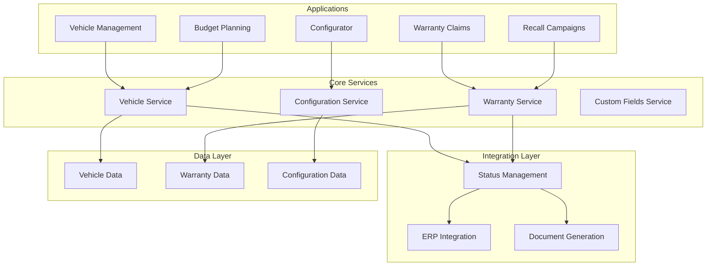

# Vehicle Management and Warranty System

## Overview

The Vehicle Management and Warranty System delivers enterprise-grade capabilities for automotive organizations managing vehicle inventories, warranty operations, and service networks. Built using SAP CAP (Cloud Application Programming) framework, the system provides extensive configurability, seamless ERP integration, and comprehensive business process support tailored to automotive industry requirements.

## System Architecture

The platform consists of two integrated core modules that work together to provide complete vehicle lifecycle management:

### Core Modules
- **Vehicle Management**: Comprehensive vehicle data management with advanced configuration capabilities
- **Warranty Management**: Full-featured claim processing and recall campaign orchestration

### Technical Foundation
- Built on SAP CAP for enterprise scalability and reliability
- Microservices architecture with defined service boundaries
- RESTful APIs for all operations
- Real-time data synchronization across modules
- Extensive configurability without code modification

## Core Modules

### [Vehicle Management](./vehicle-management/README.md)
Comprehensive vehicle lifecycle management from registration to retirement. The system handles everything from basic vehicle data to complex fleet operations with customizable fields, advanced search capabilities, and document management. Perfect for dealerships, fleet operators, and service networks requiring detailed vehicle tracking and history management.

### [Warranty Management](./warranty-management/README.md)
End-to-end warranty claim processing and campaign management. From claim templates that streamline submissions to sophisticated recall campaign coordination, this module transforms warranty operations. Service advisors can quickly create claims while warranty managers maintain full visibility and control over the entire warranty process.

## Integration with SAP

The Vehicle Management and Warranty System is designed to complement and enhance your existing SAP landscape. Sales processes remain within your standard SAP SD (Sales and Distribution) module, leveraging the robust capabilities already embedded in SAP for order management, pricing, billing, and customer management. Our solution integrates seamlessly with SAP, providing specialized vehicle and warranty functionality while respecting the proven sales processes you already have in place.

This approach ensures you maintain the full power of SAP's sales capabilities - from complex pricing procedures to credit management - while gaining industry-specific vehicle and warranty management features that standard SAP doesn't provide out of the box.

## Key Capabilities

### Vehicle Management Features
- **Comprehensive Vehicle Records**: Track vehicles with standard and custom fields throughout their lifecycle
- **Advanced Configuration System**: Template-based vehicle configuration with constraint resolution
- **Budget Management**: Multi-dimensional budget planning with dealer distribution and adjustments
- **Flexible Search and Lists**: Query across all fields with configurable list views
- **Field Controls**: Granular control over field visibility and editability by status and user type
- **Custom Fields**: Extend vehicle records with organization-specific data
- **Document Management**: Attach and manage vehicle-related documents
- **Text Management**: Configurable text types for various narrative needs

### Warranty Management Features
- **Claim Processing**: Comprehensive claim management with versioning and audit trails
- **Template System**: Pre-configured templates for common claim scenarios
- **Master Warranty Profiles**: Automated coverage validation based on time and mileage
- **Recall Campaigns**: Complete campaign orchestration from setup to completion tracking
- **Field Controls**: Status-based field visibility and mandatory field enforcement
- **Custom Fields**: Business-specific extensions for claims and campaigns
- **Financial Tracking**: IC/IV/OC/OV model for complete cost transparency
- **Parts Return**: Track defective parts with return flag management

### Integration Capabilities
- **Third-Party Status Management**: Fully auditable status processing with document generation in SAP or other ERPs
- **ERP Integration**: Search helps for customers, sales organizations, business partners, and dealers
- **Material Master Sync**: Parts and material data synchronization
- **Document Generation**: Automated document creation in target systems based on status changes
- **Order Inquiry**: Real-time order status and linkage to vehicles

### Configuration and Extensibility
- **Dynamic Custom Fields**: Add fields without code modification
- **Field Control Configuration**: Define visibility and editability rules
- **Text Type Configuration**: Customize text categories and icons
- **Number Range Management**: Automated numbering for claims and campaigns
- **Version Management**: Complete change tracking with comparison capabilities
- **Multi-Language Support**: Configurable text and labels

## System Architecture

## Target Organizations

The system serves various automotive business models:

- **Manufacturer Subsidiaries**: Manage national vehicle distribution and warranty operations
- **Dealership Groups**: Coordinate inventory and warranty across multiple locations
- **Independent Service Networks**: Process warranty claims and manage service campaigns
- **Fleet Management Companies**: Track vehicle lifecycle and warranty coverage
- **Import/Export Operations**: Handle international vehicle and warranty management

## Implementation Approach

The modular architecture enables phased implementation:

1. **Phase 1 - Core Setup**: Deploy vehicle and warranty base functionality
2. **Phase 2 - Integration**: Connect with existing ERP and business systems
3. **Phase 3 - Configuration**: Customize fields, controls, and workflows
4. **Phase 4 - Advanced Features**: Enable campaigns, budgets, and analytics

## Documentation

- [Vehicle Management Module](./vehicle-management/README.md) - Detailed vehicle management capabilities
- [Warranty Management Module](./warranty-management/README.md) - Comprehensive warranty operations guide
- [Development Status](./development-status/README.md) - Current implementation progress

---

For technical specifications and API documentation, please refer to the service definitions in the implementation.