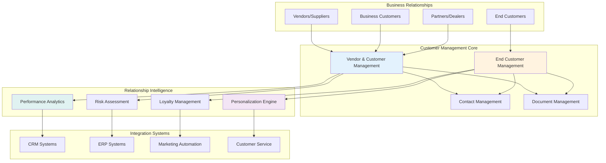
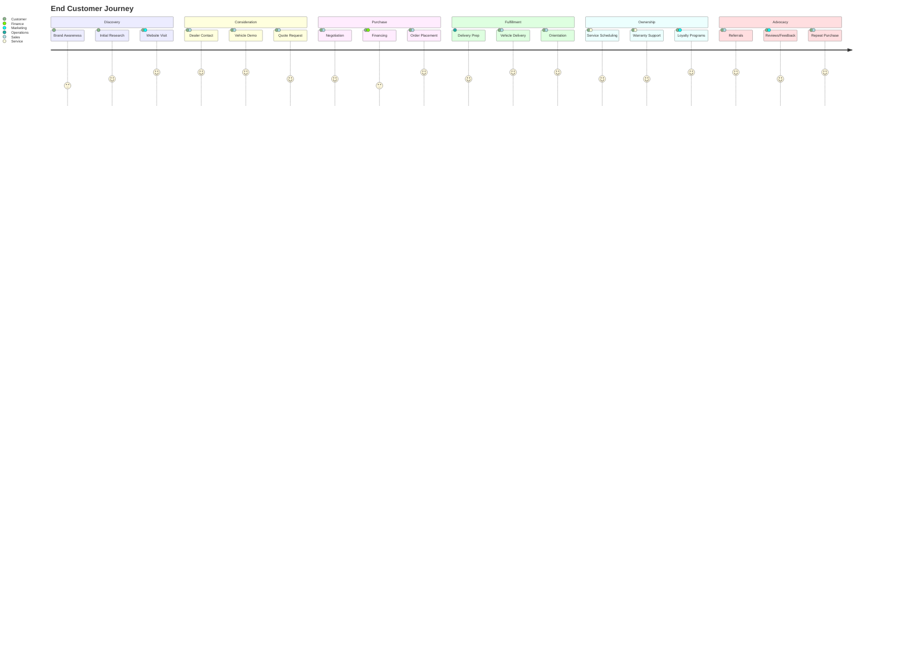
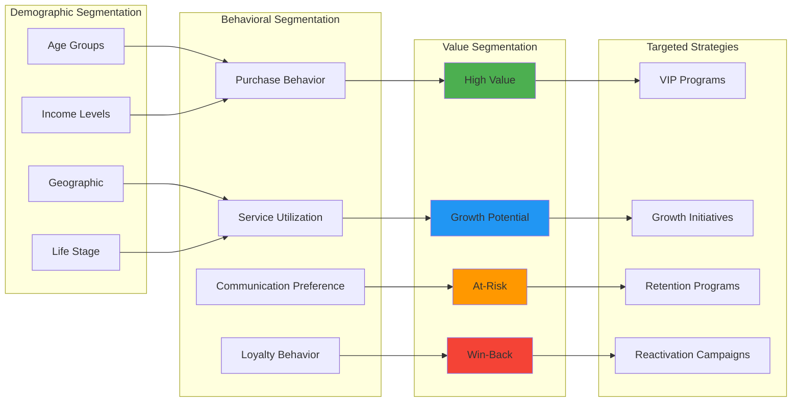
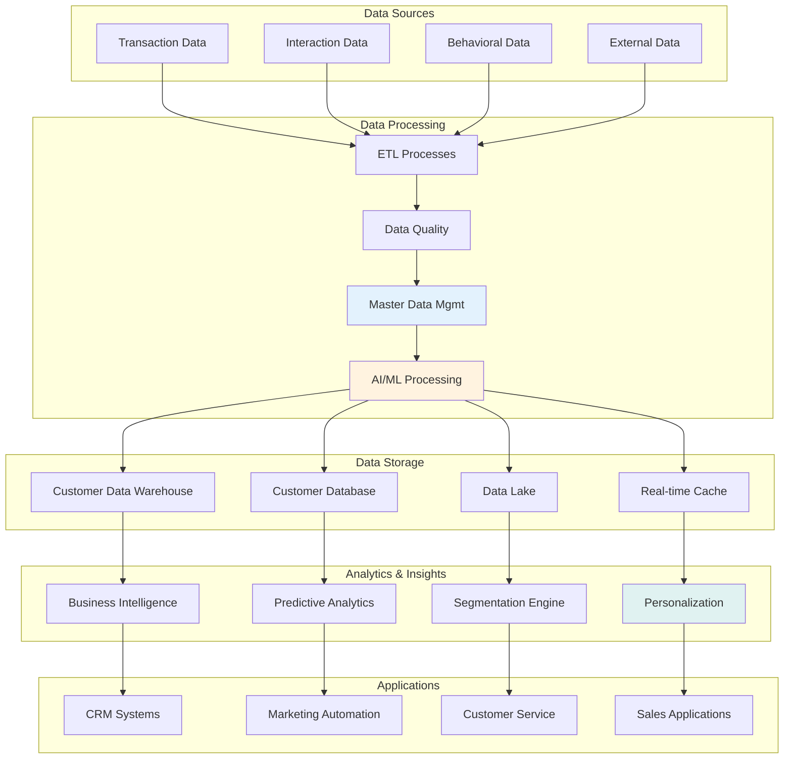
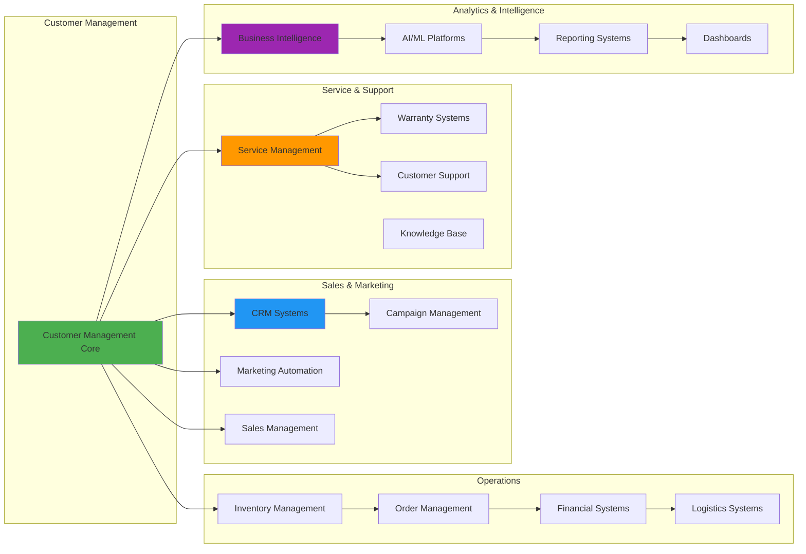

# Customer Management

## Overview
⚠️ **PARTIALLY IMPLEMENTED - VEHICLE-CENTRIC APPROACH**

The Customer Management module describes planned comprehensive relationship management capabilities. Currently, customer and vendor information is managed through the Vehicle Management system with basic customer/vendor ID associations. Dedicated CRM applications are planned for future implementation.

## Current Implementation Status

### ✅ Currently Available (Vehicle-Centric)
- **Basic Vendor References** - Vendor ID fields in vehicle master data
- **Customer Associations** - Customer, sales order customer, and end customer ID fields
- **Vehicle-Customer Linking** - Customer information tied to specific vehicles
- **Warranty Customer Data** - Customer information in warranty claims and profiles

### ⚠️ Planned CRM Applications

#### [Vendor & Customer Management](vendor-customer.md)
*Future: Comprehensive management system for both suppliers and customers*
- Unified vendor and customer profiles with relationship hierarchy
- Performance tracking and risk assessment
- Contract management and compliance monitoring
- Analytics-driven relationship optimization

#### [End Customer Management](end-customer.md)
*Future: Specialized retail customer management*
- Detailed customer profiles with preferences and buying patterns
- Customer lifecycle management and journey optimization
- Personalization engine with AI-driven recommendations
- Privacy compliance and data protection

## Relationship Architecture

## Customer Journey Mapping

## Customer Segmentation Strategy

## Business Value Framework

### Revenue Impact
- **Customer Lifetime Value** - 25% increase through personalized service and retention
- **Cross-sell Opportunities** - 30% increase in additional service and product sales
- **Referral Revenue** - 20% of new business from customer referrals
- **Premium Service Revenue** - 15% revenue increase from premium service offerings

### Cost Optimization
- **Service Efficiency** - 20% reduction in customer service costs through self-service
- **Marketing ROI** - 40% improvement in marketing effectiveness through segmentation
- **Retention Costs** - 50% reduction in customer acquisition costs vs. retention costs
- **Process Automation** - 35% reduction in manual customer management tasks

### Risk Mitigation
- **Customer Churn** - 60% reduction in customer churn through proactive management
- **Supplier Risk** - Early identification and mitigation of supplier performance issues
- **Compliance Risk** - Automated compliance monitoring and reporting
- **Data Security** - Enhanced data protection and privacy compliance

## Data Management Architecture

## Performance Metrics Dashboard

### Customer Satisfaction Metrics
- **Net Promoter Score (NPS)** - Customer advocacy and referral likelihood
- **Customer Satisfaction Score (CSAT)** - Overall satisfaction with service delivery
- **Customer Effort Score (CES)** - Ease of doing business measurement
- **First Contact Resolution** - Percentage of issues resolved on first contact

### Relationship Health Metrics
- **Customer Lifetime Value** - Total value of customer relationship over time
- **Customer Retention Rate** - Percentage of customers retained annually
- **Churn Rate** - Rate of customer loss and reasons for departure
- **Engagement Score** - Level of customer interaction and participation

### Business Impact Metrics
- **Revenue per Customer** - Average revenue generated per customer
- **Cross-sell Success Rate** - Effectiveness of additional product/service sales
- **Acquisition Cost vs. Lifetime Value** - ROI of customer acquisition efforts
- **Service Profitability** - Profitability of customer service operations

### Operational Efficiency Metrics
- **Response Time** - Average time to respond to customer inquiries
- **Resolution Time** - Average time to resolve customer issues
- **Self-Service Adoption** - Usage rate of self-service options
- **Process Automation Rate** - Percentage of automated vs. manual processes

## Integration Ecosystem

## Implementation Roadmap

### Phase 1: Foundation (Months 1-3)
- **Core Customer Database** - Unified customer and vendor data model
- **Basic CRM Functionality** - Essential customer management capabilities
- **Data Migration** - Clean migration of existing customer data
- **User Training** - Initial user training and adoption programs

### Phase 2: Enhancement (Months 4-6)
- **Advanced Segmentation** - Behavioral and value-based customer segmentation
- **Personalization Engine** - AI-driven personalization capabilities
- **Self-Service Portal** - Customer self-service capabilities
- **Integration Expansion** - Additional system integrations

### Phase 3: Optimization (Months 7-9)
- **Predictive Analytics** - Customer behavior prediction and recommendations
- **Automation Workflows** - Advanced process automation
- **Mobile Applications** - Full-featured mobile customer management
- **Performance Optimization** - System performance and scalability improvements

### Phase 4: Innovation (Months 10-12)
- **AI/ML Advanced Features** - Machine learning for customer insights
- **IoT Integration** - Connected vehicle and customer experience data
- **Blockchain Customer Records** - Secure, transparent customer data management
- **Advanced Analytics** - Real-time customer intelligence and recommendations

## Success Criteria

### 6-Month Targets
- **Customer Satisfaction** - 90%+ NPS score achievement
- **Data Quality** - 95%+ customer data accuracy and completeness
- **User Adoption** - 90%+ system adoption rate across all user groups
- **Process Efficiency** - 30% improvement in customer management process efficiency

### 12-Month Targets
- **Customer Retention** - 95%+ customer retention rate
- **Revenue Growth** - 25% increase in customer lifetime value
- **Operational Efficiency** - 50% reduction in manual customer management tasks
- **Innovation Index** - Top quartile in industry customer experience rankings