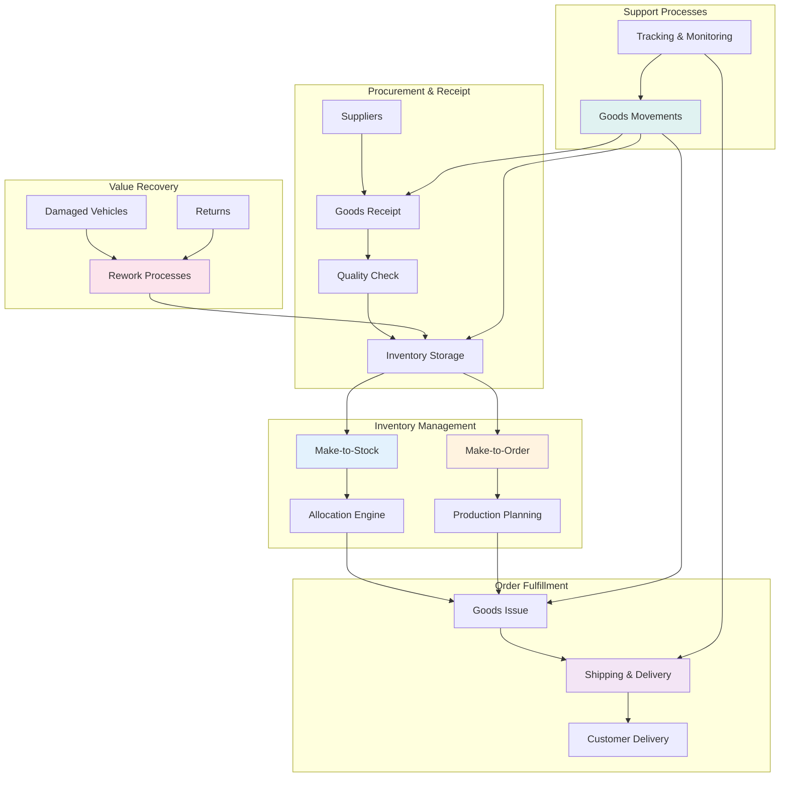
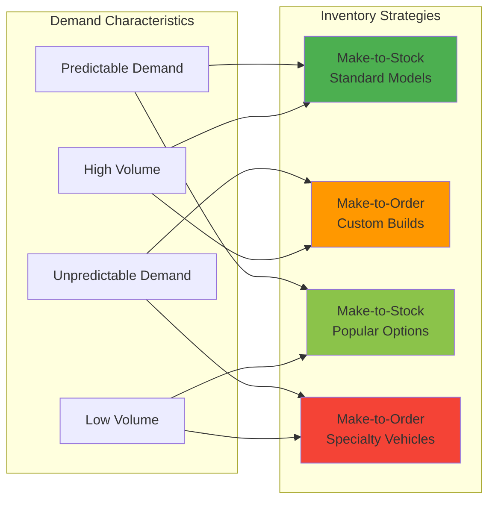
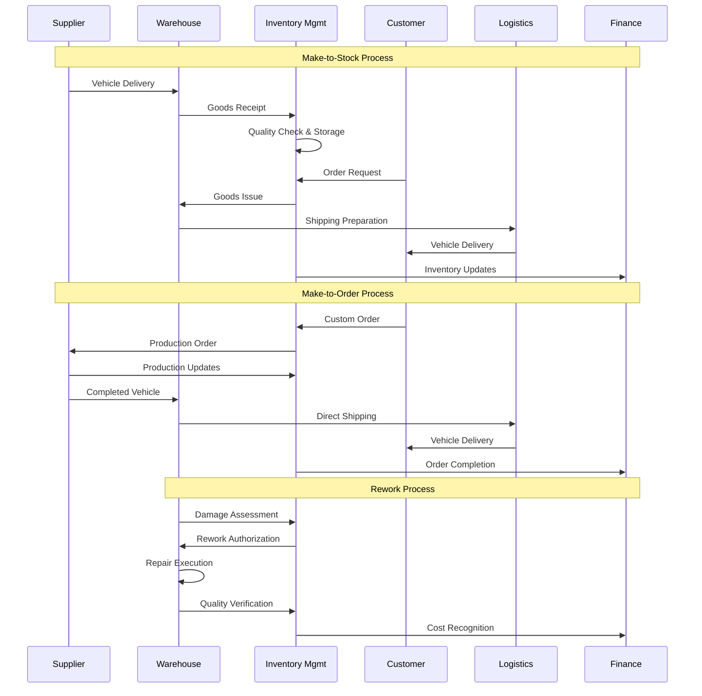
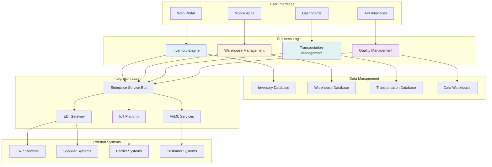

# Inventory & Operations

## Overview
⚠️ **PLANNED FEATURES - NOT YET IMPLEMENTED**

The Inventory & Operations module represents planned comprehensive logistics and operational management capabilities. Currently, basic inventory data is managed through the Vehicle Management system with vehicle status, location, and availability tracking. Dedicated inventory and operations applications are planned for future implementation.

## Current Implementation Status

### ✅ Currently Available (Basic Vehicle Inventory)
- **Vehicle Availability** - Availability status tracking in vehicle entities
- **Storage Location** - Plant and storage location associations
- **Vehicle Status** - Basic status and lifecycle management
- **Shelf Level Management** - Basic shelf level classification

### ⚠️ Planned Inventory Applications

#### [Make-to-Stock](make-to-stock.md)
*Future: Inventory strategy where vehicles are produced and stocked based on demand forecasting*
- Demand forecasting and inventory optimization
- Real-time availability and allocation management
- Sales integration with available-to-promise capabilities
- Performance analytics and inventory aging management

#### [Make-to-Order](make-to-order.md)
*Future: Production strategy where vehicles are built only after confirmed customer orders*
- Custom configuration and build-to-order processing
- Production integration and milestone tracking
- Customer communication and expectation management
- Change management throughout production lifecycle

#### [Goods Movements](goods-movements.md)
*Future: Comprehensive tracking of all vehicle and inventory movements*
- Receipt processing from suppliers with quality verification
- Issue processing for customer deliveries and internal transfers
- Real-time inventory updates and financial integration
- Complete audit trail and compliance documentation

#### [Shipping & Delivery](shipping-delivery.md)
*Future: Transportation and delivery coordination for optimal logistics*
- Carrier management and route optimization
- Customer delivery scheduling and tracking
- Real-time communication and exception management
- Quality protection throughout transportation

#### [Rework Processes](rework-processes.md)
*Future: Vehicle refurbishment and repair management for value recovery*
- Damage assessment and cost estimation workflows
- Professional rework execution and quality assurance
- Complete documentation and compliance management
- Integration with goods movements and inventory systems

## Operational Flow Architecture

## Inventory Strategy Matrix

## End-to-End Process Flow

## Business Value Drivers

### Cost Optimization
- **Inventory Investment** - 20-30% reduction in inventory carrying costs through optimization
- **Operational Efficiency** - 25% improvement in warehouse and logistics productivity
- **Quality Costs** - 40% reduction in quality-related costs through prevention
- **Transportation Costs** - 15% reduction through route optimization and consolidation

### Customer Satisfaction
- **Delivery Performance** - 95%+ on-time delivery rate achievement
- **Order Accuracy** - 99%+ order fulfillment accuracy
- **Customization Options** - Full customization capability for customer requirements
- **Communication Quality** - Real-time visibility into order and delivery status

### Operational Excellence
- **Inventory Turnover** - 30% improvement in inventory turnover rates
- **Process Automation** - 50% reduction in manual processing tasks
- **Quality Performance** - 99%+ quality pass rate for all operations
- **Compliance** - 100% compliance with regulatory and audit requirements

## Technology Architecture

## Key Performance Indicators

### Inventory Metrics
- **Inventory Turnover** - Annual inventory turnover rate and trend analysis
- **Days Supply** - Average days of inventory on hand by category
- **Fill Rate** - Percentage of customer requests filled from available stock
- **Stockout Rate** - Frequency and impact of inventory stockout situations
- **Carrying Cost** - Total cost of carrying inventory including financing and storage

### Operational Metrics
- **Order Cycle Time** - Time from order receipt to customer delivery
- **Warehouse Productivity** - Transactions processed per person-hour
- **Transportation Efficiency** - Cost per delivery and route optimization effectiveness
- **Quality Performance** - Defect rates and first-time-right percentages
- **Resource Utilization** - Utilization rates for warehouse space and equipment

### Customer Metrics
- **Delivery Performance** - On-time delivery rate and customer satisfaction
- **Order Accuracy** - Percentage of orders delivered correctly and completely
- **Damage Rate** - Percentage of vehicles damaged during handling or transportation
- **Customer Complaints** - Number and resolution time of logistics-related complaints
- **Return Rate** - Percentage of vehicles returned due to quality or logistics issues

### Financial Metrics
- **Cost per Transaction** - Average cost per inventory transaction
- **Labor Productivity** - Revenue per employee in logistics operations
- **Asset Utilization** - Return on invested capital in inventory and facilities
- **Working Capital** - Inventory impact on overall working capital requirements
- **Cost Variance** - Actual vs. budgeted operational costs

## Risk Management Framework

### Inventory Risks
- **Demand Variability** - Fluctuations in customer demand and market conditions
- **Supplier Performance** - Delivery delays and quality issues from suppliers
- **Obsolescence** - Risk of inventory becoming obsolete or unsaleable
- **Shrinkage** - Inventory loss due to theft, damage, or administrative errors

### Operational Risks
- **Capacity Constraints** - Warehouse and transportation capacity limitations
- **Quality Issues** - Defects and quality problems affecting customer deliveries
- **System Failures** - Technology failures impacting operational capabilities
- **Regulatory Compliance** - Changes in regulations affecting operations

### Mitigation Strategies
- **Diversification** - Multiple suppliers and transportation providers
- **Insurance** - Comprehensive coverage for inventory and operational risks
- **Monitoring** - Real-time monitoring and alert systems
- **Contingency Planning** - Backup plans for critical operational disruptions

## Implementation Strategy

### Phase 1: Core Operations (Months 1-4)
- **Inventory Management System** - Core inventory tracking and management
- **Warehouse Management** - Basic warehouse operations and processes
- **Goods Movement Tracking** - Receipt and issue processing capabilities
- **Quality Management** - Basic quality control and inspection processes

### Phase 2: Advanced Operations (Months 5-8)
- **Make-to-Stock Optimization** - Advanced demand forecasting and optimization
- **Make-to-Order Processing** - Custom build and configuration management
- **Transportation Management** - Advanced shipping and delivery capabilities
- **Rework Management** - Comprehensive rework and refurbishment processes

### Phase 3: Optimization (Months 9-12)
- **Predictive Analytics** - AI-driven demand forecasting and optimization
- **Automation** - Robotic process automation and IoT integration
- **Advanced Quality** - Predictive quality management and prevention
- **Customer Integration** - Advanced customer portal and self-service capabilities

### Phase 4: Innovation (Months 13-16)
- **IoT Integration** - Connected vehicles and smart warehouse technologies
- **Blockchain** - Supply chain transparency and smart contracts
- **AI/ML Advanced** - Machine learning for operational optimization
- **Sustainability** - Green logistics and environmental optimization

## Success Metrics

### 6-Month Targets
- **Inventory Accuracy** - 99%+ inventory record accuracy
- **Process Efficiency** - 30% improvement in operational efficiency
- **Customer Satisfaction** - 95%+ customer satisfaction with delivery experience
- **Cost Reduction** - 20% reduction in operational costs per unit

### 12-Month Targets
- **Inventory Optimization** - 25% reduction in inventory investment
- **Delivery Performance** - 98%+ on-time delivery rate
- **Quality Excellence** - 99.5%+ quality pass rate
- **Automation Level** - 60%+ of processes automated or semi-automated