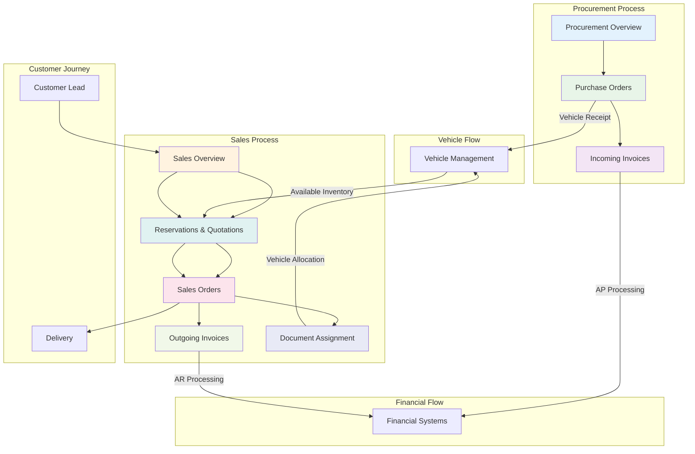
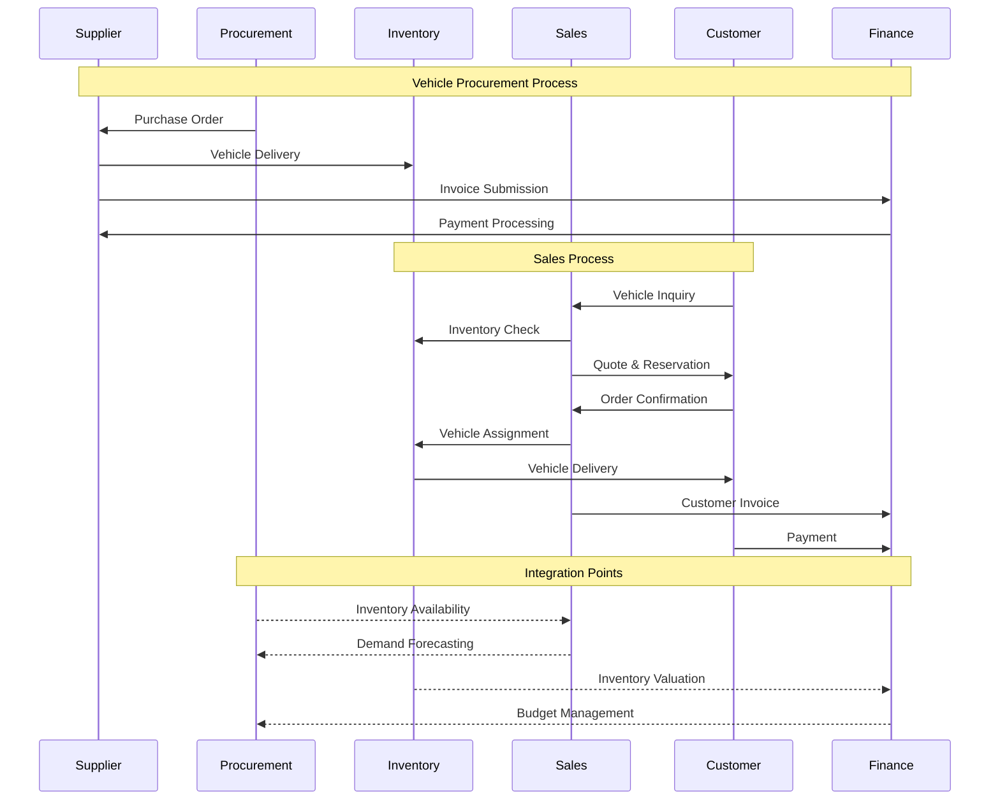
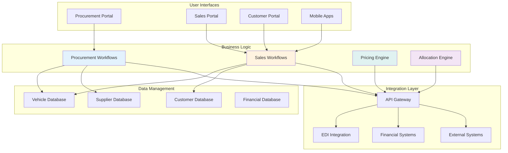

# Procurement & Sales

## Overview
⚠️ **PLANNED FEATURES - NOT YET IMPLEMENTED**

The Procurement & Sales module represents the planned future expansion of VMS to manage the complete business cycle from supplier relationships and vehicle procurement through customer sales and delivery. Currently, vehicle sales data is managed through the core Vehicle Management system, with dedicated procurement and sales applications planned for future implementation.

## Current Implementation Status

### ✅ Currently Available
- **Vehicle Master Data** - Managed through Vehicles app with customer and vendor associations
- **Basic Sales Data** - Vehicle sales information captured in vehicle records
- **Customer/Vendor References** - Basic customer and vendor ID management in vehicle entities

### ⚠️ Planned Procurement Applications

#### [Procurement Overview](procurement-overview.md)
*Future: Strategic procurement management handling supplier relationships and vehicle acquisition*
- Supplier performance tracking and contract management
- Demand forecasting and inventory optimization
- Automated procurement workflows and budget controls

#### [Purchase Orders](purchase-orders.md)
*Future: Comprehensive purchase order lifecycle management with supplier integration*
- Automated order generation and approval workflows
- Real-time order tracking and delivery coordination
- Three-way matching and performance monitoring

#### [Incoming Invoices](incoming-invoices.md)
*Future: Automated supplier invoice processing with financial system integration*
- Three-way matching and automated approval workflows
- Exception management and dispute resolution
- Payment optimization and supplier collaboration

### ⚠️ Planned Sales Applications

#### [Sales Overview](sales-overview.md)
*Future: Complete customer journey management from lead generation to delivery*
- Lead management and customer relationship building
- Sales process optimization and performance tracking
- Multi-channel sales support and analytics

#### [Reservations & Quotations](reservations-quotations.md)
*Future: Customer quote and reservation management with dynamic pricing*
- Interactive vehicle configuration and pricing
- Inventory allocation and reservation management
- Professional proposal generation and tracking

#### [Sales Orders](sales-orders.md)
*Future: Confirmed customer purchase processing and order fulfillment*
- Quote-to-order conversion and credit processing
- Order tracking and delivery coordination
- Change management and customer communication

#### [Outgoing Invoices](outgoing-invoices.md)
*Future: Customer billing and accounts receivable management*
- Automated invoice generation and payment processing
- Multiple payment methods and financing integration
- Collections management and financial reporting

#### [Document Assignment](document-assignment.md)
*Future: Vehicle allocation and assignment to sales documents and customers*
- Automated and manual vehicle assignment workflows
- Conflict resolution and allocation optimization
- Real-time availability and commitment tracking

## Process Integration Flow

## End-to-End Business Process

## Business Value Proposition

### Cost Optimization
- **Procurement Efficiency** - Automated processes reduce procurement costs by 15-20%
- **Inventory Optimization** - Demand-driven purchasing reduces carrying costs
- **Payment Optimization** - Early payment discounts and cash flow management
- **Resource Utilization** - Streamlined processes improve staff productivity

### Revenue Maximization
- **Sales Process Efficiency** - Faster quote-to-order conversion increases sales volume
- **Customer Experience** - Professional sales process improves customer satisfaction and loyalty
- **Inventory Turnover** - Optimized inventory management increases turnover rates
- **Pricing Optimization** - Dynamic pricing strategies maximize margin performance

### Risk Management
- **Supplier Risk** - Performance monitoring and diversification reduce supply risks
- **Financial Risk** - Integrated financial controls and approval workflows
- **Customer Risk** - Credit management and financing integration
- **Operational Risk** - Automated processes reduce manual errors and delays

## Key Performance Indicators

### Procurement Metrics
- **Supplier Performance** - On-time delivery, quality, and cost performance
- **Procurement Cost** - Cost per vehicle and total cost of ownership
- **Inventory Efficiency** - Inventory turnover and carrying cost optimization
- **Process Efficiency** - Order cycle time and automation rate

### Sales Metrics
- **Sales Performance** - Revenue growth, margin performance, and market share
- **Customer Satisfaction** - Sales experience ratings and loyalty metrics
- **Conversion Rates** - Lead-to-sale and quote-to-order conversion rates
- **Sales Cycle** - Time from inquiry to delivery completion

### Financial Metrics
- **Cash Flow** - Working capital optimization and payment cycle efficiency
- **Profitability** - Gross margin and net profit performance
- **Cost Control** - Operational cost per transaction and efficiency gains
- **ROI** - Return on investment in procurement and sales technology

## Technology Architecture

## Implementation Strategy

### Phase 1: Foundation
- **Core Data Models** - Vehicle, customer, and supplier master data
- **Basic Workflows** - Essential procurement and sales processes
- **User Interfaces** - Primary user portals and mobile access
- **Integration Framework** - API layer and core system connections

### Phase 2: Automation
- **Workflow Automation** - Automated approval and processing workflows
- **Pricing Engine** - Dynamic pricing and quote generation
- **Allocation Engine** - Intelligent vehicle allocation and availability
- **Financial Integration** - Complete ERP and accounting system integration

### Phase 3: Optimization
- **Advanced Analytics** - Predictive analytics and business intelligence
- **Customer Experience** - Enhanced customer portal and self-service capabilities
- **Supplier Collaboration** - Advanced supplier integration and collaboration tools
- **Performance Optimization** - System performance tuning and scalability enhancements

### Phase 4: Innovation
- **AI/ML Integration** - Machine learning for demand forecasting and optimization
- **IoT Integration** - Vehicle tracking and condition monitoring
- **Blockchain** - Supply chain transparency and smart contracts
- **Advanced Mobile** - Augmented reality and advanced mobile capabilities

## Success Metrics

### 6-Month Targets
- **Process Efficiency** - 25% reduction in procurement and sales cycle times
- **Cost Reduction** - 15% reduction in operational costs
- **Customer Satisfaction** - 90%+ customer satisfaction scores
- **System Adoption** - 95%+ user adoption rate

### 12-Month Targets
- **Revenue Growth** - 20% increase in sales revenue
- **Margin Improvement** - 10% improvement in gross margins
- **Inventory Optimization** - 30% improvement in inventory turnover
- **Supplier Performance** - 95%+ supplier on-time delivery rate