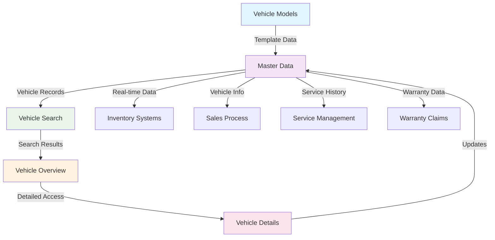
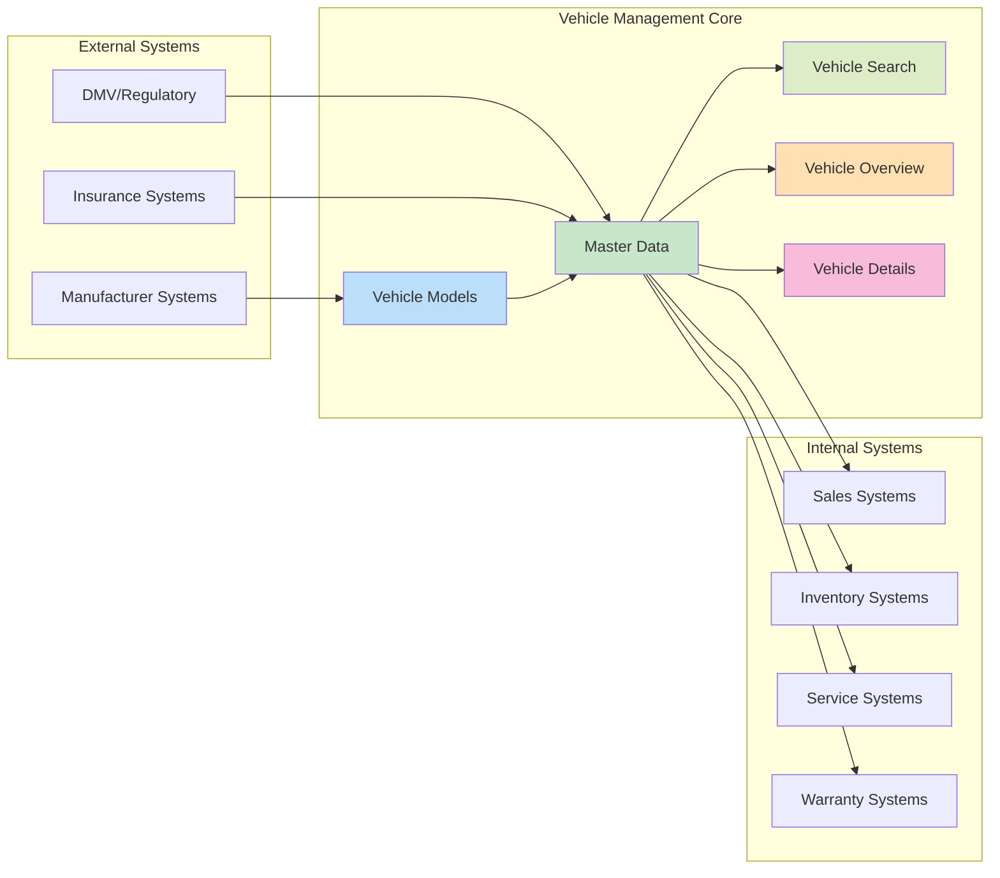

# Vehicle Management

## Overview
The Vehicle Management module serves as the foundation of the VMS system, providing comprehensive vehicle data management, search capabilities, and detailed vehicle information tracking throughout the vehicle lifecycle.

## Core Features

### [Master Data](master-data.md)
Central repository for all vehicle master data that forms the foundation of the Vehicle Management System.
- Vehicle identification and attributes
- Lifecycle management and status tracking
- Data quality management and validation

### [Vehicle Models](vehicle-models.md)
Comprehensive management of vehicle model information, specifications, and configurations.
- Model hierarchy and specifications
- Configuration management and pricing
- Market positioning and competitive analysis

### [Vehicle Search](vehicle-search.md)
Advanced search and discovery capabilities for quick vehicle location and filtering.
- Multi-criteria search with advanced filters
- Real-time search suggestions and results
- Export and reporting capabilities

### [Vehicle Overview](vehicle-overview.md)
Comprehensive dashboard providing complete vehicle status and information summary.
- Real-time status indicators and alerts
- Activity feeds and quick actions
- Role-based customizable views

### [Vehicle Details](vehicle-details.md)
Detailed vehicle information management with full editing capabilities and document management.
- Complete vehicle profile management
- Document management and version control
- Change tracking and audit trails

## Feature Integration Flow

## Data Flow Architecture

## Business Value

### Operational Excellence
- **Single Source of Truth** - Centralized vehicle information reduces data inconsistencies
- **Improved Efficiency** - Advanced search capabilities reduce time spent locating vehicles
- **Better Decision Making** - Comprehensive vehicle information enables informed decisions

### Customer Experience
- **Faster Response Times** - Quick access to complete vehicle information improves customer service
- **Accurate Information** - Consistent, up-to-date vehicle data ensures accurate customer communication
- **Professional Presentation** - Comprehensive vehicle details enhance sales presentations

### Compliance and Quality
- **Audit Readiness** - Complete change tracking and documentation support compliance requirements
- **Data Quality** - Validation and verification processes ensure high-quality vehicle data
- **Regulatory Compliance** - Integration with regulatory systems maintains compliance status

## Key Performance Indicators

### Data Quality Metrics
- **Data Completeness** - Percentage of vehicles with complete required information
- **Data Accuracy** - Accuracy rate of vehicle information vs. external sources
- **Update Timeliness** - Time from vehicle status change to system update

### Operational Metrics
- **Search Performance** - Average search response time and result relevance
- **User Productivity** - Time savings from improved vehicle information access
- **System Utilization** - Usage patterns and feature adoption rates

### Business Impact
- **Customer Satisfaction** - Impact on customer service response times and accuracy
- **Sales Effectiveness** - Contribution to sales process efficiency and conversion
- **Compliance Rate** - Adherence to regulatory and audit requirements

## Integration Dependencies

### Upstream Systems
- **Manufacturer Systems** - Model specifications and update feeds
- **Supplier Systems** - Vehicle receipt and specification data
- **Regulatory Systems** - Compliance and certification information

### Downstream Systems
- **Sales Systems** - Vehicle availability and specification data
- **Inventory Systems** - Real-time vehicle status and location information
- **Service Systems** - Vehicle history and technical specifications
- **Financial Systems** - Vehicle valuation and cost information

## Implementation Considerations

### Technical Requirements
- **Real-time Integration** - Immediate updates across all connected systems
- **Scalability** - Support for large vehicle inventories and high transaction volumes
- **Performance** - Sub-second response times for search and data retrieval
- **Security** - Role-based access control and data protection

### Change Management
- **User Training** - Comprehensive training on new search and management capabilities
- **Process Updates** - Alignment of business processes with new system capabilities
- **Data Migration** - Clean migration of existing vehicle data with quality validation
- **Continuous Improvement** - Ongoing optimization based on user feedback and performance metrics