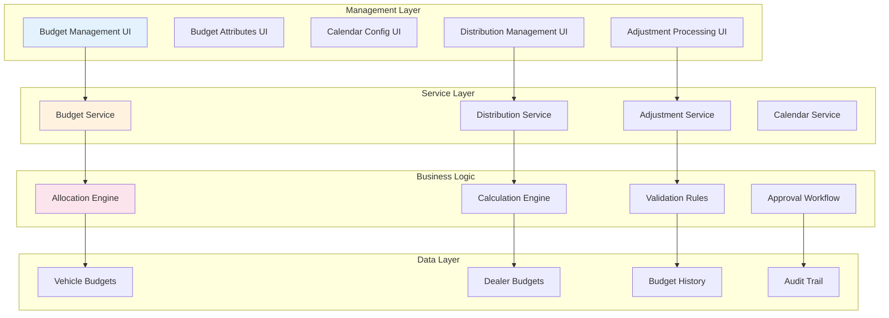
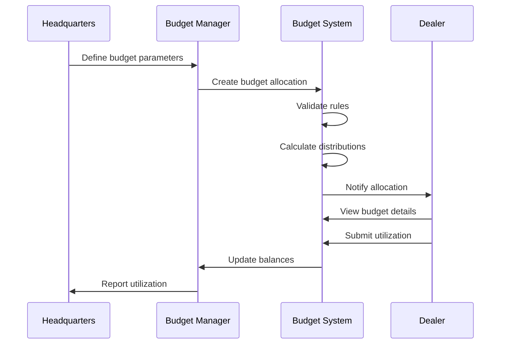

# Budget Management System

## Overview

The Budget Management System provides comprehensive financial allocation, tracking, and distribution capabilities for vehicle-related budgets across dealer networks. It enables manufacturers and regional offices to allocate budgets, track utilization, and manage dealer-specific adjustments with complete audit trails and time-based controls.

## Business Value

- **Improved Financial Control** - Centralized budget allocation and tracking
- **Enhanced Dealer Relations** - Transparent budget distribution and adjustments
- **Real-time Visibility** - Instant budget utilization insights
- **Reduced Financial Risk** - Controlled spending with approval workflows
- **Flexible Allocation Models** - Support for various distribution strategies
- **Audit Compliance** - Complete tracking of all budget movements

## System Architecture



## Core Components

### 1. Vehicle Budgets
Central budget allocation for vehicles:
- **Budget Categories** - Different types of budgets (marketing, incentive, warranty)
- **Allocation Amounts** - Monetary values assigned per vehicle
- **Time Periods** - Valid date ranges for budget utilization
- **Utilization Tracking** - Real-time consumption monitoring
- **Balance Management** - Available vs. consumed amounts

### 2. Budget Attributes
Configurable parameters for budget behavior:
- **Budget Types** - Classification of budget purposes
- **Allocation Rules** - Logic for budget distribution
- **Restriction Criteria** - Conditions for budget usage
- **Approval Thresholds** - Limits requiring authorization
- **Regional Variations** - Location-specific configurations

### 3. Budget Calendar
Time-based budget management:
- **Fiscal Periods** - Monthly, quarterly, annual cycles
- **Budget Windows** - Open/close dates for allocations
- **Rollover Rules** - End-of-period balance handling
- **Seasonal Adjustments** - Time-specific modifications
- **Holiday Calendars** - Business day calculations

### 4. Dealer Distribution
Network-wide budget allocation:
- **Distribution Models** - Equal, performance-based, custom
- **Dealer Hierarchies** - Multi-level distribution support
- **Allocation Formulas** - Configurable distribution logic
- **Reserve Pools** - Centrally managed contingency funds
- **Performance Metrics** - KPI-based distribution

### 5. Dealer Adjustments
Dynamic budget modifications:
- **Adjustment Types** - Increases, decreases, transfers
- **Approval Workflows** - Multi-level authorization
- **Reason Codes** - Categorized adjustment purposes
- **Documentation** - Supporting document attachments
- **Reversal Capability** - Undo/correction mechanisms

## Implementation Details

### Applications

#### Vehicle Budgets App (`/app/vehiclebudgets/`)
- **Type**: Fiori Elements Application
- **Purpose**: Manage vehicle-level budget allocations
- **Key Features**:
  - Budget creation and allocation
  - Vehicle association
  - Utilization monitoring
  - Balance tracking
  - Report generation

#### Budget Attributes App (`/app/vehiclebudgetattributes/`)
- **Type**: Fiori Elements Application
- **Purpose**: Configure budget parameters and rules
- **Key Features**:
  - Attribute definition
  - Rule configuration
  - Validation setup
  - Default value management
  - Template creation

#### Budget Calendar Config App (`/app/budgetcalendarconfig/`)
- **Type**: Fiori Elements Application
- **Purpose**: Manage time-based budget settings
- **Key Features**:
  - Period definition
  - Calendar setup
  - Rollover configuration
  - Holiday management
  - Deadline tracking

#### Dealer Distribution App (`/app/dealerdistribution/`)
- **Type**: Fiori Elements Application
- **Purpose**: Allocate budgets across dealer network
- **Key Features**:
  - Distribution planning
  - Allocation execution
  - Performance tracking
  - Balance monitoring
  - Reallocation tools

#### Dealer Adjustments App (`/app/dealeradjustments/`)
- **Type**: Fiori Elements Application
- **Purpose**: Process budget modifications
- **Key Features**:
  - Adjustment requests
  - Approval processing
  - Documentation management
  - Audit trail viewing
  - Reversal processing

### Data Model

#### Core Entities

```cds
entity VehicleBudgets {
    key ID: UUID;
    vehicle: Association to Vehicles;
    budgetType: String(20);
    category: String(30);
    allocatedAmount: Decimal(15,2);
    consumedAmount: Decimal(15,2);
    availableAmount: Decimal(15,2);
    currency: String(3);
    validFrom: Date;
    validTo: Date;
    status: String enum { ACTIVE; SUSPENDED; EXPIRED; CONSUMED };
    attributes: Association to many BudgetAttributes;
}

entity BudgetAttributes {
    key ID: UUID;
    attributeType: String(30);
    attributeValue: String(100);
    description: localized String(255);
    validationRule: String(500);
    isRequired: Boolean;
    defaultValue: String(100);
    sortOrder: Integer;
}

entity BudgetCalendar {
    key ID: UUID;
    fiscalYear: Integer;
    period: Integer;
    periodType: String enum { MONTHLY; QUARTERLY; ANNUAL };
    startDate: Date;
    endDate: Date;
    isOpen: Boolean;
    rolloverAllowed: Boolean;
    rolloverPercentage: Decimal(5,2);
}

entity DealerDistributions {
    key ID: UUID;
    dealer: Association to Partners;
    budget: Association to VehicleBudgets;
    distributionDate: Date;
    allocatedAmount: Decimal(15,2);
    distributionMethod: String(20);
    performanceScore: Decimal(5,2);
    adjustmentFactor: Decimal(5,2);
    finalAmount: Decimal(15,2);
    status: String(20);
}

entity DealerAdjustments {
    key ID: UUID;
    dealer: Association to Partners;
    budget: Association to VehicleBudgets;
    adjustmentType: String enum { INCREASE; DECREASE; TRANSFER };
    adjustmentAmount: Decimal(15,2);
    reasonCode: String(20);
    justification: String(500);
    requestedBy: String(100);
    requestedDate: Timestamp;
    approvedBy: String(100);
    approvedDate: Timestamp;
    status: String enum { PENDING; APPROVED; REJECTED; REVERSED };
    documents: Composition of many AdjustmentDocuments;
}
```

## Business Processes

### Budget Allocation Process



### Adjustment Workflow

1. **Request Initiation** - Dealer/manager requests adjustment
2. **Validation** - System validates against rules
3. **Approval Routing** - Based on amount and type
4. **Documentation** - Attach supporting documents
5. **Processing** - Execute approved adjustment
6. **Notification** - Inform affected parties
7. **Audit Trail** - Record all actions

## Allocation Strategies

### Performance-Based Distribution
```javascript
allocation = baseAmount * (dealerScore / totalScore) * performanceFactor
```

### Tiered Distribution
```javascript
if (dealerTier === 'PLATINUM') allocation = totalBudget * 0.4
if (dealerTier === 'GOLD') allocation = totalBudget * 0.3
if (dealerTier === 'SILVER') allocation = totalBudget * 0.2
if (dealerTier === 'BRONZE') allocation = totalBudget * 0.1
```

### Regional Distribution
```javascript
allocation = regionalBudget * (dealerSales / regionalSales)
```

## Integration Points

### Vehicle Management Integration
- Link budgets to specific vehicles
- Track budget consumption per vehicle
- Update vehicle financial status

### Warranty Service Integration
- Allocate warranty reserve budgets
- Track claim-related budget usage
- Manage warranty cost recovery

### Financial System Integration
- Sync with ERP financial modules
- Export budget data for accounting
- Import cost center hierarchies

### Reporting Integration
- Real-time budget dashboards
- Utilization analytics
- Forecasting models

## Security & Compliance

### Role-Based Access Control
- **Budget Administrator** - Full system access
- **Regional Manager** - Regional budget management
- **Dealer Manager** - Dealer-specific view and requests
- **Finance Auditor** - Read-only access to all data
- **Dealer Staff** - Limited view of allocated budgets

### Audit Requirements
- Complete transaction history
- User action tracking
- Document retention
- Change justification
- Approval chain records

### Compliance Features
- SOX compliance support
- Regional regulatory adherence
- Financial reporting standards
- Data privacy protection

## Reporting & Analytics

### Standard Reports
- Budget Utilization Summary
- Dealer Distribution Report
- Adjustment Activity Log
- Period-over-Period Analysis
- Top/Bottom Performer Report

### Key Metrics
- **Utilization Rate** - Consumed vs. Allocated
- **Distribution Efficiency** - Actual vs. Target
- **Adjustment Frequency** - Changes per period
- **Approval Turnaround** - Processing time
- **Budget Variance** - Planned vs. Actual

### Analytics Dashboards
- Real-time budget status
- Trend analysis
- Predictive utilization
- Dealer performance scoring
- Regional comparisons

## Configuration Guide

### Budget Type Setup
1. Define budget categories
2. Set allocation rules
3. Configure approval workflows
4. Establish validation criteria
5. Create report templates

### Calendar Configuration
1. Define fiscal periods
2. Set business calendars
3. Configure rollover rules
4. Establish deadlines
5. Set holiday schedules

### Distribution Model Setup
1. Choose distribution method
2. Define performance metrics
3. Set tier criteria
4. Configure formulas
5. Test calculations

## Best Practices

### Budget Planning
- Align with business objectives
- Consider seasonal variations
- Build in contingency reserves
- Review historical utilization
- Engage stakeholder input

### Distribution Management
- Transparent allocation criteria
- Regular performance reviews
- Timely communication
- Fair adjustment processes
- Clear documentation

### System Maintenance
- Regular rule validation
- Periodic formula review
- Archive historical data
- Update approval chains
- Monitor system performance

## Troubleshooting

### Common Issues

#### Budget Not Appearing
- Check validity dates
- Verify allocation status
- Review dealer assignment
- Confirm approval completion

#### Calculation Errors
- Validate formula syntax
- Check input parameters
- Review calculation logs
- Verify data completeness

#### Approval Delays
- Check workflow configuration
- Verify approver availability
- Review threshold settings
- Check notification delivery

## Future Enhancements

### Planned Features
1. **AI-Powered Forecasting** - Predictive budget planning
2. **Mobile Approval App** - On-the-go adjustment processing
3. **Blockchain Audit Trail** - Immutable transaction records
4. **Dynamic Reallocation** - Automatic optimization
5. **Integration Hub** - Extended system connectivity

### Technical Improvements
1. **Real-time Sync** - Instant budget updates
2. **Advanced Analytics** - Machine learning insights
3. **Performance Optimization** - Faster calculations
4. **API Expansion** - Enhanced integration options

## Related Documentation

- [Vehicle Management](../vms/vehicle-management/)
- [Warranty Management](../warranty/)
- [Dealer Management](../vms/customer-management/)
- [Financial Integration](../integration/financial/)