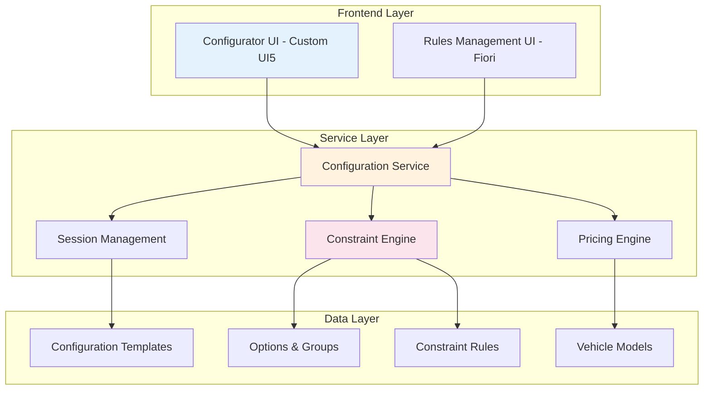

# Vehicle Configuration System (Third-Party Solution)

> **Implementation Note**: The vehicle configuration functionality is provided by a third-party vendor solution. This document describes the business requirements and integration approach.

## Overview

The Vehicle Configuration System provides a sophisticated, real-time vehicle configuration engine that enables dealers and customers to customize vehicles with complex option dependencies, constraints, and pricing rules. The system is implemented through integration with an external configuration vendor.

## Business Value

- **Reduction in Configuration Errors** - Real-time constraint validation prevents invalid configurations
- **Faster Quote Generation** - Automated pricing and option resolution
- **Enhanced Customer Experience** - Interactive, visual configuration process
- **Improved Order Accuracy** - Validated configurations reduce production errors
- **Flexible Business Rules** - Easily maintainable configuration logic

## System Architecture



## Core Components

### 1. Configuration Templates

Templates define the base structure for vehicle configurations, including:

- **Base Model Selection** - Starting point for configuration
- **Standard Equipment** - Default included options
- **Available Options** - Selectable features and packages
- **Pricing Structure** - Base price and option pricing
- **Constraint Rules** - Business logic for option compatibility

### 2. Option Groups & Options

Hierarchical organization of configurable elements:

- **Option Groups** - Logical grouping of related options (e.g., "Exterior", "Interior", "Performance")
- **Options** - Individual selectable features (e.g., "Panoramic Sunroof", "Leather Seats")
- **Packages** - Bundled options with special pricing
- **Dependencies** - Parent-child relationships between options

### 3. Constraint Engine

Real-time validation and resolution system:

- **Requires Rules** - Option A requires Option B
- **Excludes Rules** - Option A excludes Option B
- **Implies Rules** - Option A automatically includes Option B
- **Quantity Rules** - Minimum/maximum selection limits
- **Performance Monitoring** - Sub-millisecond constraint resolution

### 4. Session Management

Stateful configuration tracking:

- **Session Creation** - Initialize configuration state
- **Change Tracking** - Monitor configuration modifications
- **Validation State** - Real-time validity status
- **Persistence** - Save and resume configurations
- **Multi-user Support** - Concurrent configuration sessions

## Implementation Details

### Applications

#### Configurator App (`/app/configurator/`)

- **Type**: Custom UI5 Application
- **Purpose**: Interactive vehicle configuration interface
- **Features**:
  - Visual option selection
  - Real-time price calculation
  - Constraint violation feedback
  - Configuration summary
  - Export/save functionality

#### Configuration Rules App (`/app/configuratorrules/`)

- **Type**: Fiori Elements Application
- **Purpose**: Manage configuration rules and constraints
- **Features**:
  - Rule creation and editing
  - Constraint definition
  - Template management
  - Option group organization
  - Business logic maintenance

### Services

#### ConfigurationsService (`/srv/configurator.cds`)

Primary service for configuration operations:

```javascript
service ConfigurationsService {
    // Entities
    entity ConfigurationTemplates
    entity OptionGroups
    entity Options
    entity ConfigurationSessions
    entity Constraints

    // Actions
    action createSession(templateId: UUID) returns Session
    action addOption(sessionId: UUID, optionId: UUID) returns ValidationResult
    action removeOption(sessionId: UUID, optionId: UUID) returns ValidationResult
    action validateConfiguration(sessionId: UUID) returns ValidationResult
    action calculatePrice(sessionId: UUID) returns PriceCalculation

    // Functions
    function getTemplate(templateId: UUID) returns Template
    function getAvailableOptions(sessionId: UUID) returns array of Option
    function getConstraintViolations(sessionId: UUID) returns array of Violation
}
```

### Data Model

#### Core Entities

```cds
entity ConfigurationTemplates {
    key ID: UUID;
    name: String(100);
    vehicleModel: Association to VehicleModels;
    basePrice: Decimal(15,2);
    validFrom: Date;
    validTo: Date;
    isActive: Boolean;
    options: Composition of many TemplateOptions;
}

entity Options {
    key ID: UUID;
    code: String(20);
    name: localized String(100);
    description: localized String(500);
    optionGroup: Association to OptionGroups;
    price: Decimal(15,2);
    isStandard: Boolean;
    constraints: Association to many Constraints;
}

entity Constraints {
    key ID: UUID;
    name: String(100);
    type: String enum { REQUIRES; EXCLUDES; IMPLIES };
    sourceOption: Association to Options;
    targetOption: Association to Options;
    isActive: Boolean;
}

entity ConfigurationSessions {
    key ID: UUID;
    template: Association to ConfigurationTemplates;
    vehicle: Association to Vehicles;
    selectedOptions: many UUID;
    totalPrice: Decimal(15,2);
    isValid: Boolean;
    violations: array of String;
    createdAt: Timestamp;
    modifiedAt: Timestamp;
}
```

## Constraint Resolution Algorithm

The constraint resolver implements an efficient graph-based algorithm:

1. **Dependency Graph Construction** - Build directed graph of option dependencies
2. **Cycle Detection** - Identify and handle circular dependencies
3. **Forward Propagation** - Apply IMPLIES rules transitively
4. **Conflict Detection** - Identify EXCLUDES violations
5. **Requirement Validation** - Verify all REQUIRES rules satisfied
6. **Resolution Suggestions** - Provide fix recommendations for violations

### Performance Characteristics

- **Average Resolution Time**: < 10ms for 100+ options
- **Worst Case Complexity**: O(n²) where n = number of options
- **Memory Usage**: O(n) for constraint graph
- **Optimization**: Caching of frequently used configurations

## Business Rules Examples

### Example 1: Luxury Package

```javascript
{
    type: "IMPLIES",
    source: "LUXURY_PACKAGE",
    targets: ["LEATHER_SEATS", "PREMIUM_AUDIO", "AMBIENT_LIGHTING"]
}
```

### Example 2: Engine Compatibility

```javascript
{
    type: "REQUIRES",
    source: "SPORT_EXHAUST",
    target: "V8_ENGINE"
}
```

### Example 3: Exclusive Options

```javascript
{
    type: "EXCLUDES",
    source: "MANUAL_TRANSMISSION",
    target: "ADAPTIVE_CRUISE_CONTROL"
}
```

## Integration Points

### Vehicle Service Integration

- Retrieve vehicle model specifications
- Update vehicle configuration data
- Link configurations to vehicle records

### Pricing Service Integration

- Real-time price calculation
- Discount application
- Tax and fee computation

### Order Management Integration

- Convert configuration to sales order
- Validate configuration for production
- Track configuration through order lifecycle

## User Workflows

### Dealer Configuration Flow

1. Select vehicle model/template
2. Review standard equipment
3. Add/remove options with real-time validation
4. Review price and configuration summary
5. Save configuration to vehicle/customer record
6. Generate quote or order

### Customer Self-Service Flow

1. Browse available models
2. Start configuration wizard
3. Guided option selection with recommendations
4. Visual configuration preview
5. Price transparency with breakdown
6. Save or share configuration
7. Schedule dealer appointment

## Security & Permissions

### Role-Based Access

- **Configuration Admin** - Full template and rule management
- **Sales Manager** - Configuration creation and pricing override
- **Sales Representative** - Configuration creation within limits
- **Customer** - Self-service configuration (no pricing override)

### Data Protection

- Session-based isolation
- Audit trail for configuration changes
- Price visibility controls
- Option availability by region/dealer

## Monitoring & Analytics

### Key Metrics

- Configuration completion rate
- Average configuration time
- Most/least selected options
- Constraint violation frequency
- Price optimization opportunities

### Performance Monitoring

- Constraint resolution time
- Session creation/update latency
- Database query performance
- UI responsiveness metrics

## Maintenance & Administration

### Template Management

- Version control for templates
- A/B testing different configurations
- Seasonal option updates
- Regional variation support

### Rule Management

- Business-friendly rule editor
- Rule validation and testing
- Impact analysis for rule changes
- Rule activation scheduling

## Future Enhancements

### Planned Features

1. **AI-Powered Recommendations** - ML-based option suggestions
2. **3D Visualization** - Interactive 3D vehicle preview
3. **AR Integration** - Augmented reality configuration experience
4. **Dynamic Pricing** - Market-based price optimization
5. **Configuration Sharing** - Social media integration
6. **Production Feasibility** - Real-time factory constraint checking

### Technical Improvements

1. **GraphQL API** - Modern API for mobile/web clients
2. **Redis Caching** - Performance optimization
3. **Event Streaming** - Real-time configuration updates
4. **Microservice Architecture** - Separate constraint engine service

## Troubleshooting Guide

### Common Issues

#### Configuration Won't Save

- Check session validity
- Verify constraint violations resolved
- Confirm user permissions
- Review audit logs

#### Constraint Resolution Timeout

- Reduce option complexity
- Check for circular dependencies
- Review constraint rule efficiency
- Monitor system resources

#### Price Calculation Errors

- Verify pricing data completeness
- Check discount rule conflicts
- Review tax configuration
- Validate currency settings

## API Reference

See [Configuration API Documentation](./api-reference.md) for detailed endpoint specifications.

## Related Documentation

- [Vehicle Management](../vms/vehicle-management/)
- [Sales Order Processing](../vms/procurement-sales/sales-orders.md)
- [Pricing Management](../vms/pricing/)
- [Template Management Guide](./template-guide.md)
