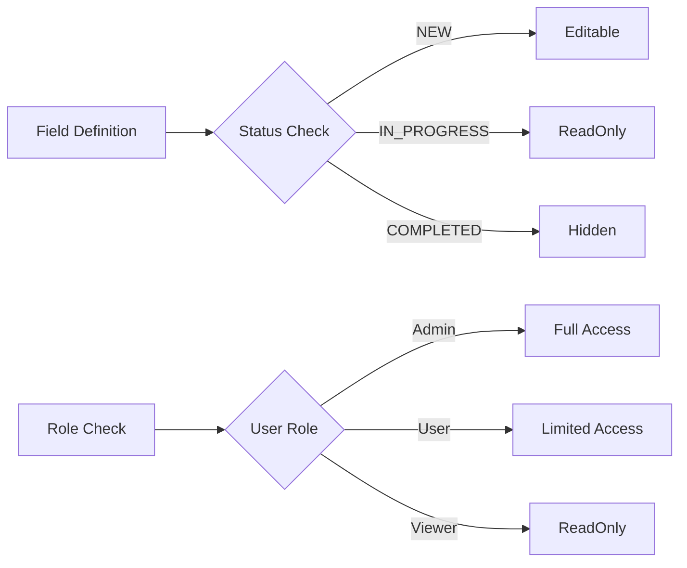

# Configuration Guide

Learn how to configure and customize VMS for your organization's needs.

## Configuration Areas

### System Configuration
- [System Settings](system.md) - Global system parameters
- [Master Data Setup](master-data.md) - Required reference data
- [Environment Configuration](environments.md) - Dev/Test/Prod settings

### Field Configuration
- [Field Controls](field-controls.md) - Visibility and editability rules
- [Validation Rules](validation.md) - Data validation configuration
- [Custom Fields](custom-fields.md) - Dynamic field extensions

### User Interface
- [Search Helps](search-helps.md) - Lookup configuration
- [Value Lists](value-lists.md) - Dropdown and picklist values
- [Text Types](text-types.md) - Text categorization

### Integration
- [SAP Integration](../integration/sap-s4hana.md) - S/4HANA connectivity
- [External Systems](../integration/third-party.md) - Third-party integration
- [API Configuration](../integration/api-reference.md) - API settings

## Quick Configuration Tasks

### Initial Setup
1. [Configure master data](master-data.md#initial-setup)
2. [Set up user roles](system.md#user-roles)
3. [Define custom fields](custom-fields.md#creating-fields)
4. [Configure validations](validation.md#basic-rules)

### Common Configurations

#### Vehicle Configuration
```yaml
Vehicle Settings:
  VIN_validation: strict
  duplicate_check: true
  status_workflow: standard
  document_retention: 7 years
```

#### Warranty Configuration
```yaml
Warranty Settings:
  auto_approve_limit: 500
  version_control: enabled
  parts_return_required: true
  coverage_check: real-time
```

#### Budget Configuration
```yaml
Budget Settings:
  fiscal_year_start: January
  allocation_method: performance
  approval_required: true
  rollover_allowed: false
```

## Configuration by Module

### [Vehicle Management](modules/vehicle-config.md)
- Vehicle statuses
- Custom fields
- Document types
- Validation rules

### [Warranty Management](modules/warranty-config.md)
- Claim types
- Approval limits
- Coverage rules
- Template setup

### [Budget Management](modules/budget-config.md)
- Budget types
- Allocation formulas
- Approval chains
- Period configuration

### [Recall Campaigns](modules/recall-config.md)
- Campaign types
- Notification templates
- Progress tracking
- Completion rules

## Field Control Matrix

### Status-Based Controls



### Dynamic Field Controls

| Condition | Field Behavior |
|-----------|---------------|
| Status = DRAFT | All fields editable |
| Status = SUBMITTED | Key fields readonly |
| Status = APPROVED | All fields readonly |
| Role = ADMIN | Override readonly |
| Custom Rule | Conditional visibility |

## Validation Rules

### Built-in Validations

#### VIN Validation
```javascript
{
  field: 'VIN',
  rules: [
    { type: 'length', value: 17 },
    { type: 'pattern', value: '^[A-HJ-NPR-Z0-9]{17}$' },
    { type: 'unique', scope: 'global' },
    { type: 'checksum', algorithm: 'mod11' }
  ]
}
```

#### Date Validations
```javascript
{
  field: 'repairDate',
  rules: [
    { type: 'required', when: 'status != DRAFT' },
    { type: 'after', field: 'damageDate' },
    { type: 'before', value: 'today + 7' }
  ]
}
```

### Custom Validations

```javascript
// Custom validation example
function validateClaimAmount(claim) {
  if (claim.totalAmount > claim.coverage.limit) {
    return 'Amount exceeds coverage limit';
  }
  if (claim.totalAmount < 0) {
    return 'Amount must be positive';
  }
  return null; // Valid
}
```

## Search Help Configuration

### Vehicle Search
```yaml
search_help: VehicleSearch
fields:
  - VIN: 
      type: contains
      boost: 2.0
  - LicensePlate:
      type: exact
      boost: 1.5
  - Model:
      type: contains
      display: code + description
filters:
  - Status
  - ModelYear
  - Dealer
sorting:
  default: createdDate DESC
  options: [VIN, Model, Status]
```

### Customer Search
```yaml
search_help: CustomerSearch
source: SAP Business Partner
cache: 12 hours
fields:
  - CustomerNumber:
      type: starts_with
  - CustomerName:
      type: contains
  - City:
      type: contains
additional_data:
  - CreditLimit
  - PaymentTerms
```

## Value Lists

### Static Value Lists
```yaml
VehicleStatus:
  values:
    NEW: New Vehicle
    IN_STOCK: In Stock
    RESERVED: Reserved
    SOLD: Sold
    DELIVERED: Delivered
  default: NEW
  
ClaimType:
  values:
    WARRANTY: Warranty Claim
    GOODWILL: Goodwill
    CAMPAIGN: Campaign
    EXTENDED: Extended Warranty
  default: WARRANTY
```

### Dynamic Value Lists
```javascript
// Dynamic list based on context
async function getAvailableStatuses(currentStatus, userRole) {
  const transitions = {
    DRAFT: ['SUBMITTED'],
    SUBMITTED: ['IN_REVIEW', 'RETURNED'],
    IN_REVIEW: ['APPROVED', 'REJECTED']
  };
  
  return transitions[currentStatus] || [];
}
```

## Master Data Requirements

### Required from SAP
- Materials (Vehicle Models)
- Business Partners (Customers, Dealers)
- Pricing Conditions
- Cost Centers
- Tax Codes

### Local Master Data
- Text Types
- Document Types
- Claim Types
- Status Codes
- Custom Field Definitions

## Environment Configuration

### Development
```json
{
  "environment": "DEV",
  "features": {
    "mockData": true,
    "debugMode": true,
    "autoApprove": true
  },
  "limits": {
    "maxClaimAmount": 999999,
    "attachmentSize": 100
  }
}
```

### Production
```json
{
  "environment": "PROD",
  "features": {
    "mockData": false,
    "debugMode": false,
    "autoApprove": false
  },
  "limits": {
    "maxClaimAmount": 50000,
    "attachmentSize": 10
  }
}
```

## Best Practices

### Configuration Management
1. Version control all configurations
2. Document configuration changes
3. Test in lower environments first
4. Use configuration templates
5. Regular configuration audits

### Performance Considerations
- Cache static configurations
- Minimize dynamic lookups
- Index frequently searched fields
- Optimize validation rules

### Security
- Restrict configuration access
- Audit configuration changes
- Validate input data
- Encrypt sensitive configurations

## Troubleshooting

### Common Issues

#### Configuration Not Applied
- Clear cache
- Restart service
- Check environment
- Verify syntax

#### Validation Errors
- Review rule syntax
- Check field references
- Test with sample data
- Review error logs

#### Performance Issues
- Review complex validations
- Check lookup performance
- Optimize cache settings
- Monitor database queries

## Next Steps

1. Start with [System Settings](system.md)
2. Configure [Master Data](master-data.md)
3. Set up [Custom Fields](custom-fields.md)
4. Define [Validation Rules](validation.md)
5. Configure [Search Helps](search-helps.md)