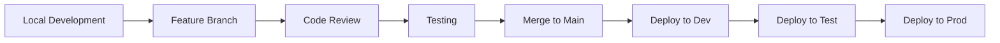

# Development Guide

Documentation for developers working with VMS, including setup, implementation guides, and best practices.

## Getting Started

- [Development Setup](setup.md) - Set up your local environment
- [Architecture Overview](../platform/architecture.md) - Understand the system
- [Quick Start Tutorial](quick-start.md) - Build your first feature

## Development Topics

### Implementation
- [Implementation Guide](implementation-guide.md) - Step-by-step development guide
- [Feature Backlog](feature-backlog.md) - Remaining features to implement
- [Code Examples](examples.md) - Common patterns and snippets

### Best Practices
- [Coding Standards](best-practices.md#coding-standards) - Code style and conventions
- [Testing Guide](testing.md) - Unit and integration testing
- [Performance](best-practices.md#performance) - Optimization guidelines
- [Security](best-practices.md#security) - Security best practices

### Reference
- [API Documentation](../integration/api-reference.md) - Service APIs
- [Data Model](data-model.md) - Entity relationships
- [Service Handlers](service-handlers.md) - Business logic patterns

## Technology Stack

### Core Technologies
- **Backend**: SAP CAP (Node.js)
- **Frontend**: SAP Fiori Elements / UI5
- **Database**: SAP HANA Cloud
- **Platform**: SAP BTP (Cloud Foundry)

### Development Tools
- **IDE**: Visual Studio Code
- **Version Control**: Git
- **Package Manager**: npm
- **Testing**: Jest / QUnit

## Project Structure

```
newvms/
├── app/              # Fiori applications
│   ├── vehicles/
│   ├── warrantyclaims/
│   └── ...
├── srv/              # CAP services
│   ├── vehicle-service.cds
│   ├── vehicle-service.js
│   └── ...
├── db/               # Data models
│   ├── vms.cds
│   ├── warranty.cds
│   └── data/        # CSV test data
├── package.json      # Project configuration
└── mta.yaml         # Deployment descriptor
```

## Common Tasks

### Creating a New Entity
1. Define entity in `/db/domain.cds`
2. Create service projection in `/srv/service.cds`
3. Implement handlers in `/srv/service.js`
4. Add test data in `/db/data/`
5. Create Fiori app in `/app/`

### Adding a Service Action
```javascript
// In service.cds
service MyService {
  entity MyEntity as projection on db.MyEntity;
  action myAction(param: String) returns String;
}

// In service.js
module.exports = cds.service.impl(async function() {
  this.on('myAction', async (req) => {
    const { param } = req.data;
    // Implementation
    return `Result: ${param}`;
  });
});
```

### Implementing Validation
```javascript
this.before('CREATE', 'Entity', async (req) => {
  if (!req.data.requiredField) {
    req.error(400, 'Required field missing');
  }
});
```

## Development Workflow



## Current Implementation Status

### Completed Modules (40%)
- ✅ Vehicle Management (80%)
- ✅ Warranty Management (90%)
- ✅ Budget Management (100%)
- ✅ Recall Campaigns (100%)

### In Progress
- 🚧 Service Operations (40%)
- 🚧 Customer Management (20%)

### Not Started
- ❌ Procurement & Sales (0%)
- ❌ Inventory Operations (0%)

See [Feature Backlog](feature-backlog.md) for detailed implementation tasks.

## Quick Links

### By Task
- [Set up environment](setup.md)
- [Implement a feature](implementation-guide.md)
- [Write tests](testing.md)
- [Deploy application](deployment.md)

### By Module
- [Vehicle Management](feature-backlog.md#vehicle-management)
- [Warranty Management](feature-backlog.md#warranty-management)
- [Procurement & Sales](feature-backlog.md#procurement-sales)
- [Inventory Operations](feature-backlog.md#inventory-operations)

## Getting Help

- Check [Troubleshooting](../support/troubleshooting.md)
- Review [FAQ](../support/faq.md)
- Contact the development team

## Contributing

1. Fork the repository
2. Create a feature branch
3. Implement your changes
4. Write tests
5. Submit a pull request

See [Contributing Guide](contributing.md) for details.