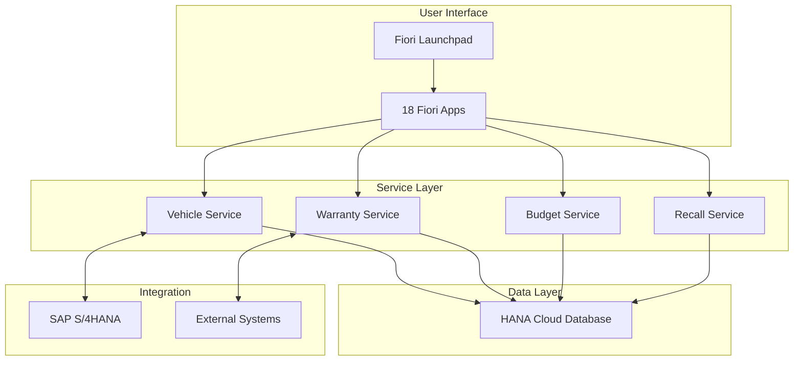

# Getting Started with VMS

Welcome to the Vehicle Management System. This guide will help you understand what VMS is and how to get started.

## What is VMS?

VMS is a comprehensive cloud-native platform for managing vehicle lifecycle, warranty operations, and dealer networks. Built on SAP Cloud Application Programming (CAP) model, it provides enterprise-grade reliability with modern user experiences.

## Who Uses VMS?

- **OEM After-Sales Departments** - Warranty and service operations
- **Dealer Networks** - Multi-brand dealer groups
- **Service Centers** - Workshop and repair facilities
- **Fleet Operators** - Commercial vehicle management

## Key Capabilities

### Vehicle Lifecycle Management
Track every vehicle from factory to end-of-life with complete digital history, including:
- Vehicle master data and specifications
- Ownership and registration
- Service history
- Warranty coverage
- Recall campaigns

### Warranty Processing
End-to-end warranty claim management with:
- Template-based claim creation
- Multi-level approval workflows
- Version control and audit trails
- Parts return management
- Financial integration

### Budget Management
Comprehensive financial allocation and tracking:
- Dealer budget distribution
- Performance-based allocation
- Approval workflows
- Variance analysis

### Recall Campaign Management
Safety and compliance excellence through:
- Bulk vehicle assignment
- Progress tracking
- Automated notifications
- Claim generation

## System Architecture Overview

## Next Steps

1. **[Installation Guide](installation.md)** - Set up your development environment
2. **[Quick Tour](quick-tour.md)** - Walk through the main features
3. **[User Guides](../user-guide/index.md)** - Learn how to use specific modules
4. **[Configuration](../configuration/index.md)** - Customize for your needs

## Quick Links

- [Create your first vehicle](quick-tour.md#first-vehicle)
- [Process a warranty claim](quick-tour.md#first-claim)
- [Set up a dealer budget](quick-tour.md#first-budget)
- [Configure custom fields](../configuration/custom-fields.md)

## Need Help?

- Check the [FAQ](../support/faq.md)
- Review [Troubleshooting](../support/troubleshooting.md)
- Contact [Support](../support/contact.md)