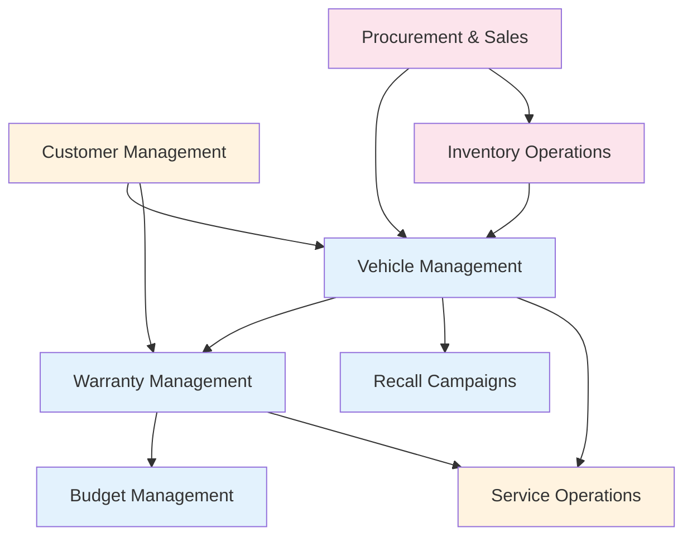

# Functional Modules

VMS is organized into functional modules that address specific business needs. Each module contains related applications, services, and business logic.

## Operational Modules

### [Vehicle Management](vehicle-management/index.md)
Core vehicle lifecycle management capabilities
- **Apps**: Vehicles
- **Features**: Master data, custom fields, document management

### [Warranty Management](warranty-management/index.md)
Complete warranty claim processing and management
- **Apps**: Claims, Templates, Versions, Origin, Parts Return
- **Features**: Claim processing, version control, template management

### [Budget Management](budget-management/index.md)
Financial allocation and tracking across dealer networks
- **Apps**: Budgets, Distribution, Adjustments, Calendar, Attributes
- **Features**: Budget allocation, dealer distribution, adjustment workflows

### [Recall Campaigns](recall-campaigns/index.md)
Safety recall and service campaign management
- **Apps**: Recall Campaigns
- **Features**: Campaign management, vehicle assignment, progress tracking

## Partially Implemented Modules

### [Service Operations](service-operations/index.md)
Service order and workshop management
- **Current**: Basic service tracking
- **Planned**: Full service order management, workshop scheduling

### [Customer Management](customer-management/index.md)
Customer and dealer relationship management
- **Current**: Partner integration via middleware
- **Planned**: Full CRM capabilities, customer portal

## Planned Modules

### [Procurement & Sales](procurement-sales/index.md)
Purchase orders, sales orders, and invoicing
- **Planned Features**: Purchase orders, sales orders, invoicing, quotations

### [Inventory Operations](inventory-operations/index.md)
Goods movements, stock management, and logistics
- **Planned Features**: Goods movements, stock tracking, shipping, delivery

## Module Integration

## Quick Navigation

### By Business Process
- **Vehicle Acquisition**: [Procurement & Sales](procurement-sales/index.md) → [Vehicle Management](vehicle-management/index.md)
- **Warranty Processing**: [Vehicle Management](vehicle-management/index.md) → [Warranty Management](warranty-management/index.md)
- **Service Delivery**: [Service Operations](service-operations/index.md) → [Warranty Management](warranty-management/index.md)
- **Financial Management**: [Budget Management](budget-management/index.md) → All modules

### By User Role
- **Vehicle Manager**: [Vehicle Management](vehicle-management/index.md), [Recall Campaigns](recall-campaigns/index.md)
- **Warranty Processor**: [Warranty Management](warranty-management/index.md)
- **Budget Manager**: [Budget Management](budget-management/index.md)
- **Service Advisor**: [Service Operations](service-operations/index.md)

## Implementation Roadmap

### Current State
- Core vehicle tracking
- Warranty claim processing
- Budget allocation
- Recall management

### Next Phase
- Purchase order management
- Sales order processing
- Basic inventory tracking
- Enhanced customer management

### Future Phases
- Full inventory operations
- Advanced service management
- Complete procurement cycle
- Analytics and reporting

## Module Dependencies

| Module | Depends On | Required By |
|--------|-----------|-------------|
| Vehicle Management | Master Data (SAP) | All modules |
| Warranty Management | Vehicle Management | Budget Management |
| Budget Management | None | None |
| Recall Campaigns | Vehicle Management | Service Operations |
| Service Operations | Vehicle Management | Warranty Management |
| Customer Management | Master Data (SAP) | All modules |
| Procurement & Sales | Vehicle, Customer | Inventory Operations |
| Inventory Operations | Procurement & Sales | Vehicle Management |

## Next Steps

- Explore individual module documentation for detailed functionality
- Review [Configuration Guide](../configuration/index.md) for setup instructions
- Check [User Guides](../user-guide/index.md) for usage instructions
- See [Development Guide](../development/feature-backlog.md) for implementation plans