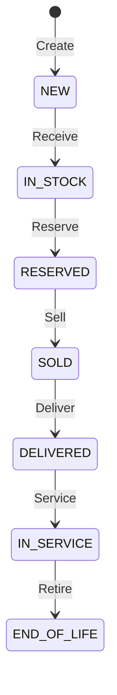

# Vehicle Management Module

## Overview

The Vehicle Management module provides comprehensive lifecycle management for vehicles from acquisition to end-of-life. It serves as the foundation for all other VMS modules.

## Current Status

- **Implementation**: 80% Complete
- **Applications**: 1 (Vehicles app)
- **Database Tables**: 4 main entities
- **Integration**: SAP Material Master

## Core Functionality

### Vehicle Master Data

Comprehensive vehicle information management including:

#### Key Fields
- **VIN** - 17-character vehicle identification number
- **License Plate** - Regional registration
- **Model** - Link to vehicle model master data
- **Model Year** - Manufacturing year
- **Engine Number** - Unique engine identifier

#### Status Management


### Custom Fields

Dynamic field extension without coding:
- Text fields (up to 255 characters)
- Number fields (with validation)
- Date fields
- Boolean flags
- Picklist values
- Multi-select lists

### Document Management

Centralized document storage:
- Purchase orders
- Registration documents
- Service records
- Images and photos
- Customer correspondence

### Text Management

Structured text handling:
- Internal notes
- Customer communications
- Service descriptions
- Damage reports
- Threading support

## Field Controls

Dynamic field visibility and editability based on:

### Status-Based Controls

| Field | NEW | IN_STOCK | SOLD | DELIVERED |
|-------|-----|----------|------|-----------|
| VIN | Mandatory | ReadOnly | ReadOnly | ReadOnly |
| License Plate | Optional | Optional | Mandatory | ReadOnly |
| Purchase Price | Mandatory | ReadOnly | ReadOnly | ReadOnly |
| Retail Price | Optional | Mandatory | ReadOnly | ReadOnly |
| Customer | Hidden | Hidden | Mandatory | ReadOnly |

### Role-Based Controls

| Role | Can Create | Can Edit | Can Delete | Can View All |
|------|-----------|----------|------------|--------------|
| Admin | ✅ | ✅ | ✅ | ✅ |
| Manager | ✅ | ✅ | ❌ | ✅ |
| Sales | ✅ | Limited | ❌ | ✅ |
| Viewer | ❌ | ❌ | ❌ | ✅ |

## Integration Points

### SAP S/4HANA Integration

#### Inbound Data (from SAP)
- Vehicle models (Material Master)
- Pricing information
- Business partners (dealers/customers)

#### Outbound Data (to SAP)
- Vehicle registrations
- Status updates
- Financial postings

### Internal Integration

Connected to other VMS modules:
- **Warranty Management** - Claim creation
- **Recall Campaigns** - Vehicle assignment
- **Budget Management** - Budget allocation
- **Service Operations** - Service history

## Business Rules

### Validation Rules

```javascript
// VIN Validation
- Must be exactly 17 characters
- Alphanumeric only (excluding I, O, Q)
- Must be unique in system
- Check digit validation

// Model Year Validation
- Cannot be more than 1 year in future
- Cannot be more than 10 years in past
- Must match model availability

// Status Transitions
- Cannot skip required statuses
- Cannot move backwards (except corrections)
- Certain transitions require approvals
```

### Automated Actions

1. **Warranty Activation**
   - Triggered when status = DELIVERED
   - Creates warranty record
   - Sets coverage period

2. **Recall Assignment**
   - Checks VIN against active campaigns
   - Auto-assigns to applicable recalls
   - Sends notifications

3. **Document Generation**
   - Auto-generates delivery documents
   - Creates registration forms
   - Produces warranty certificates

## User Interface

### Vehicles App

Main application for vehicle management:

#### List Report Features
- Advanced search and filter
- Export to Excel
- Mass update capability
- Quick actions

#### Object Page Features
- Complete vehicle details
- Document attachments
- Service history
- Warranty information
- Custom fields
- Action buttons

### Search Capabilities

- VIN search (partial match)
- License plate lookup
- Model filtering
- Status filtering
- Date range searches
- Custom field searches

## Configuration

### System Configuration

```yaml
Vehicle Settings:
  VIN_validation: strict
  duplicate_check: true
  status_workflow: standard
  document_retention: 7 years
  
Field Controls:
  use_dynamic_controls: true
  role_based_security: true
  status_based_visibility: true
  
Integration:
  sap_sync_frequency: real-time
  cache_duration: 24 hours
  batch_size: 1000
```

### Master Data Setup

Required master data:
- Vehicle models (from SAP)
- Dealers (Business Partners)
- Status codes
- Document types
- Text types
- Custom field definitions

## Reporting

### Standard Reports
- Vehicle inventory by status
- Vehicle aging report
- Model distribution
- Dealer allocation
- Custom field analysis

### Analytics
- Status transition times
- Average days in inventory
- Model popularity
- Seasonal trends

## Security

### Data Access
- Row-level security by dealer
- Field-level security by role
- Document access control
- Audit trail for all changes

### Compliance
- GDPR data handling
- VIN privacy protection
- Customer data encryption
- Retention policies

## Troubleshooting

### Common Issues

1. **Duplicate VIN Error**
   - Check for existing vehicle
   - Verify VIN format
   - Check archived vehicles

2. **Status Transition Blocked**
   - Verify required fields
   - Check user permissions
   - Review business rules

3. **Integration Sync Issues**
   - Check SAP connectivity
   - Verify mapping configuration
   - Review error logs

## Future Enhancements

### Planned Features
- Mobile app support
- Barcode/QR code scanning
- Image recognition for VIN
- Predictive maintenance alerts
- IoT device integration

### Under Consideration
- Blockchain for ownership tracking
- AI-powered damage assessment
- Automated valuation
- Virtual vehicle tours

## Related Documentation

- [User Guide - Vehicle Manager](../../user-guide/vehicle-manager.md)
- [Configuration - Custom Fields](../../configuration/custom-fields.md)
- [Integration - SAP S/4HANA](../../integration/sap-s4hana.md)
- [API Reference - Vehicle Service](../../integration/api-reference.md#vehicle-service)

## Next Steps

- Configure master data in [System Configuration](../../configuration/system.md)
- Set up custom fields in [Custom Fields Guide](../../configuration/custom-fields.md)
- Learn daily operations in [Vehicle Manager Guide](../../user-guide/vehicle-manager.md)
- Review integration needs in [Integration Guide](../../integration/index.md)