# System Architecture

## Overview

VMS follows a modern, cloud-native architecture built on SAP Cloud Application Programming (CAP) model with microservices design principles.

## Architecture Layers

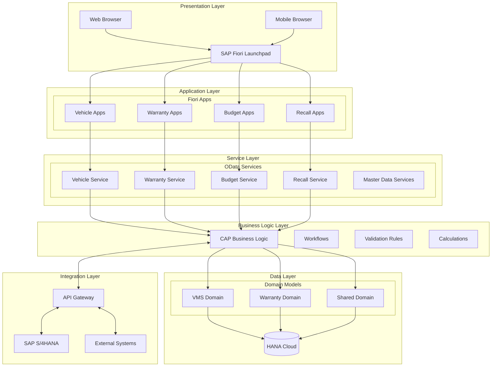

## Component Architecture

### Frontend Components

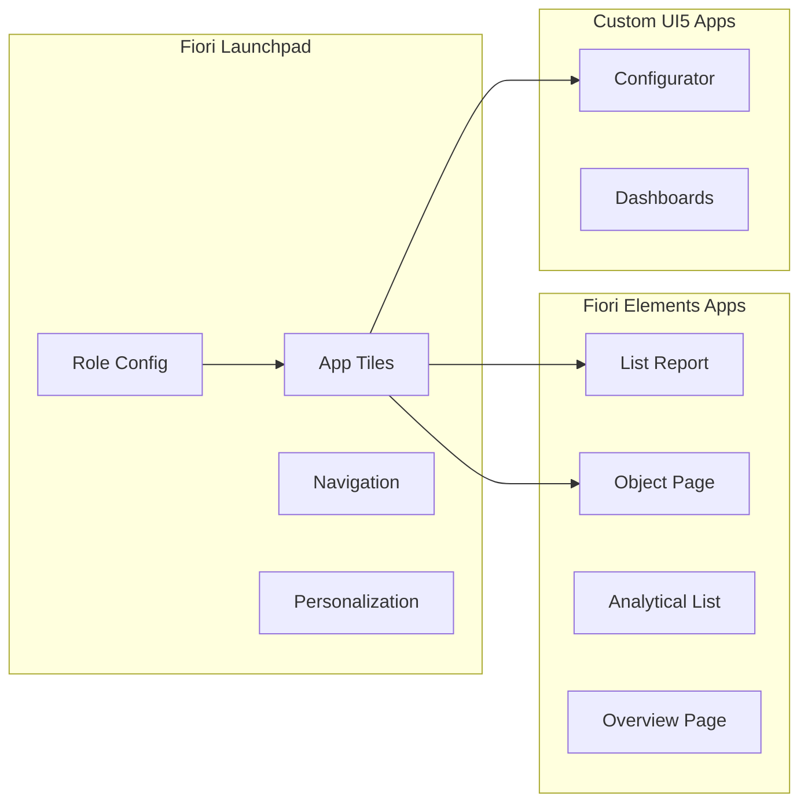

### Service Architecture

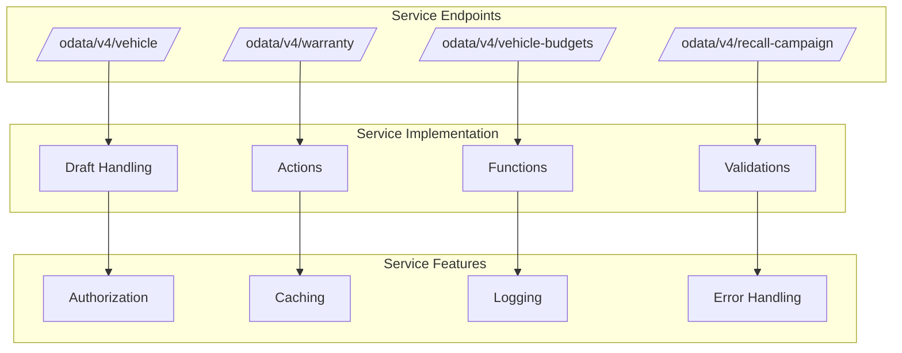

## Data Model Architecture

### Domain Structure

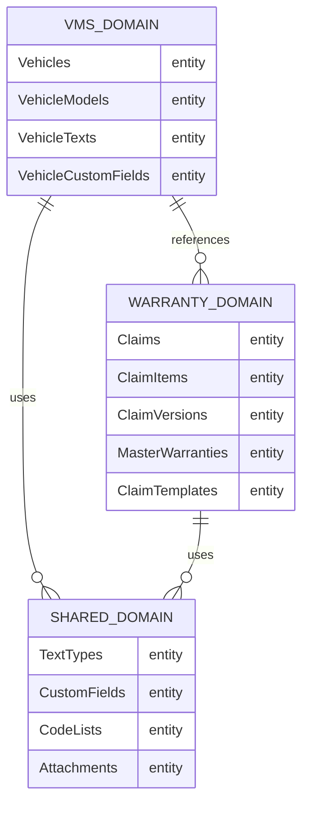

### Entity Relationships

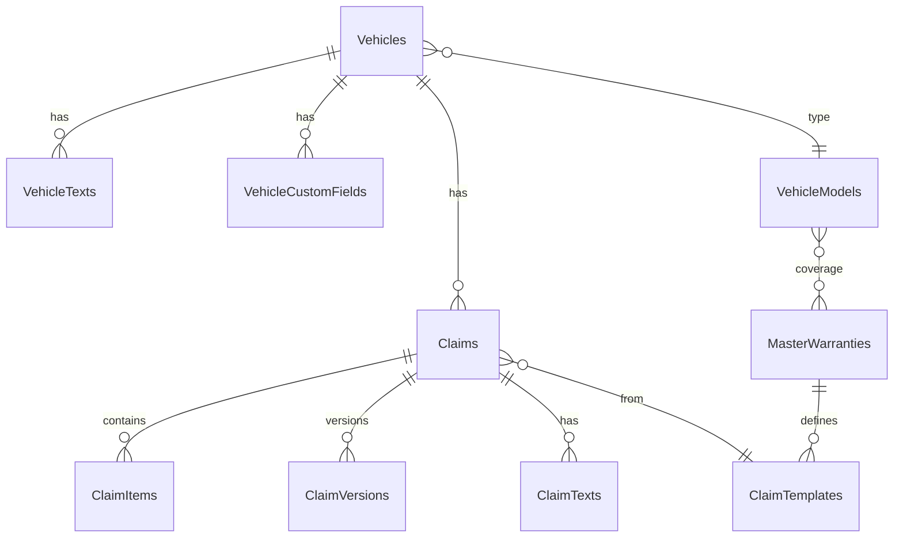

## Integration Architecture

### SAP S/4HANA Integration

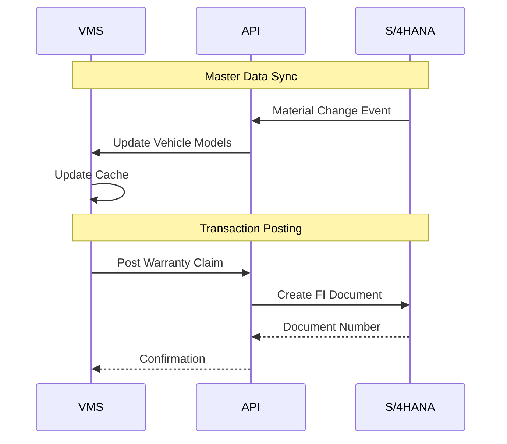

### External System Integration

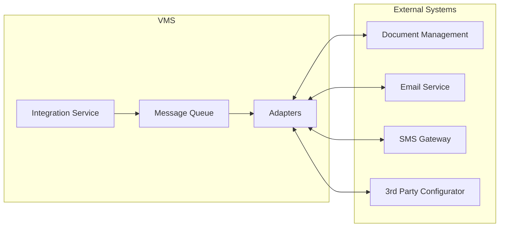

## Security Architecture

### Authentication & Authorization

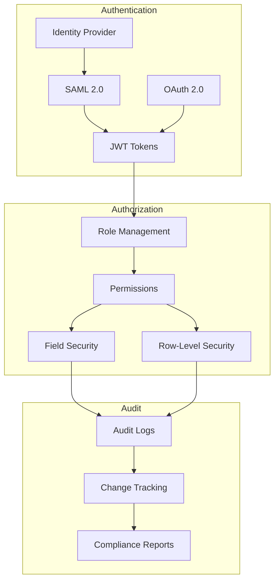

## Deployment Architecture

### Cloud Deployment

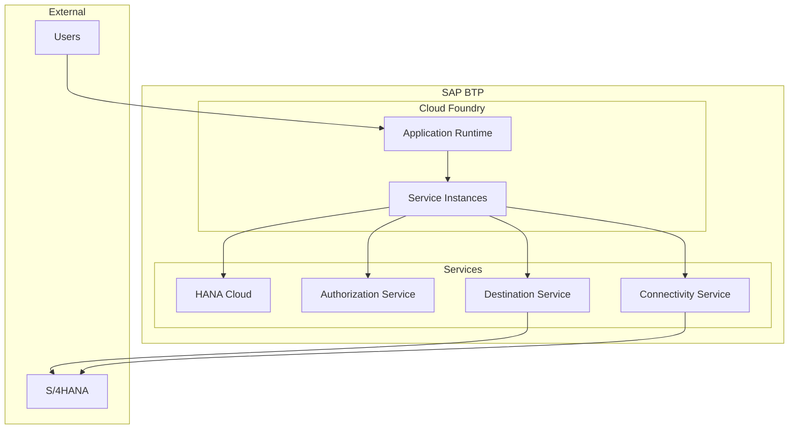

## Performance Architecture

### Caching Strategy

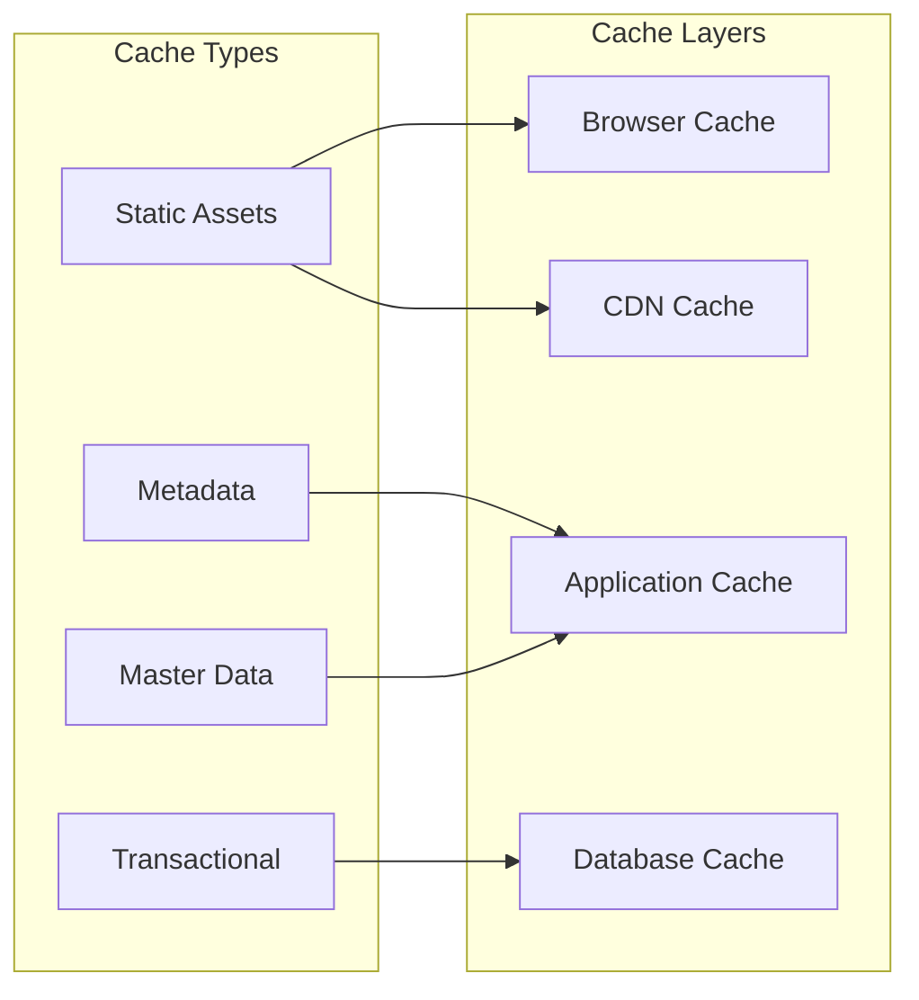

## Development Architecture

### Development Flow

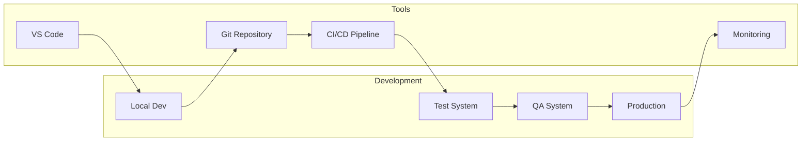

## Scalability Considerations

### Horizontal Scaling
- Stateless services enable easy scaling
- Load balancing across instances
- Database connection pooling
- Caching reduces database load

### Vertical Scaling
- HANA Cloud auto-scaling
- Dynamic resource allocation
- Performance monitoring
- Capacity planning

## Technology Decisions

### Why SAP CAP?
- Native SAP integration
- Built-in best practices
- Rapid development
- Enterprise features out-of-box

### Why HANA Cloud?
- In-memory performance
- Native CAP integration
- Advanced analytics
- Scalability

### Why Fiori Elements?
- Consistent UX
- Rapid development
- Responsive design
- Accessibility compliance

## Next Steps

- Review [Technology Stack](technology.md) for detailed technologies
- Check [Security & Compliance](security.md) for security details
- See [Development Guide](../development/index.md) for development setup
- Explore [Integration Guide](../integration/index.md) for integration patterns