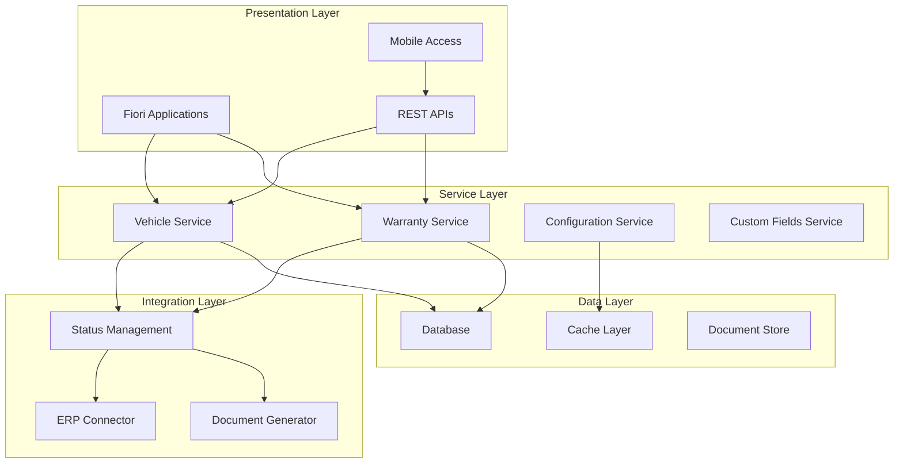

# System Architecture

## Overview

The Vehicle Management and Warranty System is built on SAP Cloud Application Programming (CAP) framework, providing enterprise-grade scalability, reliability, and extensibility. The microservices architecture ensures modularity while maintaining seamless integration between components.

## Technical Stack

### Core Framework
- **SAP CAP**: Cloud Application Programming framework
- **Node.js**: Runtime environment
- **CDS**: Core Data Services for data modeling
- **HANA/SQLite**: Database options
- **REST/OData**: API protocols

### Architecture Pattern

## Service Architecture

### Core Services
**VehicleService**
- Vehicle CRUD operations
- Budget management
- Configuration handling
- Search and filtering

**WarrantyService**
- Claim processing
- Campaign management
- Template operations
- Version control

**ConfigurationService**
- Option management
- Constraint resolution
- Template administration
- Session handling

**CustomFieldsService**
- Field definition
- Usage tracking
- Validation rules
- Search integration

### Integration Services
**Status Management**
- Third-party integration
- Document generation
- Workflow triggers
- Audit trails

**ERP Integration**
- Master data sync
- Search helps
- Order inquiry
- Financial posting

## Data Architecture

### Data Model Organization
- **Shared Entities**: Common across modules
- **Domain Entities**: Module-specific
- **Configuration**: System settings
- **Transactional**: Business operations

### Key Design Patterns
- **Composition**: Parent-child relationships
- **Association**: Cross-entity references
- **Aspects**: Reusable traits
- **Views**: Calculated projections

## API Design

### RESTful Services
- Resource-based URLs
- Standard HTTP verbs
- JSON payloads
- Pagination support

### OData Protocol
- Query capabilities
- Filtering and sorting
- Expand related entities
- Batch operations

## Security Architecture

### Authentication
- OAuth 2.0 support
- SAML integration
- JWT tokens
- Session management

### Authorization
- Role-based access
- Field-level controls
- Data segregation
- API security

## Scalability

### Horizontal Scaling
- Stateless services
- Load balancing
- Container deployment
- Auto-scaling

### Performance
- Database optimization
- Caching strategies
- Lazy loading
- Query optimization

## Deployment Options

### Cloud Platforms
- SAP BTP
- AWS
- Azure
- Google Cloud

### On-Premise
- Docker containers
- Kubernetes orchestration
- Traditional servers
- Hybrid deployment

## Integration Patterns

### Synchronous
- REST API calls
- Direct database access
- Real-time validation
- Immediate response

### Asynchronous
- Message queuing
- Event-driven updates
- Batch processing
- Scheduled jobs

## Monitoring

### Application Monitoring
- Performance metrics
- Error tracking
- Usage analytics
- Health checks

### Infrastructure
- Resource utilization
- Network monitoring
- Database performance
- Storage metrics

## Best Practices

1. **Service Isolation**: Maintain clear boundaries
2. **API Versioning**: Support backward compatibility
3. **Error Handling**: Comprehensive error management
4. **Logging**: Detailed audit trails
5. **Documentation**: API and service documentation

## Related Features

- [Security](/features/platform/security)
- [Integration](/features/platform/integrations)
- [Analytics](/features/platform/analytics)
- [Implementation](/features/platform/implementation)