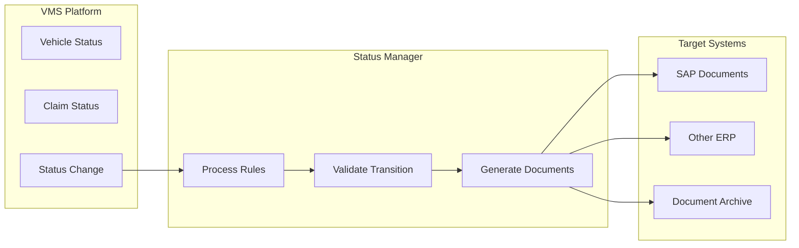

# Integration Capabilities

## Overview

The platform provides comprehensive integration capabilities to connect with existing enterprise systems. From ERP integration for master data to specialized status management systems, the platform ensures seamless data flow while maintaining system boundaries and data integrity.

## Third-Party Status Management

### Core Capabilities

The external status management integration provides:
- **Auditable Processing**: Complete history of all status transitions
- **Document Generation**: Automatic document creation in target systems
- **Multi-System Support**: SAP and other ERP platforms
- **Workflow Automation**: Trigger processes based on status changes
- **Compliance Documentation**: Full audit trails for regulatory requirements

### How It Works



### Integration Benefits
- Maintains existing business processes
- Ensures compliance with audit requirements
- Reduces manual document creation
- Provides real-time status synchronization
- Supports multiple target systems simultaneously

## ERP Integration

### Search Helps

Dynamic value lists from ERP master data:
- **Customer Search**: Find and validate customer records
- **Business Partners**: Dealer and vendor information
- **Sales Organizations**: Organizational structures
- **Material Master**: Parts and component data
- **Cost Centers**: Financial allocations

### Master Data Synchronization
- Real-time customer updates
- Business partner validation
- Material specifications
- Pricing information
- Currency and UOM tables

### Order Management
- Sales order inquiry
- Delivery tracking
- Invoice association
- Payment status
- Credit management

## SAP-Specific Integration

### Standard Integration Points
- **SD Module**: Sales and distribution
- **MM Module**: Materials management
- **FI Module**: Financial accounting
- **CO Module**: Controlling
- **PM Module**: Plant maintenance

### Data Exchange
- IDoc processing
- RFC function calls
- OData services
- Web service APIs
- File-based transfers

## API Framework

### REST APIs
All functionality exposed through RESTful services:
```
GET /api/vehicles/{id}
POST /api/claims
PUT /api/campaigns/{id}
DELETE /api/templates/{id}
```

### Authentication
- OAuth 2.0
- API key authentication
- Certificate-based auth
- SAML assertions
- JWT tokens

### Rate Limiting
- Request throttling
- Quota management
- Priority queuing
- Burst handling

## Integration Patterns

### Real-Time Integration
**Synchronous Processing**
- Immediate validation
- Instant updates
- Live queries
- Direct responses

Use Cases:
- Coverage verification
- Customer lookup
- Price calculation
- Status validation

### Batch Integration
**Scheduled Processing**
- Nightly synchronization
- Bulk updates
- Mass imports
- Report generation

Use Cases:
- Master data updates
- Financial posting
- Report distribution
- Archive processes

### Event-Driven Integration
**Asynchronous Updates**
- Status change notifications
- Webhook triggers
- Message queuing
- Event streaming

Use Cases:
- Claim approvals
- Campaign launches
- Document generation
- Alert notifications

## Document Generation

### Automated Creation
Documents generated in target systems:
- Purchase orders
- Service orders
- Credit memos
- Invoices
- Reports

### Document Types
- PDF generation
- XML exports
- CSV files
- EDI messages
- Custom formats

## Configuration

### Connection Setup
```yaml
ERP Connection:
  type: SAP
  host: erp.company.com
  client: 100
  credentials: secure-vault
  
Status Manager:
  endpoint: https://status.system.com
  authentication: OAuth2
  timeout: 30s
```

### Mapping Configuration
- Field mapping rules
- Value translations
- Unit conversions
- Code mappings
- Default values

## Error Handling

### Retry Logic
- Automatic retries
- Exponential backoff
- Dead letter queues
- Manual retry options

### Monitoring
- Connection health
- Transaction logs
- Error alerts
- Performance metrics

## Use Cases

### Daily Operations
- Vehicle registration in SAP
- Warranty claim posting
- Customer data updates
- Inventory synchronization

### Period-End Processing
- Financial reconciliation
- Report generation
- Data archival
- Audit trails

## Best Practices

1. **Connection Pooling**: Optimize resource usage
2. **Error Recovery**: Implement robust retry logic
3. **Data Validation**: Verify before sending
4. **Monitoring**: Track all integrations
5. **Documentation**: Maintain integration specs

## Related Features

- [Architecture](/features/platform/architecture)
- [Security](/features/platform/security)
- [Vehicle Management](/features/vehicle-management/core-records)
- [Warranty Processing](/features/warranty-management/claim-processing)