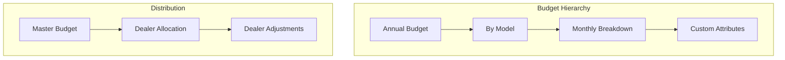

# Budget Management

## Overview

The comprehensive budget management system enables organizations to plan, allocate, and track vehicle inventories across multiple dimensions. From annual planning cycles to monthly dealer allocations, the system provides the tools needed to optimize vehicle distribution and monitor performance against targets.

## How It Works

### Budget Structure

Vehicle budgets operate on annual cycles with monthly granularity, tracking planned quantities across multiple categorization dimensions:

### Budget Types

The system supports four budget channels following the IC/IV/OC/OV model:
- **IC**: Incoming Claimant vehicles
- **IV**: Incoming Vendor vehicles
- **OC**: Outgoing Claimant vehicles
- **OV**: Outgoing Vendor vehicles

## Key Features

### Budget Planning
- Annual budget creation by model
- Monthly allocation across 12 months
- Six configurable attributes for categorization
- Version control for budget iterations
- Final version locking

### Dealer Distribution
- Allocate master budgets to dealers
- Percentage or unit-based distribution
- Monthly distribution planning
- Automatic variance calculation
- Distribution status tracking

### Dealer Adjustments
- Dealers request allocation changes
- Constraint validation against limits
- Audit trail of all adjustments
- Future workflow approval support
- Historical adjustment tracking

### Budget Analytics
- Real-time allocation status
- Variance analysis and reporting
- Dealer performance tracking
- Model-level aggregations
- Trend analysis over time

## Status Indicators

The system automatically calculates allocation status:
- **Not Allocated**: No dealer assignments made
- **Under Allocated**: Partial distribution completed
- **Fully Allocated**: Complete distribution achieved
- **Over Allocated**: Exceeds budget limits

## Configuration

### Attribute Configuration
Define up to six custom attributes:
1. Color variants
2. Equipment levels
3. Regional specifications
4. Customer segments
5. Sales channels
6. Special editions

### Calendar Configuration
- Configurable budget year start
- Custom month definitions
- Cutoff date management
- Planning horizon settings

## Benefits

- **Optimized Distribution**: Ensure vehicles go where demand exists
- **Dealer Empowerment**: Allow dealers to influence allocations
- **Performance Tracking**: Monitor actual vs planned performance
- **Flexibility**: Adapt to changing market conditions
- **Transparency**: Clear visibility for all stakeholders

## Use Cases

### Annual Planning
Setting yearly targets based on:
- Historical sales data
- Market analysis
- Production capacity
- Strategic objectives

### Monthly Operations
Managing monthly flow:
- Production scheduling alignment
- Seasonal adjustment handling
- Promotion planning
- Inventory balancing

### Dealer Management
Supporting dealer network:
- Fair allocation processes
- Performance-based adjustments
- Special request handling
- Regional balancing

## Analytics Views

### Budget vs Allocation
Compare planned budgets against actual allocations:
- Variance percentages
- Gap identification
- Trend analysis
- Predictive insights

### Dealer Performance
Track dealer-specific metrics:
- Allocation utilization
- Sales achievement
- Adjustment patterns
- Historical performance

## Related Features

- [Core Vehicle Records](/features/vehicle-management/core-records)
- [Dealer Distribution](/features/vehicle-management/dealer-distribution)
- [Vehicle Configuration](/features/vehicle-management/vehicle-configuration)
- [Analytics](/features/platform/analytics)