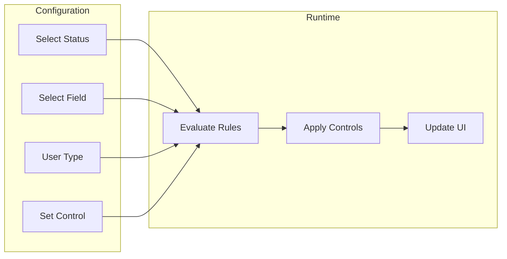

# Field Control System

## Overview

The field control system provides granular governance over vehicle data by controlling field visibility and editability based on vehicle status and user context. This ensures data integrity while enabling appropriate access for different user roles throughout the vehicle lifecycle.

## How It Works

Field controls operate through a configuration matrix that evaluates:
- Current vehicle status
- User type (internal vs external)
- Specific field requirements
- Business process stage

Based on these factors, each field receives a control value that determines its behavior in the user interface.

### Control Types

**Hidden (0)**
- Field is completely removed from the interface
- No data visible to the user
- Useful for sensitive or irrelevant information

**Read-Only (1)**
- Field is visible but cannot be edited
- Users can view but not modify data
- Common for historical or system-generated fields

**Optional (3)**
- Field is visible and editable
- User can choose to enter data
- Standard for most operational fields

**Mandatory (7)**
- Field must be completed before progression
- System enforces data entry
- Critical for compliance and process integrity

## Key Features

### Comprehensive Coverage
- Over 30 vehicle-level fields controllable
- Configuration-specific field controls
- Custom field control support
- Status-dependent rules

### User Differentiation
- Separate controls for internal users
- External user restrictions
- Role-based refinements
- Partner-specific limitations

### Status Integration
- Different controls per vehicle status
- Automatic control updates on status change
- Workflow-driven field requirements
- Progressive data completion

## Benefits

- **Data Integrity**: Prevent unauthorized modifications to critical data
- **Process Compliance**: Ensure required data is captured at appropriate stages
- **User Experience**: Show only relevant fields for each user's tasks
- **Security**: Protect sensitive information from unauthorized access
- **Flexibility**: Adapt to different business processes without code changes

## Configuration

### Field Control Setup

### Configuration Options
- Define controls by vehicle status
- Set user-type specific rules
- Configure field dependencies
- Create control templates

## Use Cases

### Sales Process
- Hide pricing fields from service users
- Make customer fields mandatory at sale
- Lock financial data after approval

### Service Operations
- Show only service-relevant fields
- Make mileage mandatory for service
- Hide sales information from technicians

### Compliance
- Enforce regulatory field requirements
- Protect personally identifiable information
- Maintain data quality standards

## Implementation Examples

### New Vehicle Registration
- VIN: Mandatory
- Customer: Mandatory
- Price: Optional (internal), Hidden (external)
- Status: Read-only

### In-Service Vehicle
- Mileage: Mandatory
- Service History: Read-only
- Next Service: Optional
- Financial Data: Hidden

## Related Features

- [Core Vehicle Records](/features/vehicle-management/core-records)
- [Custom Fields](/features/vehicle-management/custom-fields)
- [Vehicle Status Management](/features/platform/status-management)
- [Security and Compliance](/features/platform/security)