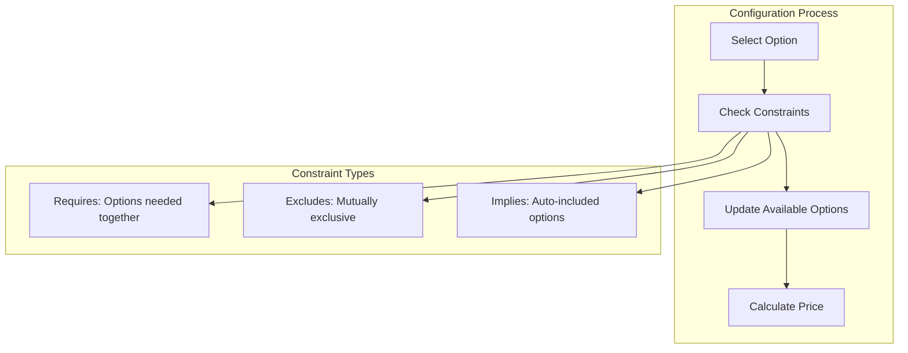

# Vehicle Configuration System

## Overview

The advanced vehicle configuration system manages complex option structures through templates and real-time constraint validation. This ensures valid vehicle configurations while supporting the full complexity of modern automotive options, from simple color choices to sophisticated powertrain combinations.

## How It Works

### Configuration Templates

Templates organize vehicle options into logical groups, defining the structure and rules for vehicle configuration:

- **Option Groups**: Categories like powertrain, exterior, interior, technology
- **Selection Types**: Single-select (one engine) or multi-select (multiple accessories)
- **Requirements**: Mandatory vs optional selections
- **Model Applicability**: Template variants for sedan, SUV, electric vehicles
- **Pricing Structure**: Base prices and option costs

### Constraint Resolution Engine

The system validates configurations in real-time through sophisticated constraint logic:



## Key Features

### Template Management
- Create model-specific templates
- Define option group hierarchies
- Set default selections
- Configure pricing rules
- Version control for templates

### Option Definition
- Readable codes and descriptions
- Individual option pricing
- Material associations for parts
- Metadata for additional properties
- Active/inactive status management

### Constraint System
- **Requires Constraints**: Panoramic roof requires sunshade
- **Excludes Constraints**: Manual transmission excludes adaptive cruise
- **Implies Constraints**: M Sport package includes sport suspension
- **Cascade Rules**: Changes propagate through related options
- **Validation Messages**: Clear explanations of invalid combinations

### Configuration Sessions
- Maintain configuration state
- Real-time validation feedback
- Running price calculation
- Save partial configurations
- Configuration comparison

## Benefits

- **Error Prevention**: Invalid combinations detected immediately
- **Guided Selling**: Constraints guide users to valid configurations
- **Pricing Accuracy**: Automatic calculation includes all dependencies
- **Flexibility**: Adapt to new models and options without code changes
- **Customer Satisfaction**: Clear understanding of option relationships

## Configuration Examples

### Powertrain Configuration
```
Engine Selection: 2.0T (implies automatic transmission)
  ├── Automatic Transmission (auto-selected)
  ├── All-Wheel Drive (optional)
  └── Sport Exhaust (requires sport package)
```

### Package Dependencies
```
M Sport Package selected:
  ├── Sport Suspension (included)
  ├── Aerodynamic Kit (included)
  ├── Sport Steering Wheel (included)
  └── Comfort Seats (excluded - conflicts)
```

## Third-Party Integration

The system integrates with external configuration tools:
- Import manufacturer configuration data
- Synchronize with configurator systems
- Validate against external rule engines
- Export configurations to order systems
- Characteristic name-value pair management

## Use Cases

### Sales Configuration
- Build customer vehicles with valid options
- Generate accurate quotes with all dependencies
- Compare different configuration scenarios

### Production Planning
- Validate buildable combinations
- Track popular option combinations
- Forecast parts requirements

### Service Operations
- Identify vehicle equipment for service
- Verify option-specific maintenance needs
- Track retrofit possibilities

## Related Features

- [Core Vehicle Records](/features/vehicle-management/core-records)
- [Custom Fields](/features/vehicle-management/custom-fields)
- [Budget Management](/features/vehicle-management/budget-management)
- [ERP Integration](/features/platform/integrations)