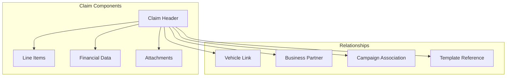

# Claim Processing

## Overview

The claim processing system provides end-to-end management of warranty claims from initial submission through final resolution. With comprehensive data capture, automatic validation, and complete audit trails, the system ensures accurate and efficient warranty operations while maintaining compliance requirements.

## How It Works

### Claim Structure

Claims follow a hierarchical structure with header information and detailed line items:

### Core Claim Data
- **Claim Number**: Auto-generated unique identifier
- **Authorization Number**: Approval reference
- **Partner Information**: Dealer/service center details
- **Date Tracking**: Registration, repair, and damage dates
- **Usage Metrics**: Mileage and operating hours
- **Status Flags**: Manual, closed, active, pricing complete

## Key Features

### Claim Classification
Multiple classification dimensions organize claims:
- **Claim Type**: Warranty category classification
- **Claim Group**: Functional grouping
- **Coverage Type**: Specific coverage application
- **Origin**: Source of claim initiation
- **Status**: Current processing state

### Line Item Management
Each claim supports multiple line items with:
- Material type and specifications
- Quantity and unit of measure
- Four-way financial tracking (IC/IV/OC/OV)
- Causal part identification
- Return flag management
- Pricing completion status

### Financial Model
The IC/IV/OC/OV financial structure tracks:
- **IC (Incoming Claimant)**: Costs from claimant
- **IV (Incoming Vendor)**: Vendor charges
- **OC (Outgoing Claimant)**: Claimant payments
- **OV (Outgoing Vendor)**: Vendor payments

This model provides complete cost transparency and margin analysis.

### Validation System
Automatic validation ensures claim accuracy:
- Coverage eligibility verification
- Date and mileage range checking
- Required field completion
- Business rule evaluation
- Documentation requirements

## Benefits

- **Accuracy**: Validation reduces errors and rejections
- **Efficiency**: Streamlined processing saves time
- **Transparency**: Complete visibility into claim status
- **Compliance**: Audit trails meet regulatory requirements
- **Financial Control**: Detailed cost tracking and analysis

## Processing Workflow

### Claim Creation
1. Select vehicle and verify coverage
2. Choose template or create manual claim
3. Enter repair details and parts
4. Attach required documentation
5. Submit for processing

### Approval Flow
1. Automatic validation checks
2. Route based on value and type
3. Review by appropriate authority
4. Request additional information if needed
5. Approve, reject, or return for modification

### Completion
1. Final pricing calculation
2. Payment authorization
3. Parts return processing if required
4. Claim closure
5. Archive for audit trail

## Integration Points

### Vehicle Integration
- Automatic vehicle data population
- Coverage verification from vehicle record
- Service history access
- Mileage validation

### ERP Integration
- Business partner validation
- Material master synchronization
- Financial posting preparation
- Document generation

## Use Cases

### Service Centers
- Quick claim creation from templates
- Real-time coverage verification
- Documentation upload from mobile
- Status tracking for customer updates

### Warranty Administrators
- Claim review and approval
- Pattern analysis for quality issues
- Financial reconciliation
- Audit report generation

### Manufacturers
- Coverage validation
- Cost analysis
- Quality tracking
- Dealer performance monitoring

## Related Features

- [Claim Templates](/features/warranty-management/claim-templates)
- [Version Management](/features/warranty-management/version-management)
- [Field Controls](/features/warranty-management/field-controls)
- [Master Warranty](/features/warranty-management/master-warranty)