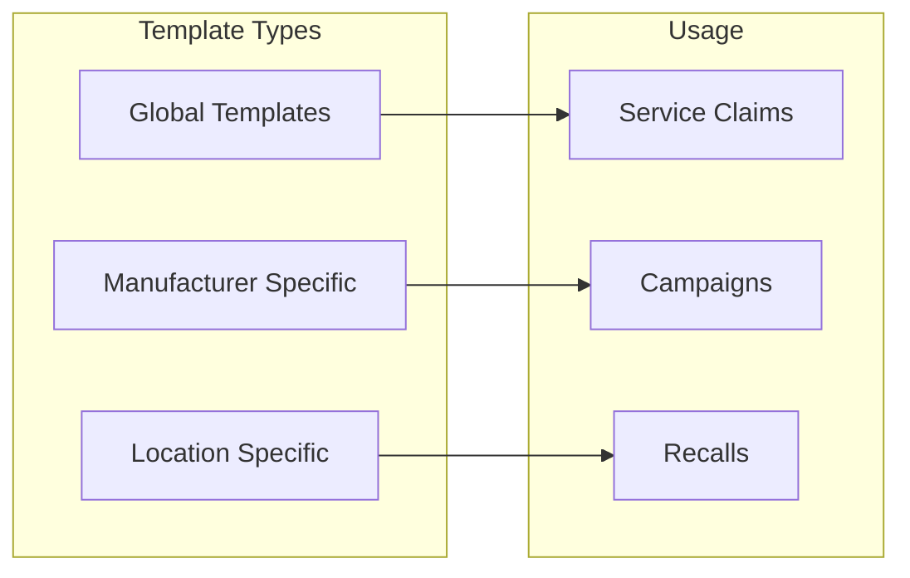

# Claim Templates

## Overview

Claim templates streamline warranty processing by providing pre-configured claim structures for common repair scenarios. Service advisors can quickly create accurate claims by selecting appropriate templates that automatically populate standard information, reducing data entry time and minimizing errors.

## How It Works

Templates store complete claim configurations that can be reused across multiple claims. When selected, the template populates:
- Claim classifications (type, group, coverage)
- Standard line items with parts and labor
- Financial allocations
- Documentation requirements
- Processing instructions

### Template Hierarchy

## Key Features

### Template Components
- **Identification**: Template ID and description
- **Classifications**: Pre-set claim type, group, and status
- **Line Items**: Standard materials and quantities
- **Financial Defaults**: Cost allocations and pricing
- **Instructions**: Processing notes and requirements

### Template Management
- Create new templates from scratch
- Copy from existing claims
- Version control for changes
- Active/inactive status
- Usage tracking and analytics

### Dual Purpose
Templates serve two primary functions:
1. **Individual Claims**: Quick creation of service claims
2. **Campaign Foundation**: Base for recall and service campaigns

## Benefits

- **Speed**: Reduce claim creation time by 70%
- **Accuracy**: Eliminate common data entry errors
- **Consistency**: Standardize claim processing
- **Training**: Simplify new employee onboarding
- **Compliance**: Ensure required information captured

## Template Categories

### Common Repair Templates
**Oil Service**
- Standard oil change items
- Labor time allocations
- Filter replacements
- Disposal fees

**Brake Service**
- Pad replacement parts
- Rotor specifications
- Labor operations
- Safety inspections

**Battery Replacement**
- Battery specifications
- Installation labor
- Testing procedures
- Disposal handling

### Warranty-Specific Templates
**Powertrain Claims**
- Engine components
- Transmission items
- Diagnostic requirements
- Extended warranty coverage

**Electrical System**
- Component listings
- Diagnostic procedures
- Programming requirements
- Technical bulletins

**Emissions Warranty**
- Covered components
- Test requirements
- Regulatory compliance
- Documentation needs

## Configuration

### Template Creation
1. Define template identity and description
2. Set claim classifications
3. Add standard line items
4. Configure financial defaults
5. Specify documentation requirements
6. Activate for use

### Template Optimization
- Analyze usage patterns
- Identify frequently modified fields
- Update based on claim success rates
- Remove obsolete templates
- Consolidate similar templates

## Use Cases

### Service Operations
- Routine maintenance claims
- Common repair patterns
- Seasonal service campaigns
- Preventive maintenance programs

### Recall Management
- Campaign claim generation
- Standardized repair procedures
- Consistent cost tracking
- Compliance documentation

### Training
- New technician education
- Process standardization
- Best practice enforcement
- Error reduction

## Best Practices

1. **Regular Review**: Update templates based on changes
2. **Naming Standards**: Use clear, descriptive names
3. **Documentation**: Include usage instructions
4. **Access Control**: Limit creation to trained users
5. **Performance Monitoring**: Track template effectiveness

## Related Features

- [Claim Processing](/features/warranty-management/claim-processing)
- [Recall Campaigns](/features/warranty-management/recall-campaigns)
- [Master Warranty](/features/warranty-management/master-warranty)
- [Version Management](/features/warranty-management/version-management)