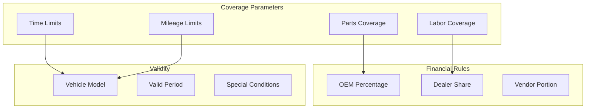

# Master Warranty Profiles

## Overview

Master Warranty Profiles define coverage parameters that automatically determine claim eligibility. By establishing time and mileage-based coverage rules, financial responsibilities, and inclusion specifications, the system validates warranty coverage instantly without manual verification.

## How It Works

### Profile Structure

Each warranty profile contains:


## Key Features

### Coverage Definition
- **Time-Based Coverage**: Min/max days from purchase
- **Mileage-Based Coverage**: Min/max mileage ranges
- **Parts Inclusion**: Coverage for replacement parts
- **Labor Inclusion**: Coverage for repair labor
- **Combined Criteria**: Time AND mileage requirements

### Financial Configuration
Split financial responsibility:
- **OEM Share**: Manufacturer contribution percentage
- **Dealer Share**: Dealer responsibility portion
- **Vendor Share**: Third-party vendor allocation
- Total must equal 100% for valid configuration

### Profile Management
- Link to specific vehicle models
- Set temporal validity periods
- Define special conditions
- Version control for changes
- Active/inactive status

## Profile Types

### Basic Warranty
**New Vehicle Coverage**
- 3 years or 36,000 miles
- Parts and labor included
- 100% OEM coverage
- Standard terms

### Powertrain Warranty
**Extended Coverage**
- 5 years or 60,000 miles
- Engine and transmission only
- Parts and labor included
- 100% OEM coverage

### Certified Pre-Owned
**Used Vehicle Programs**
- 2 years from certification
- Unlimited mileage
- Selected components
- Split coverage (OEM/Dealer)

### Extended Service Plans
**Additional Protection**
- Various term options
- Mileage limits
- Component selection
- Third-party backed

## Benefits

- **Automation**: Instant coverage determination
- **Accuracy**: Eliminate manual verification errors
- **Consistency**: Uniform coverage application
- **Flexibility**: Multiple profile configurations
- **Transparency**: Clear coverage parameters

## Coverage Validation

### Automatic Checks
When a claim is submitted:
1. Identify applicable warranty profiles
2. Check vehicle age against time limits
3. Verify mileage within parameters
4. Confirm parts/labor inclusion
5. Calculate financial splits

### Validation Results
- **Covered**: Full coverage confirmed
- **Partial**: Limited coverage available
- **Expired**: Outside coverage parameters
- **Not Applicable**: No matching profile

## Configuration Examples

### Standard Warranty
```yaml
Profile: NEW_VEHICLE_BASIC
Description: "3 Year/36,000 Mile Basic Warranty"
Vehicle Model: All Models
Coverage:
  Min Days: 0
  Max Days: 1095
  Min Mileage: 0
  Max Mileage: 36000
  Include Parts: Yes
  Include Labor: Yes
Financial Split:
  OEM: 100%
  Dealer: 0%
  Vendor: 0%
Valid From: 2024-01-01
Valid To: 2025-12-31
```

### Split Coverage
```yaml
Profile: CERTIFIED_PREOWNED
Description: "CPO Comprehensive Coverage"
Vehicle Model: Luxury Lines
Coverage:
  Min Days: 0
  Max Days: 730
  Min Mileage: 0
  Max Mileage: Unlimited
  Include Parts: Yes
  Include Labor: Yes
Financial Split:
  OEM: 60%
  Dealer: 40%
  Vendor: 0%
```

## Use Cases

### Claim Processing
- Automatic coverage verification
- Financial responsibility calculation
- Rejection reason documentation
- Override justification

### Financial Planning
- Warranty reserve calculations
- Cost allocation planning
- Dealer agreement management
- Third-party negotiations

### Customer Service
- Coverage explanation
- Eligibility confirmation
- Extension offerings
- Upgrade opportunities

## Integration

### Vehicle Management
- Link profiles to vehicle models
- Track coverage by vehicle
- Monitor expiration dates
- Alert for expiring coverage

### Claim Processing
- Real-time validation
- Automatic split calculation
- Coverage reason codes
- Exception handling

## Best Practices

1. **Clear Definitions**: Document coverage clearly
2. **Regular Updates**: Adjust for model changes
3. **Communication**: Inform dealers of changes
4. **Monitoring**: Track profile effectiveness
5. **Compliance**: Ensure regulatory alignment

## Related Features

- [Claim Processing](/features/warranty-management/claim-processing)
- [Vehicle Management](/features/vehicle-management/core-records)
- [Financial Tracking](/features/warranty-management/financial-tracking)
- [Field Controls](/features/warranty-management/field-controls)