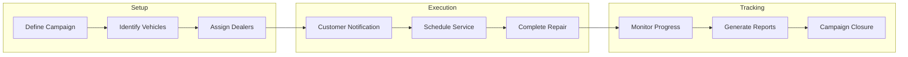

# Recall Campaigns

## Overview

The recall campaign system manages the complete lifecycle of vehicle recalls and service campaigns. From initial campaign definition through completion tracking, the system orchestrates complex multi-vehicle operations while maintaining compliance with regulatory requirements and providing real-time visibility into campaign progress.

## How It Works

### Campaign Lifecycle

## Key Features

### Campaign Definition
- **Campaign Number**: Auto-generated identifier
- **Title and Description**: Clear campaign communication
- **Affected Parts**: Specific component identification
- **Priority Levels**: Urgency classification
- **Regulatory References**: Compliance tracking
- **Campaign Types**: Mandatory recalls vs voluntary service

### Vehicle Assignment
- VIN range selection
- Model year targeting
- Build date criteria
- Component serial numbers
- Geographic restrictions
- Custom selection criteria

### Dealer Management
- Automatic dealer assignment
- Capacity planning
- Workload distribution
- Performance tracking
- Communication tools

### Progress Monitoring
Real-time tracking includes:
- Total affected vehicles
- Notification status
- Scheduled appointments
- Completion rates
- Outstanding vehicles
- Performance metrics

## Campaign Types

### Safety Recalls
**Mandatory Compliance**
- Regulatory mandated
- Safety-critical issues
- Priority scheduling
- Legal documentation
- Completion enforcement

### Service Campaigns
**Quality Improvements**
- Voluntary programs
- Customer satisfaction
- Preventive measures
- Product enhancements
- Goodwill gestures

### Regional Campaigns
**Geographic Specific**
- Climate-related issues
- Local regulations
- Market-specific problems
- Limited distribution
- Targeted solutions

## Benefits

- **Compliance**: Meet regulatory requirements
- **Efficiency**: Streamline campaign execution
- **Visibility**: Real-time progress tracking
- **Cost Control**: Accurate financial tracking
- **Customer Safety**: Rapid issue resolution

## Campaign Execution

### Setup Phase
1. Create campaign with details
2. Define affected vehicle criteria
3. Select claim template
4. Assign to dealers
5. Set completion targets

### Customer Engagement
1. Generate notification letters
2. Send communications (mail, email, SMS)
3. Track delivery confirmation
4. Follow-up reminders
5. Schedule appointments

### Service Completion
1. Vehicle arrives for service
2. Verify campaign applicability
3. Perform required repairs
4. Generate warranty claim
5. Update completion status

## Tracking and Analytics

### Progress Metrics
- **Response Rate**: Customer engagement levels
- **Completion Velocity**: Daily/weekly completion rates
- **Dealer Performance**: Location-specific metrics
- **Time to Complete**: Average resolution time
- **Cost Analysis**: Total campaign expenses

### Reporting
- Regulatory compliance reports
- Dealer performance summaries
- Customer response analytics
- Financial impact assessment
- Trend analysis

## Integration

### Claim Processing
- Automatic claim generation
- Template-based standardization
- Cost allocation
- Financial tracking

### Customer Communication
- Multi-channel notifications
- Personalized messaging
- Language localization
- Delivery tracking

### Regulatory Compliance
- Authority reporting
- Documentation requirements
- Audit trail maintenance
- Evidence collection

## Use Cases

### Manufacturer Recalls
- Safety defect resolution
- Component failure addressing
- Software update deployment
- Emissions compliance

### Dealer Programs
- Preventive maintenance campaigns
- Customer retention programs
- Satisfaction improvements
- Loyalty initiatives

### Fleet Management
- Systematic fleet updates
- Compliance maintenance
- Safety programs
- Cost optimization

## Best Practices

1. **Clear Communication**: Use simple, direct language
2. **Rapid Response**: Launch campaigns quickly
3. **Complete Documentation**: Maintain thorough records
4. **Customer Focus**: Prioritize convenience
5. **Continuous Monitoring**: Track progress daily

## Related Features

- [Claim Templates](/features/warranty-management/claim-templates)
- [Claim Processing](/features/warranty-management/claim-processing)
- [Vehicle Management](/features/vehicle-management/core-records)
- [Analytics](/features/platform/analytics)