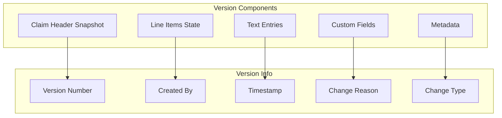

# Version Management

## Overview

The version management system maintains a complete, immutable history of all warranty claim changes. Every modification creates a new version snapshot, providing comprehensive audit trails for compliance, dispute resolution, and process improvement.

## How It Works

### Version Creation

Each claim modification triggers automatic version creation:



## Key Features

### Complete Snapshots
Each version captures:
- Full claim header data
- All line items with details
- Text entries and notes
- Custom field values
- Related references

### Version Metadata
- **Version Number**: Sequential identifier
- **Created By**: User making changes
- **Created On**: Exact timestamp
- **Change Reason**: Description of modifications
- **Change Type**: Created, Modified, or Deleted

### Line Item Tracking
- Original item references
- Change identification
- Addition/removal tracking
- Modification history
- Quantity/price changes

## Benefits

- **Compliance**: Complete audit trail for regulations
- **Dispute Resolution**: Evidence of claim evolution
- **Process Analysis**: Understanding modification patterns
- **Training**: Learning from claim corrections
- **Quality Control**: Identifying error sources

## Version Comparison

### Side-by-Side Analysis

The comparison feature enables:
1. Select two versions
2. Display differences
3. Highlight changes
4. Show addition/deletions
5. Export comparison report

### Change Categories
- **Header Changes**: Basic claim information
- **Financial Changes**: Amount modifications
- **Item Changes**: Parts and labor updates
- **Status Changes**: Workflow progression
- **Text Changes**: Note modifications

## Use Cases

### Audit Requirements
- Regulatory compliance documentation
- Internal audit support
- External audit evidence
- Process verification
- Control validation

### Dispute Resolution
- Customer claim disputes
- Dealer disagreements
- Manufacturer challenges
- Financial reconciliation
- Coverage determinations

### Process Improvement
- Error pattern identification
- Training needs assessment
- Workflow optimization
- Quality metrics
- Efficiency analysis

## Version Types

### System Versions
**Automatic Creation**
- Status changes
- Approval actions
- System calculations
- Integration updates

### User Versions
**Manual Modifications**
- Data corrections
- Information updates
- Document additions
- Note entries

### Integration Versions
**External Updates**
- ERP synchronization
- Status management
- Document generation
- Payment processing

## Implementation

### Storage Strategy
- Immutable version records
- Compressed storage
- Indexed for retrieval
- Archived after retention

### Performance
- Efficient version creation
- Fast comparison engine
- Optimized queries
- Bulk version operations

## Comparison Features

### Visual Comparison
```
Version 3                    Version 5
---------                    ---------
Status: Submitted     →      Status: Approved
Amount: $500.00       →      Amount: $475.00
Parts: 3              →      Parts: 4
Labor: 2.5 hrs        →      Labor: 2.0 hrs
```

### Comparison Report
- Summary of changes
- Detailed field differences
- User and timestamp
- Business impact
- Approval chain

## Best Practices

1. **Change Documentation**: Always provide reason
2. **Regular Reviews**: Audit version patterns
3. **Training**: Educate on version importance
4. **Retention**: Define version retention periods
5. **Access Control**: Limit version viewing appropriately

## Technical Details

### Version Storage
- Dedicated version tables
- JSON difference tracking
- Relationship preservation
- Index optimization

### Retrieval
- Version by number
- Versions by date range
- Versions by user
- Latest version
- Change type filtering

## Related Features

- [Claim Processing](/features/warranty-management/claim-processing)
- [Field Controls](/features/warranty-management/field-controls)
- [Security](/features/platform/security)
- [Analytics](/features/platform/analytics)