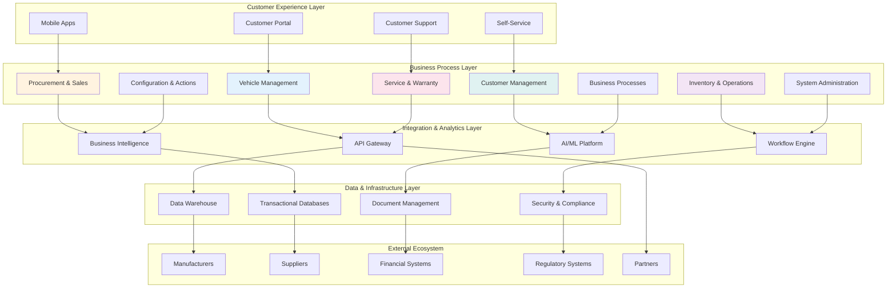
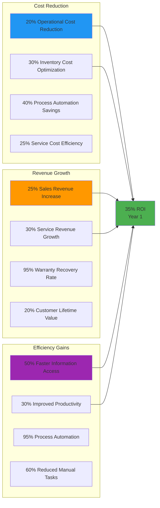
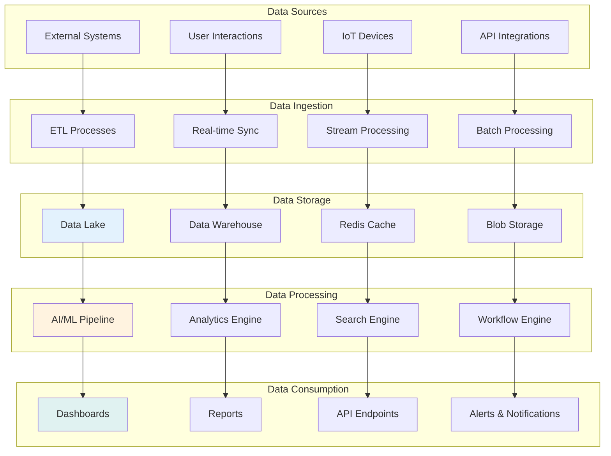
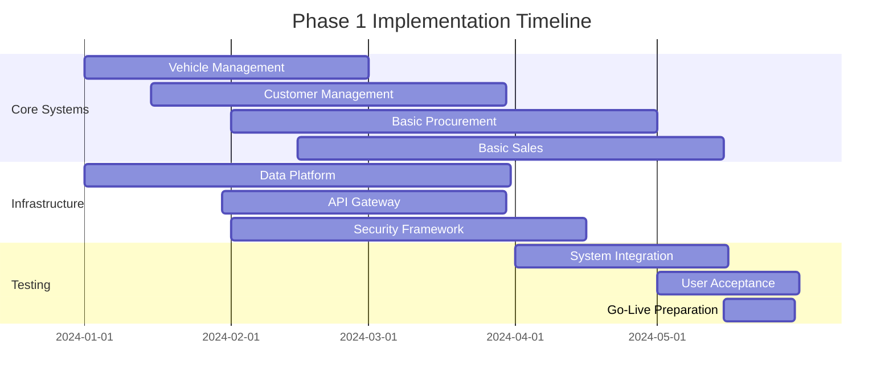

# Vehicle Management System (VMS) - Functional Documentation

## Executive Summary

This comprehensive documentation defines the functional requirements and business architecture for a next-generation Vehicle Management System (VMS) designed to revolutionize automotive retail and service operations. The system integrates vehicle lifecycle management, customer relationships, procurement processes, sales operations, service management, and warranty administration into a unified, intelligent platform.

## System Architecture Overview

## Core Business Modules

### 🚗 [Vehicle Management](vms/vehicle-management/)
**Foundation of the VMS ecosystem providing comprehensive vehicle data management**

- **[Master Data](vms/vehicle-management/master-data.md)** - Central vehicle information repository
- **[Vehicle Models](vms/vehicle-management/vehicle-models.md)** - Model specifications and configuration management
- **[Vehicle Search](vms/vehicle-management/vehicle-search.md)** - Advanced search and discovery capabilities
- **[Vehicle Overview](vms/vehicle-management/vehicle-overview.md)** - Comprehensive vehicle dashboard
- **[Vehicle Details](vms/vehicle-management/vehicle-details.md)** - Detailed information management

**Business Impact**: Single source of truth for vehicle data, enabling 99%+ data accuracy and 50% faster information access

### 🛒 [Procurement & Sales](vms/procurement-sales/)
**Complete business cycle from supplier procurement to customer delivery**

- **[Procurement Overview](vms/procurement-sales/procurement-overview.md)** - Strategic supplier and procurement management
- **[Purchase Orders](vms/procurement-sales/purchase-orders.md)** - Comprehensive order lifecycle management
- **[Incoming Invoices](vms/procurement-sales/incoming-invoices.md)** - Automated supplier invoice processing
- **[Sales Overview](vms/procurement-sales/sales-overview.md)** - End-to-end sales management
- **[Reservations & Quotations](vms/procurement-sales/reservations-quotations.md)** - Customer pricing and reservation management
- **[Sales Orders](vms/procurement-sales/sales-orders.md)** - Order processing and fulfillment
- **[Outgoing Invoices](vms/procurement-sales/outgoing-invoices.md)** - Customer billing and payment processing
- **[Document Assignment](vms/procurement-sales/document-assignment.md)** - Vehicle allocation and assignment

**Business Impact**: 25% improvement in procurement efficiency, 30% increase in sales conversion rates

### 👥 [Customer Management](vms/customer-management/)
**Unified relationship management for all business partners and customers**

- **[Vendor & Customer Management](vms/customer-management/vendor-customer.md)** - Comprehensive relationship management
- **[End Customer Management](vms/customer-management/end-customer.md)** - Specialized retail customer focus

**Business Impact**: 40% improvement in customer satisfaction, 25% increase in customer lifetime value

### 📦 [Inventory & Operations](vms/inventory-operations/)
**Optimized inventory management and operational excellence**

- **[Make-to-Stock](vms/inventory-operations/make-to-stock.md)** - Demand-driven inventory strategies
- **[Make-to-Order](vms/inventory-operations/make-to-order.md)** - Custom build and configuration management
- **[Goods Movements](vms/inventory-operations/goods-movements.md)** - Comprehensive movement tracking
- **[Shipping & Delivery](vms/inventory-operations/shipping-delivery.md)** - Transportation and logistics optimization
- **[Rework Processes](vms/inventory-operations/rework-processes.md)** - Value recovery through refurbishment

**Business Impact**: 30% reduction in inventory costs, 95%+ on-time delivery performance

### 🔧 [Service & Warranty](vms/service-warranty/)
**Excellence in customer service and warranty management**

- **[Service Processing](vms/service-warranty/service-processing.md)** - Comprehensive service operations
- **[Warranty Claims](vms/service-warranty/warranty-claims.md)** - Maximized warranty recovery
- **[Warranty Display](vms/service-warranty/warranty-display.md)** - Transparent customer warranty information

**Business Impact**: 95%+ warranty claim approval rates, 90%+ customer service satisfaction

### ⚙️ Configuration & Actions *(Planned)*
**Vehicle configuration management and business action automation**

### 📋 Business Processes *(Planned)*
**Core business process automation and optimization**

### ⚡ System Administration *(Planned)*
**Technical integration and system management capabilities**

## Business Value Proposition

### Financial Impact

### Customer Experience Excellence
- **360° Customer View** - Complete customer journey visibility and personalization
- **24/7 Self-Service** - Always-available customer portal and mobile applications
- **Real-Time Transparency** - Live status updates for orders, service, and warranty
- **Proactive Communication** - AI-driven recommendations and notifications

### Operational Excellence
- **Process Automation** - Intelligent automation reducing manual effort by 60%
- **Data-Driven Decisions** - Real-time analytics and predictive insights
- **Quality Assurance** - 99%+ accuracy rates across all business processes
- **Scalable Architecture** - Cloud-native design supporting unlimited growth

## Data Flow Architecture

## Technology Stack

### Frontend Technologies
- **Web Applications** - React/Angular with responsive design
- **Mobile Applications** - Native iOS/Android with React Native/Flutter
- **Progressive Web Apps** - Offline-capable web applications
- **Voice Interfaces** - Alexa/Google Assistant integration

### Backend Technologies
- **Microservices Architecture** - Container-based scalable services
- **API Gateway** - Centralized API management and security
- **Message Queue** - Asynchronous processing with Kafka/RabbitMQ
- **Workflow Engine** - Business process automation

### Data Technologies
- **Cloud Data Warehouse** - Snowflake/BigQuery for analytics
- **Operational Database** - PostgreSQL/MongoDB for transactions
- **Search Engine** - Elasticsearch for advanced search capabilities
- **Cache Layer** - Redis for high-performance data access

### AI/ML Technologies
- **Machine Learning** - TensorFlow/PyTorch for predictive analytics
- **Natural Language Processing** - Customer communication and document processing
- **Computer Vision** - Vehicle damage assessment and quality inspection
- **Recommendation Engine** - Personalized customer recommendations

## Implementation Roadmap

### Phase 1: Foundation (Months 1-6)

### Phase 2: Enhancement (Months 7-12)
- **Advanced Analytics** - Business intelligence and predictive analytics
- **Inventory Optimization** - Make-to-stock and make-to-order scenarios
- **Service Management** - Comprehensive service and warranty processing
- **Process Automation** - Workflow automation and intelligent routing

### Phase 3: Innovation (Months 13-18)
- **AI/ML Integration** - Machine learning for optimization and predictions
- **IoT Connectivity** - Connected vehicle and device integration
- **Advanced Mobility** - Mobile-first capabilities and offline functionality
- **Partner Ecosystem** - Extended partner and supplier integration

### Phase 4: Transformation (Months 19-24)
- **Autonomous Operations** - Self-managing processes and optimization
- **Blockchain Integration** - Transparent and secure transaction processing
- **Augmented Reality** - AR-assisted service and customer experiences
- **Predictive Intelligence** - Proactive business optimization

## Success Metrics & KPIs

### Business Performance
- **Revenue Growth** - 25% increase in total business revenue
- **Cost Reduction** - 30% reduction in operational costs
- **Customer Satisfaction** - 95%+ Net Promoter Score achievement
- **Market Share** - 15% increase in local market share

### Operational Excellence
- **Process Efficiency** - 50% improvement in process cycle times
- **Data Accuracy** - 99%+ data quality across all systems
- **System Availability** - 99.9% uptime for all critical systems
- **User Adoption** - 95%+ adoption rate across all user groups

### Digital Transformation
- **Automation Rate** - 70% of processes fully automated
- **Self-Service Adoption** - 80% of customers using self-service options
- **Mobile Usage** - 60% of transactions via mobile applications
- **API Integration** - 100% of partner integrations via API

## Risk Management & Mitigation

### Technical Risks
- **System Integration** - Phased implementation with extensive testing
- **Data Migration** - Comprehensive data validation and quality assurance
- **Performance** - Load testing and scalability planning
- **Security** - Multi-layered security framework and compliance

### Business Risks
- **Change Management** - Comprehensive training and user adoption programs
- **Process Disruption** - Parallel running and gradual transition strategies
- **Vendor Dependencies** - Multi-vendor strategy and contingency planning
- **Regulatory Compliance** - Proactive compliance monitoring and adaptation

## Getting Started

### For Business Stakeholders
1. **Review Executive Summary** - Understand business value and ROI projections
2. **Explore Functional Areas** - Deep dive into specific business modules
3. **Assess Impact** - Evaluate impact on your specific business processes
4. **Plan Implementation** - Develop implementation strategy and timeline

### For Technical Teams
1. **Architecture Review** - Understand technical architecture and integration points
2. **Technology Assessment** - Evaluate technology stack and infrastructure requirements
3. **Integration Planning** - Plan system integrations and data migrations
4. **Development Strategy** - Develop agile implementation approach

### For Project Managers
1. **Roadmap Analysis** - Review implementation phases and dependencies
2. **Resource Planning** - Estimate resource requirements and skill needs
3. **Risk Assessment** - Identify and plan mitigation strategies
4. **Success Metrics** - Define success criteria and measurement frameworks

---

*This documentation represents a living blueprint for VMS transformation, designed to evolve with business needs and technological advancement.*