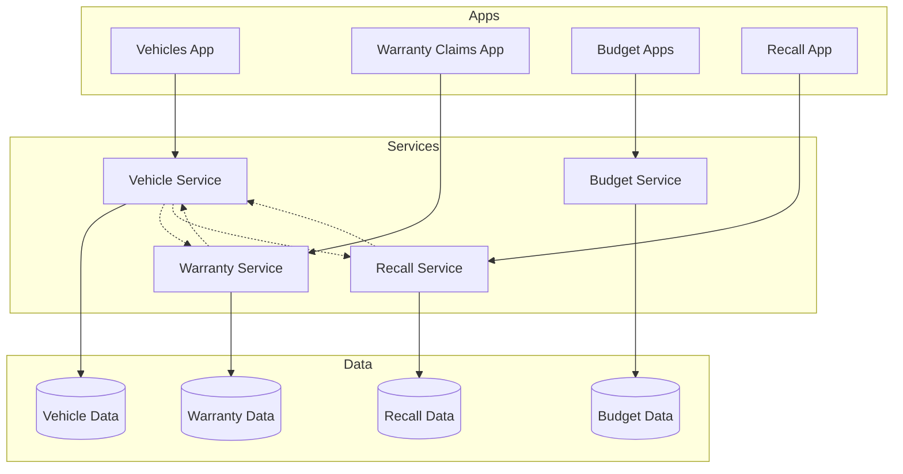

# VMS API & Service Reference Guide

> Complete API documentation for all VMS services with endpoints, actions, and data models

## Table of Contents

1. [Service Overview](#service-overview)
2. [Vehicle Service API](#vehicle-service-api)
3. [Warranty Service API](#warranty-service-api)
4. [Budget Service API](#budget-service-api)
5. [Recall Campaign Service API](#recall-campaign-service-api)
6. [Master Data Services](#master-data-services)
7. [System Services](#system-services)
8. [Common Patterns](#common-patterns)

---

## Service Overview

### Base URLs

| Environment | Base URL |
|------------|----------|
| Development | `http://localhost:4004` |
| Test | `https://vms-test.cfapps.eu10.hana.ondemand.com` |
| Production | `https://vms.cfapps.eu10.hana.ondemand.com` |

### Authentication

All services use OAuth 2.0 with JWT tokens:

```http
Authorization: Bearer <jwt-token>
```

### Service Endpoints

| Service | Path | Apps Using | Auth Required |
|---------|------|------------|---------------|
| VehicleService | `/odata/v4/vehicle/` | Vehicles | Yes |
| WarrantyService | `/odata/v4/warranty/` | Claims, Versions, Origin, Parts | AdminClaim |
| VehicleBudgetsService | `/odata/v4/vehicle-budgets/` | All Budget Apps | Yes |
| RecallCampaignService | `/odata/v4/recall-campaign/` | Recall Campaigns | Yes |
| MasterWarrantyService | `/odata/v4/master-warranty/` | Master Warranties | Yes |
| ClaimTemplateService | `/odata/v4/claim-template/` | Claim Templates | Yes |
| CustomFieldsService | `/odata/v4/custom-fields/` | Custom Fields | Yes |
| TextTypesService | `/odata/v4/text-types/` | Text Types | Yes |

---

## Vehicle Service API

### Base Path: `/odata/v4/vehicle/`

### Entities

#### Vehicles
```typescript
GET /Vehicles
GET /Vehicles(ID)
POST /Vehicles
PATCH /Vehicles(ID)
DELETE /Vehicles(ID)

// Draft operations
POST /Vehicles(ID)/draftActivate
POST /Vehicles(ID)/draftEdit
DELETE /Vehicles(ID)/draftDiscard

// Navigation
GET /Vehicles(ID)/texts
GET /Vehicles(ID)/customFields
GET /Vehicles(ID)/warrantyClaims
GET /Vehicles(ID)/masterWarrantyProfile
```

#### Entity Structure
```json
{
  "ID": "uuid",
  "vin": "string(17)",
  "licensePlate": "string(20)",
  "model_ID": "uuid",
  "modelYear": 2024,
  "engineNumber": "string",
  "vehicleUsage": "DEMO|STOCK|SOLD",
  "availability": "AVAILABLE|RESERVED|SOLD",
  "visibility": "PUBLIC|INTERNAL|HIDDEN",
  "deliveryDate": "2024-01-15",
  "purchasePrice": 45000.00,
  "retailPrice": 52000.00,
  "currentMileage": 15000,
  "hasActiveRecalls": true,
  "recallCount": 2
}
```

### Actions

#### createClaimFromTemplate
```http
POST /createClaimFromTemplate

Request:
{
  "vehicleID": "uuid",
  "templateID": "uuid",
  "damageDate": "2024-01-01",
  "repairDate": "2024-01-05",
  "currentMileage": 15000
}

Response:
{
  "ID": "uuid",
  "claimNumber": "CLM-2024-0001",
  "status": "DRAFT"
}
```

### Expand Examples
```http
# Get vehicle with all related data
GET /Vehicles(123)?$expand=
  texts,
  customFields,
  model($expand=specifications),
  masterWarrantyProfile,
  warrantyClaims($filter=claimStatus eq 'OPEN')
```

---

## Warranty Service API

### Base Path: `/odata/v4/warranty/`

### Entities

#### Claims
```typescript
GET /Claims
GET /Claims(ID)
POST /Claims
PATCH /Claims(ID)

// Draft operations (requires AdminClaim role)
POST /Claims(ID)/draftEdit
POST /Claims(ID)/draftActivate

// Navigation
GET /Claims(ID)/items
GET /Claims(ID)/versions
GET /Claims(ID)/texts
GET /Claims(ID)/customFields
```

#### Claim Structure
```json
{
  "ID": "uuid",
  "claimNumber": "CLM-2024-0001",
  "vehicle_ID": "uuid",
  "vehicleVIN": "WBA1234567890",
  "currentMileage": 15000,
  "claimType": "WARRANTY|GOODWILL|CAMPAIGN",
  "claimStatus": "DRAFT|SUBMITTED|IN_REVIEW|APPROVED|REJECTED",
  "damageDate": "2024-01-01",
  "repairDate": "2024-01-05",
  "submissionDate": "2024-01-06",
  "totalClaimedAmount": 1500.00,
  "totalApprovedAmount": 1400.00,
  "currency": "USD",
  "version": 1,
  "isLatestVersion": true
}
```

#### ClaimItems
```json
{
  "ID": "uuid",
  "claim_ID": "uuid",
  "itemNumber": 10,
  "itemType": "LABOR|PART|FLUID|SUBLET",
  "description": "Engine oil change",
  "partNumber": "PART-123",
  "quantity": 5,
  "unitPrice": 25.00,
  "totalPrice": 125.00,
  "isApproved": true,
  "approvedAmount": 125.00
}
```

### Actions

#### createClaimVersion
```http
POST /createClaimVersion

Request:
{
  "claimID": "uuid",
  "reason": "Additional repairs needed"
}

Response:
{
  "ID": "uuid",
  "version": 2,
  "claimNumber": "CLM-2024-0001",
  "status": "DRAFT"
}
```

### Complex Queries
```http
# Get all approved claims for a vehicle
GET /Claims?$filter=
  vehicle_ID eq 'abc-123' and 
  claimStatus eq 'APPROVED'
  &$expand=items,versions
  &$orderby=submissionDate desc

# Get claims with high value
GET /Claims?$filter=
  totalClaimedAmount gt 5000
  &$expand=vehicle($select=vin,model)
```

---

## Budget Service API

### Base Path: `/odata/v4/vehicle-budgets/`

### Entities

#### VehicleBudgets
```json
{
  "ID": "uuid",
  "vehicle_ID": "uuid",
  "budgetYear": 2024,
  "budgetType": "MARKETING|INCENTIVE|WARRANTY",
  "month01": 1000.00,
  "month02": 1000.00,
  "month03": 1500.00,
  // ... through month12
  "yearlyTotal": 18000.00, // Calculated
  "currency": "USD",
  "version": 1,
  "isFinal": false,
  "createdAt": "2024-01-01T00:00:00Z",
  "modifiedBy": "user@company.com"
}
```

### Actions

#### setFinalVersion
```http
POST /setFinalVersion

Request:
{
  "budgetID": "uuid"
}

Response:
{
  "ID": "uuid",
  "isFinal": true,
  "finalizedAt": "2024-01-15T10:30:00Z",
  "finalizedBy": "manager@company.com"
}
```

#### DealerDistribution
```json
{
  "ID": "uuid",
  "budget_ID": "uuid",
  "dealer_ID": "uuid",
  "allocationAmount": 5000.00,
  "distributionMethod": "EQUAL|PERFORMANCE|CUSTOM",
  "performanceScore": 85.5,
  "adjustmentFactor": 1.1,
  "finalAmount": 5500.00,
  "status": "DRAFT|APPROVED|DISTRIBUTED"
}
```

#### DealerAdjustments
```json
{
  "ID": "uuid",
  "dealer_ID": "uuid",
  "budget_ID": "uuid",
  "adjustmentType": "INCREASE|DECREASE|TRANSFER",
  "adjustmentAmount": 1000.00,
  "reasonCode": "PERFORMANCE|CORRECTION|REALLOCATION",
  "justification": "Q4 performance bonus",
  "requestedBy": "user@company.com",
  "approvedBy": "manager@company.com",
  "status": "PENDING|APPROVED|REJECTED"
}
```

---

## Recall Campaign Service API

### Base Path: `/odata/v4/recall-campaign/`

### Entities

#### RecallCampaigns
```json
{
  "ID": "uuid",
  "campaignNumber": "RC-2024-001",
  "title": "Brake System Safety Recall",
  "description": "Potential brake fluid leak",
  "severity": "CRITICAL|HIGH|MEDIUM|LOW",
  "status": "DRAFT|ACTIVE|IN_PROGRESS|COMPLETED",
  "startDate": "2024-01-01",
  "targetCompletionDate": "2024-06-30",
  "affectedModelIDs": ["model1", "model2"],
  "affectedVINRange": {
    "from": "WBA0000000",
    "to": "WBA9999999"
  },
  "totalAffectedVehicles": 10000,
  "completedCount": 7500,
  "completionRate": 75.0
}
```

#### CampaignVehicles
```json
{
  "ID": "uuid",
  "campaign_ID": "uuid",
  "vehicle_ID": "uuid",
  "status": "PENDING|IN_PROGRESS|COMPLETED",
  "notificationDate": "2024-01-15",
  "completionDate": "2024-02-01",
  "claim_ID": "uuid",
  "notes": "Completed at dealer"
}
```

### Actions

#### assignVehiclesToCampaign
```http
POST /assignVehiclesToCampaign

Request:
{
  "campaignID": "uuid",
  "vehicleIDs": ["uuid1", "uuid2", "uuid3"],
  "notificationMethod": "EMAIL|SMS|MAIL"
}

Response:
{
  "assigned": 3,
  "failed": 0,
  "alreadyAssigned": 0,
  "campaignVehicles": [...]
}
```

### Analytics Views

#### CampaignProgress
```http
GET /CampaignProgress

Response:
{
  "campaign_ID": "uuid",
  "totalVehicles": 10000,
  "completed": 7500,
  "inProgress": 1000,
  "pending": 1500,
  "completionRate": 75.0,
  "averageDaysToComplete": 15,
  "projectedCompletionDate": "2024-05-15"
}
```

#### OutstandingRecalls
```http
GET /OutstandingRecalls?$filter=vehicle_ID eq 'uuid'

Response:
[
  {
    "vehicle_ID": "uuid",
    "campaign_ID": "uuid",
    "campaignNumber": "RC-2024-001",
    "severity": "CRITICAL",
    "daysOutstanding": 45
  }
]
```

---

## Master Data Services

### Master Warranty Service

#### Base Path: `/odata/v4/master-warranty/`

##### MasterWarrantyProfiles
```json
{
  "ID": "uuid",
  "profileCode": "STD-WARRANTY-2024",
  "profileName": "Standard Warranty 2024",
  "effectiveFrom": "2024-01-01",
  "effectiveTo": "2024-12-31",
  "baseWarrantyMonths": 36,
  "baseWarrantyMiles": 36000,
  "extendedWarrantyAvailable": true,
  "coverageComponents": [
    {
      "component": "POWERTRAIN",
      "months": 60,
      "miles": 60000,
      "coveragePercent": 100
    },
    {
      "component": "ELECTRICAL",
      "months": 36,
      "miles": 36000,
      "coveragePercent": 100
    }
  ]
}
```

### Claim Template Service

#### Base Path: `/odata/v4/claim-template/`

##### ClaimTemplates
```json
{
  "ID": "uuid",
  "templateCode": "ENG-REPAIR-001",
  "templateName": "Engine Repair Standard",
  "category": "POWERTRAIN",
  "masterWarranty_ID": "uuid",
  "standardItems": [
    {
      "itemType": "LABOR",
      "description": "Engine R&R",
      "standardHours": 8,
      "laborRate": 125.00
    },
    {
      "itemType": "PART",
      "partNumber": "ENG-2024",
      "quantity": 1,
      "unitPrice": 3500.00
    }
  ],
  "approvalThreshold": 5000.00,
  "requiredDocuments": ["Work Order", "Photos"],
  "isActive": true
}
```

---

## System Services

### Custom Fields Service

#### Base Path: `/odata/v4/custom-fields/`

##### FieldsExtension
```json
{
  "ID": "uuid",
  "fieldName": "dealerRegion",
  "fieldLabel": "Dealer Region",
  "fieldType": "STRING|NUMBER|DATE|BOOLEAN|PICKLIST",
  "entityType": "VEHICLE|CLAIM|CUSTOMER",
  "isRequired": false,
  "maxLength": 50,
  "minValue": null,
  "maxValue": null,
  "defaultValue": "NORTH",
  "picklistValues": ["NORTH", "SOUTH", "EAST", "WEST"],
  "validationRegex": "^[A-Z]+$",
  "sortOrder": 10,
  "isActive": true
}
```

### Text Types Service

#### Base Path: `/odata/v4/text-types/`

##### TextType
```json
{
  "ID": "uuid",
  "typeCode": "INTERNAL_NOTE",
  "typeName": "Internal Note",
  "category": "INTERNAL|CUSTOMER|LEGAL",
  "maxLength": 5000,
  "allowThreading": true,
  "allowRichText": false,
  "visibleToRoles": ["ADMIN", "MANAGER"],
  "editableByRoles": ["ADMIN"],
  "retentionDays": 365,
  "isActive": true
}
```

---

## Common Patterns

### Draft Handling

```javascript
// Edit draft
POST /Entity(ID)/draftEdit
// Returns draft with IsActiveEntity = false

// Save draft
PATCH /Entity(ID)
// Updates draft copy

// Activate draft
POST /Entity(ID)/draftActivate
// Merges draft to active entity

// Discard draft
DELETE /Entity(ID)
// Where IsActiveEntity = false
```

### Filtering

```http
# Text search
GET /Vehicles?$search=BMW

# Complex filter
GET /Claims?$filter=
  (claimStatus eq 'APPROVED' or claimStatus eq 'SUBMITTED') and
  totalClaimedAmount gt 1000 and
  damageDate ge 2024-01-01

# Contains
GET /Vehicles?$filter=contains(vin,'WBA')

# Date ranges
GET /Claims?$filter=
  submissionDate ge 2024-01-01 and 
  submissionDate le 2024-12-31
```

### Pagination

```http
# Page 1 (first 20 records)
GET /Vehicles?$top=20&$skip=0

# Page 2
GET /Vehicles?$top=20&$skip=20

# With count
GET /Vehicles?$top=20&$skip=0&$count=true
```

### Sorting

```http
# Single field
GET /Claims?$orderby=submissionDate desc

# Multiple fields
GET /Claims?$orderby=claimStatus,totalClaimedAmount desc
```

### Expanding Relations

```http
# Single level
GET /Vehicles(ID)?$expand=model

# Multiple expansions
GET /Vehicles(ID)?$expand=model,texts,customFields

# Nested expansion
GET /Vehicles(ID)?$expand=
  model($expand=specifications),
  warrantyClaims($expand=items)

# With filters on expansion
GET /Vehicles(ID)?$expand=
  warrantyClaims($filter=claimStatus eq 'APPROVED')
```

### Batch Operations

```http
POST /$batch

--batch_boundary
Content-Type: application/http

GET /Vehicles(123)

--batch_boundary
Content-Type: application/http

PATCH /Claims(456)
Content-Type: application/json

{"claimStatus": "APPROVED"}

--batch_boundary--
```

### Error Handling

```json
{
  "error": {
    "code": "VALIDATION_ERROR",
    "message": "VIN must be 17 characters",
    "target": "vin",
    "details": [
      {
        "code": "LENGTH_VIOLATION",
        "message": "Expected 17 characters, got 16"
      }
    ]
  }
}
```

### Common HTTP Status Codes

| Code | Meaning | Usage |
|------|---------|-------|
| 200 | OK | Successful GET, PATCH |
| 201 | Created | Successful POST |
| 204 | No Content | Successful DELETE |
| 400 | Bad Request | Validation error |
| 401 | Unauthorized | Missing/invalid auth |
| 403 | Forbidden | Insufficient permissions |
| 404 | Not Found | Entity doesn't exist |
| 409 | Conflict | Concurrent update conflict |
| 422 | Unprocessable | Business rule violation |

---

## Service Integration Map



---

*This API reference is maintained alongside the service implementations. For the latest updates, check the service CDS files in `/srv/`.*