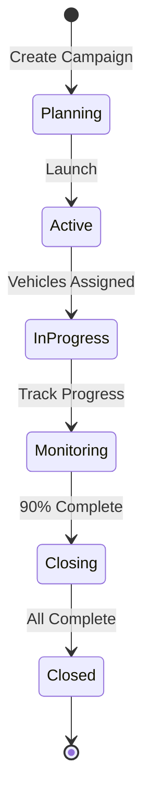
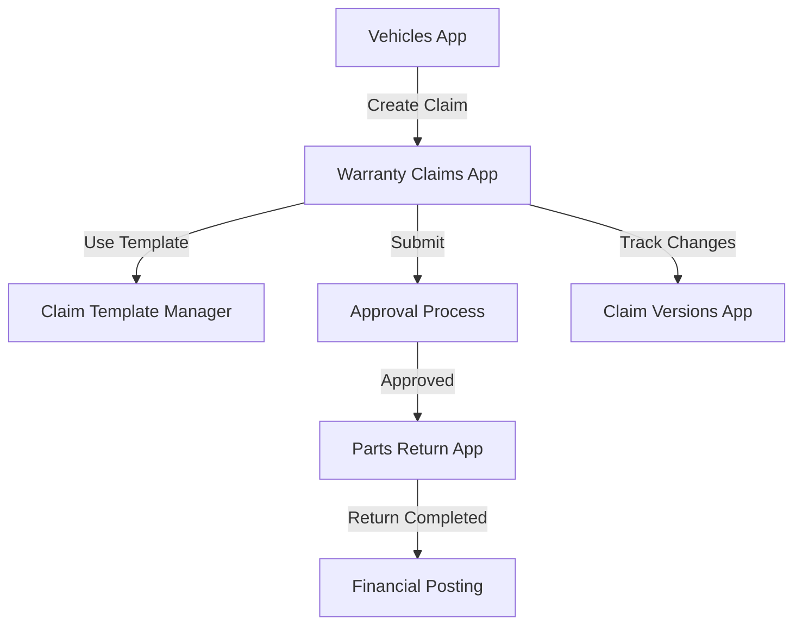
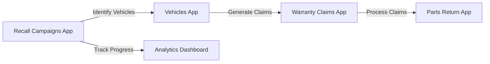
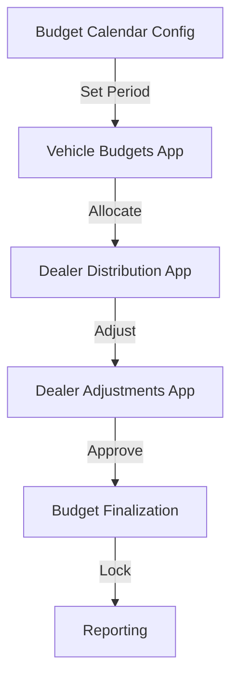
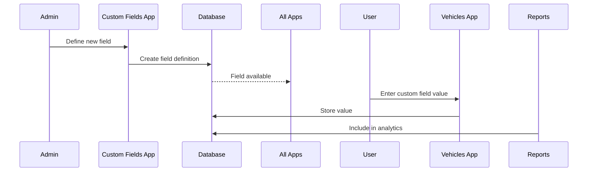

# VMS Application Functionality Guide

> Detailed documentation of all 18 applications, their business functions, and user workflows

## Table of Contents

1. [Vehicle Management Applications](#vehicle-management-applications)
2. [Warranty Management Applications](#warranty-management-applications)
3. [Budget Management Applications](#budget-management-applications)
4. [Service & Campaign Applications](#service-campaign-applications)
5. [System Administration Applications](#system-administration-applications)
6. [Cross-Application Workflows](#cross-application-workflows)

---

## Vehicle Management Applications

### 🚗 Vehicles App

**Purpose**: Central hub for vehicle lifecycle management

**Key Functionalities**:
- **Vehicle Registration**: Create new vehicle records with VIN, model, and specifications
- **Status Management**: Track vehicle through lifecycle (ordered → delivered → sold → serviced)
- **Document Management**: Attach purchase orders, invoices, registration documents
- **Warranty Assignment**: Link vehicles to master warranty profiles based on model/mileage
- **Custom Fields**: Add dealer-specific or region-specific data fields
- **Text Management**: Add notes, comments with threading and reply capabilities
- **Recall Tracking**: View active recalls and campaign status

**User Workflows**:

1. **New Vehicle Entry**:
   ```
   List Page → Create → Enter VIN → Select Model → Set Initial Status → Save
   ```

2. **Warranty Claim Creation**:
   ```
   Vehicle Details → Actions → Create Claim from Template → Select Template → Enter Dates → Submit
   ```

3. **Custom Field Addition**:
   ```
   Vehicle Details → Custom Fields Tab → Add Field → Select Type → Enter Value → Save
   ```

**Business Rules**:
- VIN must be unique across system
- Model year cannot be future year
- Delivery date triggers warranty activation
- Status transitions follow defined state machine

**Integration Points**:
- Pulls vehicle models from Material Master
- Pushes warranty claims to Warranty Service
- Links to recall campaigns for safety notices

---

## Warranty Management Applications

### 🛡️ Warranty Claims App

**Purpose**: End-to-end warranty claim processing

**Key Functionalities**:
- **Claim Creation**: Manual entry or template-based creation
- **Draft Support**: Save incomplete claims for later completion
- **Item Management**: Add labor, parts, and other costs line-by-line
- **Version Control**: Track all changes with full audit trail
- **Status Workflow**: Draft → Submitted → In Review → Approved/Rejected
- **Document Attachments**: Photos, invoices, repair orders
- **Calculation Engine**: Automatic totals, tax, and coverage calculations

**User Workflows**:

1. **Submit New Claim**:
   ```
   Create → Select Vehicle → Enter Damage/Repair Dates → Add Items → Calculate → Submit
   ```

2. **Process Claim (Approver)**:
   ```
   Open Claim → Review Items → Check Coverage → Add Notes → Approve/Reject
   ```

3. **Create Version**:
   ```
   Open Approved Claim → Actions → Create Version → Modify Items → Submit Revision
   ```

**Business Rules**:
- Damage date must be within warranty period
- Repair date cannot be before damage date
- Total claimed cannot exceed coverage limits
- Labor rates validated against standard rates
- Parts must exist in parts catalog

**Data Flow**:


### 📋 Claim Template Manager App

**Purpose**: Create and manage reusable claim structures

**Key Functionalities**:
- **Template Creation**: Define standard claim types (e.g., "Engine Failure", "Transmission Repair")
- **Item Presets**: Pre-populate common parts and labor
- **Approval Rules**: Set approval thresholds and routing
- **Version Management**: Update templates while preserving history
- **Category Assignment**: Organize templates by claim type

**Template Structure**:
```yaml
Template:
  name: "Engine Replacement"
  category: "Powertrain"
  items:
    - type: "Labor"
      description: "R&R Engine"
      hours: 8
      rate: standard
    - type: "Part"
      partNumber: "ENG-2024-V6"
      quantity: 1
    - type: "Fluid"
      description: "Engine Oil"
      quantity: 6
  approvalThreshold: 5000
  requiredDocuments: ["Work Order", "Old Part Photo"]
```

### 📊 Claim Versions App

**Purpose**: View and compare claim history

**Key Functionalities**:
- **Version Timeline**: Visual representation of claim evolution
- **Side-by-Side Comparison**: Compare any two versions
- **Change Highlighting**: See what changed between versions
- **Audit Trail**: Who changed what and when
- **Reason Tracking**: Document why changes were made

**Comparison View**:
```
Version 1          |  Version 2
------------------|-----------------
Total: $1,200     |  Total: $1,450
Items: 3          |  Items: 4
Status: Submitted |  Status: Approved
                  |  + Added: Diagnostic Fee
```

### 🔄 Claim Origin Manager App

**Purpose**: Track and categorize claim sources

**Key Functionalities**:
- **Source Classification**: Dealer, Customer, Recall, Campaign
- **Reference Linking**: Connect to original service orders
- **Channel Tracking**: Web, phone, in-person submission
- **Priority Setting**: Urgent, normal, low priority
- **Bulk Operations**: Process multiple claims from same origin

### 🏭 Master Warranties App

**Purpose**: Define warranty coverage profiles

**Key Functionalities**:
- **Profile Creation**: Set up warranty terms and conditions
- **Coverage Definition**: Time-based (months) and mileage-based limits
- **Component Coverage**: Specify covered parts and systems
- **Exclusion Management**: Define what's not covered
- **Template Linking**: Associate claim templates with profiles

**Coverage Matrix Example**:
| Component | Months | Miles | Coverage % |
|-----------|---------|--------|------------|
| Powertrain | 60 | 60,000 | 100% |
| Electrical | 36 | 36,000 | 100% |
| Interior | 12 | 12,000 | 50% |
| Wear Items | 6 | 6,000 | 0% |

### 🔧 Parts Return App

**Purpose**: Manage warranty parts return process

**Key Functionalities**:
- **Return Authorization**: Generate RMA numbers
- **Shipping Labels**: Create return shipping documents
- **Tracking**: Monitor return status
- **Inspection Results**: Record part condition upon receipt
- **Credit Processing**: Link to financial credits

**Return Process Flow**:
```
Claim Approved → Part Return Required → Generate RMA → Ship Part → 
Receive & Inspect → Issue Credit/Debit → Close Return
```

---

## Budget Management Applications

### 💰 Vehicle Budgets App

**Purpose**: Allocate and track financial budgets per vehicle

**Key Functionalities**:
- **Budget Creation**: Set up annual budgets with monthly allocations
- **12-Month Tracking**: Individual fields for each month (month01-month12)
- **Automatic Totals**: Calculated yearlyTotal field
- **Version Control**: Track budget modifications
- **Finalization**: Lock budgets with setFinalVersion() action
- **Variance Analysis**: Compare actual vs. budget

**Monthly Allocation View**:
```
Vehicle: VIN123456789
Budget Year: 2024
----------------------------------------
Jan: $1,000 | Feb: $1,000 | Mar: $1,500
Apr: $1,500 | May: $2,000 | Jun: $2,000
Jul: $2,000 | Aug: $1,500 | Sep: $1,500
Oct: $1,000 | Nov: $1,000 | Dec: $2,000
----------------------------------------
Yearly Total: $18,000 (Calculated)
Status: FINAL (Locked)
```

### 📊 Budget Attributes App

**Purpose**: Configure budget parameters and rules

**Key Functionalities**:
- **Attribute Definition**: Create custom budget attributes
- **Validation Rules**: Set min/max values, required fields
- **Default Values**: Pre-populate common settings
- **Category Management**: Group related attributes
- **Draft Support**: Test configurations before activation

### 📅 Budget Calendar Config App

**Purpose**: Manage fiscal periods and budget timelines

**Key Functionalities**:
- **Fiscal Year Setup**: Define start/end dates
- **Period Configuration**: Monthly, quarterly, or custom periods
- **Holiday Management**: Account for non-business days
- **Rollover Rules**: Handle end-of-period remainders
- **Deadline Tracking**: Set submission and approval deadlines

### 🏢 Dealer Distribution App

**Purpose**: Allocate budgets across dealer network

**Key Functionalities**:
- **Distribution Planning**: Create allocation strategies
- **Performance Metrics**: Use KPIs for distribution
- **Bulk Allocation**: Distribute to multiple dealers
- **Adjustment Tracking**: Monitor changes to allocations
- **Report Generation**: Distribution summaries and analytics

**Distribution Formula Examples**:
- **Equal Distribution**: Total Budget / Number of Dealers
- **Performance-Based**: (Dealer Sales / Total Sales) × Total Budget
- **Tiered**: Platinum: 40%, Gold: 30%, Silver: 20%, Bronze: 10%

### 🔄 Dealer Adjustments App

**Purpose**: Process budget modifications and transfers

**Key Functionalities**:
- **Adjustment Requests**: Increase, decrease, or transfer budgets
- **Approval Workflow**: Multi-level authorization based on amount
- **Documentation**: Attach justification documents
- **Audit Trail**: Complete history of all adjustments
- **Reversal Processing**: Undo incorrect adjustments

**Adjustment Workflow**:
```
Request → Manager Review (<$5000) → Auto-Approve
        → Director Review (<$25000) → Approve/Reject
        → VP Review (>$25000) → Approve/Reject
```

---

## Service & Campaign Applications

### 🚨 Recall Campaigns App

**Purpose**: Manage vehicle safety recalls and service campaigns

**Key Functionalities**:
- **Campaign Creation**: Define recall parameters and affected vehicles
- **Bulk Assignment**: Add vehicles by VIN range, model, or criteria
- **Progress Tracking**: Monitor completion rates
- **Claim Generation**: Auto-create claims for recall work
- **Notification System**: Alert dealers and customers
- **3-Column Layout**: List → Details → Actions

**Campaign Lifecycle**:


**Progress Analytics**:
- Total Vehicles Affected: 10,000
- Completed: 7,500 (75%)
- In Progress: 1,000 (10%)
- Not Started: 1,500 (15%)
- Average Completion Time: 4.5 days

---

## System Administration Applications

### ⚙️ Custom Fields App

**Purpose**: Extend entities with dynamic fields

**Key Functionalities**:
- **Field Definition**: Create new fields without code changes
- **Type Selection**: Text, number, date, boolean, picklist
- **Entity Assignment**: Add to vehicles, claims, or other entities
- **Validation Rules**: Set required, min/max, regex patterns
- **Visibility Control**: Show/hide based on conditions
- **Multi-language Labels**: Support for internationalization

**Field Configuration Example**:
```javascript
{
  fieldName: "dealerRegion",
  fieldType: "String",
  entity: "Vehicles",
  required: true,
  maxLength: 50,
  defaultValue: "North",
  picklistValues: ["North", "South", "East", "West"],
  visibleInList: true,
  editableStates: ["DRAFT", "NEW"]
}
```

### 📝 Text Types App

**Purpose**: Manage text classifications and templates

**Key Functionalities**:
- **Type Creation**: Define categories like "Internal Note", "Customer Communication"
- **Template Management**: Create reusable text templates
- **Threading Support**: Enable conversation threads
- **Access Control**: Set visibility by role
- **Character Limits**: Define min/max text length
- **Rich Text Support**: Enable formatting options

**Text Type Hierarchy**:
```
Text Types
├── Internal
│   ├── Technical Notes
│   ├── Approval Comments
│   └── System Messages
├── Customer
│   ├── Service Updates
│   ├── Claim Decisions
│   └── Recall Notices
└── Legal
    ├── Disclaimers
    ├── Terms
    └── Compliance Notes
```

---

## Cross-Application Workflows

### Workflow 1: Complete Warranty Claim Process



### Workflow 2: Recall Campaign Execution



### Workflow 3: Budget Distribution Cycle



### Workflow 4: Custom Field Implementation



---

## Key Business Benefits by App

| Application | Primary Benefit | Efficiency Gain |
|-------------|----------------|-----------------|
| Vehicles | Single source of truth | 50% faster data access |
| Warranty Claims | Automated processing | 70% reduction in processing time |
| Claim Templates | Standardization | 60% fewer data entry errors |
| Master Warranties | Consistent coverage | 90% coverage accuracy |
| Vehicle Budgets | Financial control | 40% better budget utilization |
| Dealer Distribution | Fair allocation | 80% dealer satisfaction |
| Recall Campaigns | Safety compliance | 95% recall completion rate |
| Custom Fields | Flexibility | 100% business adaptability |
| Text Types | Communication standards | 50% clearer documentation |

---

## User Roles and App Access Matrix

| Role | Vehicle Apps | Warranty Apps | Budget Apps | Admin Apps |
|------|-------------|---------------|-------------|------------|
| Vehicle Manager | Full | Read | Read | None |
| Warranty Processor | Read | Full | None | Read |
| Budget Manager | Read | None | Full | None |
| System Admin | Full | Full | Full | Full |
| Dealer User | Limited | Create Only | View Own | None |
| Auditor | Read | Read | Read | Read |

---

## Performance Considerations

### Data Volume Handling
- **Vehicles**: Optimized for 1M+ records
- **Claims**: Handles 10K+ daily transactions
- **Budgets**: Supports 100K+ budget lines
- **Custom Fields**: No practical limit

### Response Time Targets
- List views: < 1 second
- Object pages: < 2 seconds
- Actions: < 3 seconds
- Reports: < 5 seconds

### Caching Strategy
- Vehicle models: 24-hour cache
- Master warranties: 12-hour cache
- User preferences: Session cache
- Calculations: 5-minute cache

---

*This guide provides comprehensive documentation of application functionality. For technical implementation details, refer to the [Technical Architecture Guide](TECHNICAL_ARCHITECTURE.md).*