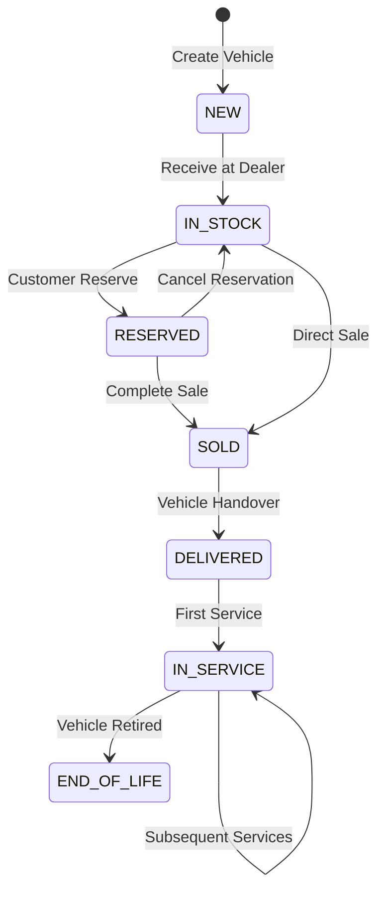
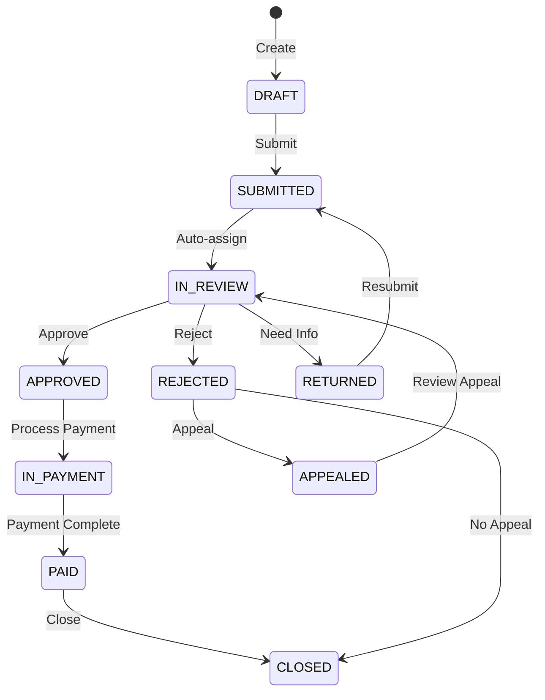

# VMS Detailed Functional Specifications

> Complete functional breakdown with configuration details, field controls, validation rules, and integration points

## Table of Contents

1. [Vehicle Management Specifications](#vehicle-management-specifications)
2. [Warranty Management Specifications](#warranty-management-specifications)
3. [Budget Management Specifications](#budget-management-specifications)
4. [System Configuration](#system-configuration)
5. [Integration & Delegation](#integration-delegation)
6. [Field Controls & Validation](#field-controls-validation)
7. [Search Helps & Value Lists](#search-helps-value-lists)

---

# Vehicle Management Specifications

## Vehicle Master Data

### Core Fields and Behavior

#### Vehicle Identification
| Field | Type | Required | Validation | Source | Notes |
|-------|------|----------|------------|--------|-------|
| VIN | String(17) | Yes | Regex: `^[A-HJ-NPR-Z0-9]{17}$` | Manual Entry | Must be globally unique |
| License Plate | String(20) | No | Country-specific format | Manual Entry | Editable until SOLD status |
| Engine Number | String(50) | Yes | Alphanumeric | Manual Entry | Cannot be changed after creation |
| Chassis Number | String(50) | No | Alphanumeric | Manual Entry | Optional additional identifier |

#### Model Information
| Field | Type | Required | Validation | Source | Notes |
|-------|------|----------|------------|--------|-------|
| Model ID | UUID | Yes | Must exist in Materials | SAP Material Master | Delegated to S/4HANA |
| Model Year | Integer | Yes | Current year -10 to +1 | Manual Entry | Affects warranty eligibility |
| Model Code | String(20) | Auto | Derived from Model ID | SAP Material Master | Display only |
| Model Description | String(100) | Auto | From Material Master | SAP Material Master | Multi-language support |

### Field Control Matrix

#### Status-Based Field Controls
```javascript
// Field Control Values:
// 0 = Hidden, 1 = ReadOnly, 3 = Optional, 7 = Mandatory

Vehicle Status: NEW
- VIN: Mandatory (7)
- License Plate: Optional (3)
- Purchase Price: Mandatory (7)
- Retail Price: Optional (3)
- Delivery Date: Hidden (0)
- Customer: Hidden (0)

Vehicle Status: IN_STOCK
- VIN: ReadOnly (1)
- License Plate: Optional (3)
- Purchase Price: ReadOnly (1)
- Retail Price: Mandatory (7)
- Delivery Date: Hidden (0)
- Customer: Hidden (0)

Vehicle Status: SOLD
- VIN: ReadOnly (1)
- License Plate: ReadOnly (1)
- Purchase Price: ReadOnly (1)
- Retail Price: ReadOnly (1)
- Delivery Date: Mandatory (7)
- Customer: Mandatory (7)

Vehicle Status: DELIVERED
- All fields: ReadOnly (1)
```

### Vehicle Lifecycle State Machine



### Business Rules

#### Warranty Activation
```javascript
Rule: Auto-Activate Warranty
WHEN 
  Vehicle.status changes to 'DELIVERED'
  AND Vehicle.deliveryDate is set
  AND Vehicle.model.warrantyProfile exists
THEN
  Create WarrantyActivation record
  Set warranty.startDate = deliveryDate
  Set warranty.endDate = deliveryDate + profile.months
  Set warranty.mileageLimit = deliveryMileage + profile.miles
```

#### Recall Assignment
```javascript
Rule: Auto-Assign to Recall
WHEN
  New RecallCampaign is activated
  AND Vehicle.model IN campaign.affectedModels
  AND Vehicle.VIN BETWEEN campaign.vinRange.start AND campaign.vinRange.end
  AND Vehicle.status != 'END_OF_LIFE'
THEN
  Create CampaignVehicle record
  Set Vehicle.hasActiveRecalls = true
  Increment Vehicle.recallCount
  Send notification to assigned dealer
```

### Custom Fields Configuration

#### Available Custom Field Types
| Type | Max Length | Validation Options | UI Control |
|------|------------|-------------------|------------|
| STRING | 255 | Regex, Required, Unique | Input, Textarea |
| NUMBER | 15,2 | Min, Max, Decimal places | Number input |
| DATE | - | Min date, Max date | Date picker |
| BOOLEAN | - | - | Checkbox |
| PICKLIST | 50 per value | Predefined values | Dropdown |
| MULTI_PICKLIST | 50 per value | Predefined values | Multi-select |
| REFERENCE | UUID | Link to other entity | Search help |

#### Custom Field Examples
```yaml
DealerRegion:
  type: PICKLIST
  values: [NORTH, SOUTH, EAST, WEST]
  required: true
  defaultValue: NORTH
  visibleRoles: [ALL]
  editableRoles: [ADMIN, MANAGER]

PreDeliveryInspection:
  type: DATE
  required: false
  validation: Cannot be future date
  visibleWhen: status IN (SOLD, DELIVERED)
  editableWhen: status = SOLD

CustomerPONumber:
  type: STRING
  maxLength: 50
  required: false
  unique: true
  visibleRoles: [SALES, ADMIN]
```

---

# Warranty Management Specifications

## Claim Processing

### Claim Types Configuration

#### Standard Claim Types
| Code | Description | Auto-Approve Limit | Required Docs | Approval Chain |
|------|-------------|-------------------|---------------|----------------|
| WARRANTY | Standard Warranty | $500 | Invoice, Photos | Manager > $500 |
| GOODWILL | Goodwill Repair | $0 | Justification, Invoice | Always Manager |
| CAMPAIGN | Campaign/Recall | $999999 | Campaign Ref | Auto-approve |
| EXTENDED | Extended Warranty | $1000 | Contract, Invoice | Manager > $1000 |
| PREDELIVERY | Pre-Delivery | $999999 | Inspection Report | Auto-approve |

### Claim Status Workflow



### Field Controls by Status

```javascript
// Claim Field Controls by Status and Role
const fieldControls = {
  DRAFT: {
    dealer: {
      damageDate: 'Editable',
      repairDate: 'Editable', 
      items: 'Editable',
      documents: 'Editable'
    }
  },
  SUBMITTED: {
    dealer: {
      damageDate: 'ReadOnly',
      repairDate: 'ReadOnly',
      items: 'ReadOnly',
      documents: 'Editable' // Can add more docs
    },
    approver: {
      all: 'ReadOnly'
    }
  },
  IN_REVIEW: {
    dealer: {
      all: 'ReadOnly'
    },
    approver: {
      approvedAmount: 'Editable',
      internalNotes: 'Editable',
      decision: 'Editable'
    }
  },
  APPROVED: {
    all: {
      all: 'ReadOnly'
    }
  }
}
```

### Claim Item Types

#### Labor Items
```yaml
Configuration:
  laborRates:
    source: SAP_MASTER_DATA
    override: ALLOWED_WITH_PERMISSION
  standardHours:
    source: REPAIR_TIME_GUIDE
    validation: +/- 20% variance needs justification
  skillLevels:
    - APPRENTICE: 0.7x rate
    - TECHNICIAN: 1.0x rate  
    - MASTER: 1.3x rate
    - SPECIALIST: 1.5x rate
```

#### Parts Items
```yaml
Configuration:
  partNumbers:
    source: SAP_MATERIAL_MASTER
    validation: Must be active part
  pricing:
    source: PRICE_LIST
    markup: 
      - WARRANTY: Cost + 15%
      - GOODWILL: Cost + 0%
      - RETAIL: Cost + 40%
  availability:
    check: REAL_TIME_INVENTORY
    backorder: ALLOWED_WITH_APPROVAL
```

### Validation Rules

#### Date Validations
```javascript
Rules:
1. damageDate <= today
2. damageDate >= vehicle.deliveryDate
3. repairDate >= damageDate
4. repairDate <= today + 7 days
5. If campaign: damageDate can be null
```

#### Coverage Validations
```javascript
Rule: Check Warranty Coverage
INPUT: claim, vehicle, warrantyProfile
PROCESS:
  daysSinceDelivery = today - vehicle.deliveryDate
  mileageSinceDelivery = claim.mileage - vehicle.deliveryMileage
  
  IF daysSinceDelivery > warrantyProfile.days THEN
    coverage = 0%
  ELSE IF mileageSinceDelivery > warrantyProfile.miles THEN
    coverage = 0%
  ELSE
    coverage = warrantyProfile.coveragePercent
    
  claim.coveredAmount = claim.totalAmount * coverage
  claim.customerPortion = claim.totalAmount - claim.coveredAmount
```

### Claim Templates

#### Template Structure
```yaml
EngineRepairTemplate:
  name: "Standard Engine Repair"
  category: POWERTRAIN
  defaultItems:
    - type: LABOR
      code: "ENG-R&R"
      description: "Remove and Replace Engine"
      hours: 8.0
      skillLevel: MASTER
    - type: PART
      partNumber: "ENGINE-2024"
      quantity: 1
    - type: FLUID
      code: "OIL-5W30"
      description: "Engine Oil"
      quantity: 6
      unit: LITERS
    - type: LABOR
      code: "QC-CHECK"
      description: "Quality Check"
      hours: 0.5
  estimatedTotal: 4500.00
  requiredDocuments:
    - "Work Order"
    - "Old Part Photos"
    - "Diagnostic Report"
```

### Version Control

#### Version Tracking
```yaml
VersionedFields:
  - claimAmount
  - approvedAmount
  - items[]
  - status
  - internalNotes
  - decision

VersionTriggers:
  - Status change
  - Amount change > 10%
  - Item addition/removal
  - Decision change

VersionDisplay:
  - Side-by-side comparison
  - Highlighted changes
  - Audit trail with user/timestamp
  - Reversion capability (with permission)
```

---

# Budget Management Specifications

## Budget Configuration

### Budget Types
| Type | Purpose | Allocation Method | Period | Rollover |
|------|---------|------------------|--------|----------|
| MARKETING | Dealer marketing support | Performance-based | Monthly | No |
| INCENTIVE | Sales incentives | Target-based | Quarterly | No |
| WARRANTY_RESERVE | Warranty cost coverage | Fixed allocation | Annual | Yes (50%) |
| TRAINING | Dealer training budget | Fixed per dealer | Annual | No |
| FACILITY | Facility improvements | Request-based | Annual | No |

### Allocation Formulas

#### Performance-Based Distribution
```javascript
function calculateDealerAllocation(dealer, totalBudget, allDealers) {
  // Weighted scorecard
  const weights = {
    salesVolume: 0.4,
    customerSatisfaction: 0.3,
    marketShare: 0.2,
    compliance: 0.1
  };
  
  const dealerScore = 
    (dealer.salesVolume / dealer.target) * weights.salesVolume +
    (dealer.csat / 100) * weights.customerSatisfaction +
    (dealer.marketShare / dealer.marketPotential) * weights.marketShare +
    (dealer.complianceScore / 100) * weights.compliance;
  
  const totalScore = allDealers.reduce((sum, d) => 
    sum + calculateScore(d), 0);
  
  return (dealerScore / totalScore) * totalBudget;
}
```

#### Tiered Distribution
```javascript
const tierAllocations = {
  PLATINUM: { 
    minScore: 90,
    budgetPercent: 40,
    bonusMultiplier: 1.5
  },
  GOLD: {
    minScore: 75,
    budgetPercent: 30,
    bonusMultiplier: 1.2
  },
  SILVER: {
    minScore: 60,
    budgetPercent: 20,
    bonusMultiplier: 1.0
  },
  BRONZE: {
    minScore: 0,
    budgetPercent: 10,
    bonusMultiplier: 0.8
  }
};
```

### Adjustment Rules

#### Approval Matrix
| Adjustment Amount | Approval Level | SLA | Delegation |
|------------------|----------------|-----|------------|
| < $1,000 | Auto-approve | Instant | System |
| $1,000 - $5,000 | Manager | 24 hours | Yes |
| $5,000 - $25,000 | Director | 48 hours | Yes |
| $25,000 - $100,000 | VP | 72 hours | No |
| > $100,000 | CFO | 5 days | No |

#### Adjustment Types
```yaml
PERFORMANCE_BONUS:
  trigger: Quarterly KPI achievement
  calculation: Base * 1.2
  documentation: KPI report required
  frequency: Quarterly

MARKET_ADJUSTMENT:
  trigger: Competitive pressure
  calculation: Manual
  documentation: Market analysis required
  frequency: As needed

PENALTY:
  trigger: Compliance violation
  calculation: -10% to -50%
  documentation: Violation report
  frequency: As occurred

REALLOCATION:
  trigger: Dealer closure/addition
  calculation: Redistribute proportionally
  documentation: Automatic
  frequency: As needed
```

---

# System Configuration

## Master Data Management

### Delegated to SAP S/4HANA
These data elements are NOT maintained in VMS but retrieved from SAP:

#### Materials/Products
```yaml
Source: /API_PRODUCT_SRV
Cached: 24 hours
Fields:
  - Material Number (Primary Key)
  - Description (Multi-language)
  - Product Hierarchy
  - Base Unit of Measure
  - Material Group
  - Gross/Net Weight
  - Dimensions
Sync: Real-time for critical updates
```

#### Business Partners
```yaml
Source: /API_BUSINESS_PARTNER
Cached: 12 hours
Types:
  - Customers (Role: FLCU01)
  - Dealers (Role: FLDL01)
  - Suppliers (Role: FLVN01)
Fields:
  - Partner Number
  - Name/Address
  - Tax Information
  - Payment Terms
  - Credit Limit
  - Contact Information
```

#### Pricing
```yaml
Source: /API_SLSPRCGCONDITIONRECORD_SRV
Cached: 1 hour
Elements:
  - Price Lists
  - Condition Types
  - Discounts
  - Surcharges
  - Tax Rates
Update: Via change pointers
```

### Local Master Data

#### Text Types
```yaml
SystemTextTypes:
  INTERNAL_NOTE:
    visibility: INTERNAL_ONLY
    threading: true
    maxLength: 5000
    richText: false
    
  CUSTOMER_COMMUNICATION:
    visibility: CUSTOMER_VISIBLE
    threading: true
    maxLength: 2000
    richText: true
    template: true
    
  APPROVAL_COMMENT:
    visibility: INTERNAL_ONLY
    threading: false
    maxLength: 500
    richText: false
    required: true
    
  DAMAGE_DESCRIPTION:
    visibility: ALL
    threading: false
    maxLength: 1000
    richText: false
    spellCheck: true
```

#### Code Lists

```yaml
VehicleUsage:
  values:
    DEMO: "Demonstration Vehicle"
    STOCK: "Inventory Stock"
    LOANER: "Customer Loaner"
    COMPANY: "Company Vehicle"
    SOLD: "Sold Vehicle"
  default: STOCK
  
VehicleAvailability:
  values:
    AVAILABLE: "Available for Sale"
    RESERVED: "Reserved for Customer"
    SOLD: "Sold"
    NOT_AVAILABLE: "Not Available"
  default: AVAILABLE
  
ClaimStatus:
  values:
    DRAFT: {label: "Draft", color: "gray"}
    SUBMITTED: {label: "Submitted", color: "blue"}
    IN_REVIEW: {label: "Under Review", color: "yellow"}
    APPROVED: {label: "Approved", color: "green"}
    REJECTED: {label: "Rejected", color: "red"}
    PAID: {label: "Paid", color: "dark-green"}
  transitions: See workflow diagram
  
ClaimItemType:
  values:
    LABOR: {label: "Labor", requiresHours: true}
    PART: {label: "Part", requiresPartNumber: true}
    FLUID: {label: "Fluid", requiresQuantity: true}
    SUBLET: {label: "Sublet", requiresVendor: true}
    MISC: {label: "Miscellaneous", requiresDescription: true}
```

---

# Integration & Delegation

## SAP S/4HANA Integration Points

### Inbound Integrations (SAP → VMS)

#### Material Master Sync
```yaml
API: /sap/opu/odata/sap/API_PRODUCT_SRV
Frequency: Real-time + Nightly batch
Method: Delta sync using change pointers
Fields:
  - Product → VehicleModel
  - ProductDescription → ModelDescription
  - ProductGroup → ModelCategory
  - BaseUnit → Units
Error Handling: Queue failed syncs for retry
```

#### Business Partner Sync
```yaml
API: /sap/opu/odata/sap/API_BUSINESS_PARTNER
Frequency: Real-time on lookup
Method: On-demand with caching
Mapping:
  - BusinessPartner → Dealer/Customer
  - Address → DealerAddress
  - CreditLimit → MaxClaimAmount
  - PaymentTerms → PaymentDays
```

### Outbound Integrations (VMS → SAP)

#### Financial Posting
```yaml
Trigger: Claim Approval
API: /sap/opu/odata/sap/API_FINANCIAL_POSTING
Mapping:
  ClaimApproval → JournalEntry:
    - Debit: Warranty Expense (P&L)
    - Credit: Dealer Payable (BS)
    - Amount: ApprovedAmount
    - Reference: ClaimNumber
    - Text: VIN + Repair Description
```

#### Inventory Updates
```yaml
Trigger: Parts Return Received
API: /sap/opu/odata/sap/API_MATERIAL_STOCK
Action: 
  - Create Goods Receipt
  - Update Stock Quantity
  - Post to Return Location
```

### Third-Party Integrations

#### Vehicle Configuration (External)
```yaml
Provider: [Third-party Configurator]
Protocol: REST API
Authentication: OAuth 2.0
Operations:
  GET /configurations/{vin}
  POST /configurations/validate
  GET /options/available
  POST /configurations/price
Fallback: Cache last known configuration
```

#### Document Management
```yaml
Provider: SAP Document Management Service
Operations:
  - Upload: POST /attachments
  - Download: GET /attachments/{id}
  - Delete: DELETE /attachments/{id}
  - Metadata: PATCH /attachments/{id}/metadata
Storage: Cloud Object Storage
Retention: 7 years for claims, 10 years for vehicles
```

---

# Field Controls & Validation

## Dynamic Field Control Framework

### Field Control Matrix
```javascript
class FieldControlEngine {
  calculateFieldControl(entity, field, context) {
    const rules = [
      this.checkRoleBasedRules,
      this.checkStatusBasedRules,
      this.checkConditionalRules,
      this.checkTimeBasedRules
    ];
    
    let control = FieldControl.EDITABLE; // Default
    
    for (const rule of rules) {
      const result = rule(entity, field, context);
      if (result === FieldControl.HIDDEN) return result;
      if (result === FieldControl.READONLY) control = result;
      if (result === FieldControl.MANDATORY && 
          control !== FieldControl.READONLY) {
        control = result;
      }
    }
    
    return control;
  }
}
```

### Validation Framework

#### Field-Level Validations
```yaml
VIN:
  - type: REGEX
    pattern: ^[A-HJ-NPR-Z0-9]{17}$
    message: "Invalid VIN format"
  - type: UNIQUE
    scope: GLOBAL
    message: "VIN already exists"
  - type: CHECKSUM
    algorithm: VIN_MOD_11
    message: "VIN checksum invalid"

Email:
  - type: REGEX
    pattern: ^[a-zA-Z0-9._%+-]+@[a-zA-Z0-9.-]+\.[a-zA-Z]{2,}$
    message: "Invalid email format"
  - type: DOMAIN
    allowedDomains: ["company.com", "dealer.net"]
    message: "Email domain not authorized"

ClaimAmount:
  - type: RANGE
    min: 0
    max: 999999.99
    message: "Amount must be between 0 and 999,999.99"
  - type: DECIMAL
    places: 2
    message: "Maximum 2 decimal places"
  - type: BUSINESS_RULE
    rule: "Cannot exceed coverage limit"
```

#### Cross-Field Validations
```javascript
const crossFieldValidations = {
  dateSequence: {
    fields: ['damageDate', 'repairDate', 'submissionDate'],
    validate: (claim) => {
      if (claim.damageDate > claim.repairDate) {
        return "Damage date cannot be after repair date";
      }
      if (claim.repairDate > claim.submissionDate) {
        return "Repair date cannot be after submission";
      }
      return null;
    }
  },
  
  coverageEligibility: {
    fields: ['vehicle.deliveryDate', 'damageDate', 'currentMileage'],
    validate: (claim, vehicle, warranty) => {
      const monthsInService = 
        monthsBetween(vehicle.deliveryDate, claim.damageDate);
      const milesDriven = 
        claim.currentMileage - vehicle.deliveryMileage;
        
      if (monthsInService > warranty.coverageMonths) {
        return "Vehicle out of time warranty";
      }
      if (milesDriven > warranty.coverageMiles) {
        return "Vehicle exceeded mileage warranty";
      }
      return null;
    }
  }
};
```

---

# Search Helps & Value Lists

## Search Help Configuration

### Vehicle Search
```yaml
SearchHelp: VehicleSearch
Fields:
  - VIN: 
      search: CONTAINS
      boost: 2.0
  - LicensePlate:
      search: EXACT
      boost: 1.5
  - Model:
      search: CONTAINS
      display: ModelCode + Description
  - Customer:
      search: CONTAINS
      display: CustomerName
  - Status:
      search: EXACT
      filter: true
Sorting:
  default: CreatedDate DESC
  options: [VIN, Model, Status, DeliveryDate]
QuickFilters:
  - Available Vehicles: status = 'AVAILABLE'
  - With Recalls: hasActiveRecalls = true
  - Warranty Expiring: warrantyEndDate < today + 30
```

### Dealer Search
```yaml
SearchHelp: DealerSearch
Source: SAP Business Partner
Cache: 12 hours
Fields:
  - DealerCode:
      search: STARTS_WITH
      key: true
  - DealerName:
      search: CONTAINS
  - City:
      search: CONTAINS
  - Region:
      search: EXACT
      filter: true
AdditionalData:
  - CreditLimit: From SAP
  - PerformanceScore: From VMS
  - ActiveVehicles: Count from VMS
```

### Parts Search
```yaml
SearchHelp: PartsSearch
Source: SAP Material Master
RealTime: true
Fields:
  - PartNumber:
      search: STARTS_WITH
      key: true
  - Description:
      search: CONTAINS
      language: User language
  - SupersededBy:
      action: Auto-replace with new part
Filters:
  - WarrantyEligible: true
  - StockAvailable: Qty > 0
  - PriceRange: User-defined
Enhancement:
  - Show stock levels
  - Display price
  - Include substitutes
```

## Value Lists

### Dynamic Value Lists
```javascript
class ValueListProvider {
  async getClaimTypes(context) {
    const baseTypes = await this.getBaseClaimTypes();
    
    // Add campaign types if active campaigns exist
    if (context.vehicle) {
      const campaigns = await this.getActiveCampaigns(
        context.vehicle.model
      );
      campaigns.forEach(c => {
        baseTypes.push({
          key: `CAMPAIGN_${c.id}`,
          text: c.title,
          autoApprove: true
        });
      });
    }
    
    // Filter by dealer authorization
    return baseTypes.filter(type => 
      context.dealer.authorizedTypes.includes(type.key)
    );
  }
}
```

### Cascading Value Lists
```yaml
Country → State/Province → City:
  Country:
    source: ISO 3166
    cache: PERMANENT
  State:
    source: Based on Country
    cache: 24 hours
  City:
    source: Based on State
    cache: 24 hours
    
Model Year → Model → Variant:
  ModelYear:
    range: CurrentYear - 10 to CurrentYear + 1
  Model:
    filter: Available in ModelYear
    source: SAP Material Master
  Variant:
    filter: Variants of selected Model
    display: Include specifications
```

### Conditional Value Lists
```javascript
// Claim Status Transitions
function getAvailableStatuses(currentStatus, userRole) {
  const transitions = {
    DRAFT: {
      DEALER: ['SUBMITTED'],
      ADMIN: ['SUBMITTED', 'CANCELLED']
    },
    SUBMITTED: {
      DEALER: [],
      APPROVER: ['IN_REVIEW', 'RETURNED'],
      ADMIN: ['IN_REVIEW', 'RETURNED', 'CANCELLED']
    },
    IN_REVIEW: {
      DEALER: [],
      APPROVER: ['APPROVED', 'REJECTED', 'RETURNED'],
      ADMIN: ['APPROVED', 'REJECTED', 'RETURNED', 'CANCELLED']
    },
    APPROVED: {
      DEALER: [],
      APPROVER: [],
      ADMIN: ['IN_PAYMENT', 'CANCELLED']
    }
  };
  
  return transitions[currentStatus]?.[userRole] || [];
}
```

## Performance Optimization

### Caching Strategy
```yaml
CacheLevels:
  PERMANENT:
    - Countries
    - Currencies
    - Units of Measure
    
  DAILY:
    - Vehicle Models
    - Dealer List
    - Warranty Profiles
    
  HOURLY:
    - Price Lists
    - Stock Levels
    - Exchange Rates
    
  REAL_TIME:
    - Claim Statuses
    - User Authorizations
    - Campaign Assignments
```

### Search Optimization
```javascript
// Indexed fields for fast search
const searchIndexes = {
  vehicles: {
    primary: ['VIN'],
    secondary: ['licensePlate', 'model', 'status'],
    text: ['customerName', 'notes'],
    numeric: ['modelYear', 'currentMileage', 'price']
  },
  claims: {
    primary: ['claimNumber'],
    secondary: ['vehicleVIN', 'status', 'dealer'],
    date: ['damageDate', 'repairDate', 'submissionDate'],
    numeric: ['totalAmount', 'approvedAmount']
  }
};
```

---

# Configuration Management

## Environment-Specific Settings

### Development
```yaml
environment: DEVELOPMENT
features:
  mockData: true
  debugMode: true
  autoApprove: true
  emailNotifications: false
limits:
  maxClaimAmount: 999999
  approvalDelayHours: 0
  attachmentSizeMB: 100
```

### Production
```yaml
environment: PRODUCTION
features:
  mockData: false
  debugMode: false
  autoApprove: false
  emailNotifications: true
limits:
  maxClaimAmount: 50000
  approvalDelayHours: 24
  attachmentSizeMB: 10
monitoring:
  errorAlerts: true
  performanceTracking: true
  auditLogging: FULL
```

## Feature Toggles
```javascript
const features = {
  CLAIM_VERSIONING: {
    enabled: true,
    rollout: 100, // Percentage
    override: ['DEALER_A', 'DEALER_B']
  },
  AUTO_PRICING: {
    enabled: true,
    rollout: 50,
    condition: (context) => context.region === 'NORTH'
  },
  BULK_OPERATIONS: {
    enabled: false,
    rollout: 0,
    plannedDate: '2024-Q2'
  }
};
```

---

*This functional specification document provides detailed configuration and behavior documentation for the VMS platform. For technical implementation details, refer to the Technical Architecture Guide.*