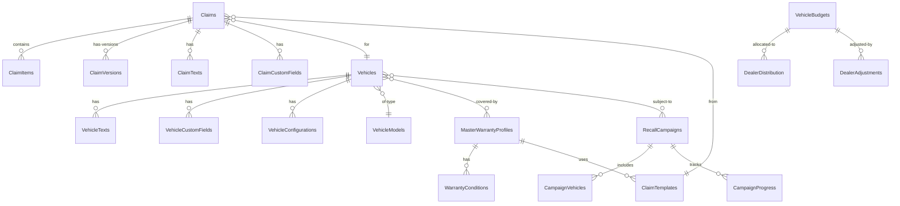
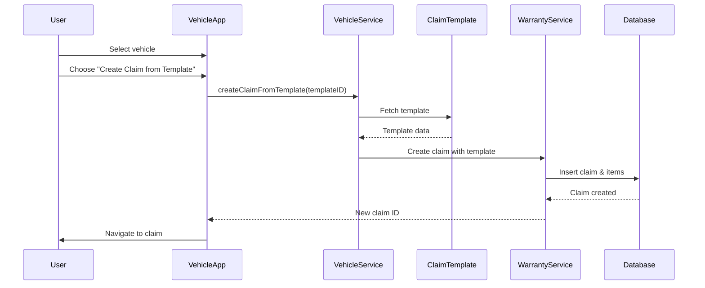
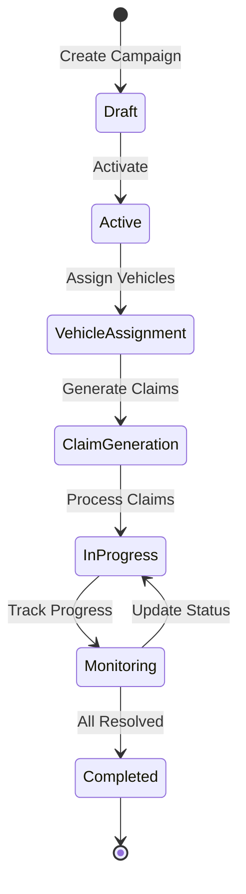

# VMS Technical Architecture & Implementation Guide

> **Version**: 1.0  
> **Last Updated**: September 2025  
> **System**: SAP CAP VMS Implementation

## Table of Contents
1. [System Overview](#system-overview)
2. [Application Catalog](#application-catalog)
3. [Service Architecture](#service-architecture)
4. [Data Model Structure](#data-model-structure)
5. [Process Flows](#process-flows)
6. [Integration Architecture](#integration-architecture)
7. [Security & Authorization](#security-authorization)
8. [Development Guide](#development-guide)

---

## System Overview

### Technology Stack
```
┌─────────────────────────────────────────────┐
│           Frontend Layer (Fiori)            │
├─────────────────────────────────────────────┤
│    18 Fiori Elements Apps + Custom UI5     │
├─────────────────────────────────────────────┤
│         Service Layer (OData V4)           │
├─────────────────────────────────────────────┤
│    8 CAP Services with Business Logic      │
├─────────────────────────────────────────────┤
│        Data Layer (CDS Models)             │
├─────────────────────────────────────────────┤
│   SQLite (Dev) / SAP HANA Cloud (Prod)     │
└─────────────────────────────────────────────┘
```

### Domain Architecture
The system is organized into three primary domains:
- **VMS Domain** (`com.encollab.vms`) - Vehicle lifecycle management
- **Warranty Domain** (`com.encollab.warranty`) - Claims and warranty processing
- **Shared Domain** (`com.encollab.shared`) - Cross-cutting concerns

---

## Application Catalog

### Vehicle Management Apps

#### 1. Vehicles App
- **Path**: `/app/vehicles/`
- **Service**: `/odata/v4/vehicle/`
- **Entity**: `Vehicles`
- **Type**: Fiori Elements List Report & Object Page
- **Features**:
  - Vehicle master data management
  - Custom fields support
  - Text management with threading
  - Warranty profile assignment
  - Recall campaign tracking
  - Action: Create warranty claim from template

#### 2. ~~Configurator App~~ (To Be Removed)
- **Status**: Replaced by third-party solution
- **Path**: `/app/configurator/`
- **Service**: `/odata/v4/configurations/`

#### 3. ~~Configurator Rules App~~ (To Be Removed)
- **Status**: Replaced by third-party solution
- **Path**: `/app/configuratorrules/`

### Warranty Management Apps

#### 4. Warranty Claims App
- **Path**: `/app/warrantyclaims/`
- **Service**: `/odata/v4/warranty/`
- **Entity**: `Claims`
- **Type**: Fiori Elements with inline create
- **Features**:
  - Full claim lifecycle management
  - Draft support for editing
  - Version control and history
  - Item-level detail management
  - Custom fields and texts
  - Document attachments

#### 5. Claim Versions App
- **Path**: `/app/claimversions/`
- **Service**: `/odata/v4/warranty/`
- **Entity**: `ClaimVersions`
- **Type**: Fiori Elements with version comparison
- **Features**:
  - Complete audit trail
  - Version-to-version comparison
  - Historical data viewing
  - Change tracking

#### 6. Claim Template Manager App
- **Path**: `/app/claimtemplatemanager/`
- **Service**: `/odata/v4/claim-template/`
- **Entity**: `ClaimTemplates`
- **Type**: Fiori Elements List Report
- **Features**:
  - Reusable claim templates
  - Pre-defined item structures
  - Template versioning
  - Link to master warranties

#### 7. Claim Origin Manager App
- **Path**: `/app/claimoriginmanager/`
- **Service**: `/odata/v4/warranty/`
- **Entity**: `ClaimOrigins`
- **Type**: Fiori Elements
- **Features**:
  - Claim source tracking
  - Origin categorization
  - Reference management

#### 8. Master Warranties App
- **Path**: `/app/masterwarranties/`
- **Service**: `/odata/v4/master-warranty/`
- **Entity**: `MasterWarrantyProfiles`
- **Type**: Fiori Elements
- **Features**:
  - Warranty profile definition
  - Coverage conditions (time/mileage)
  - Template associations
  - Eligibility rules

#### 9. Parts Return App
- **Path**: `/app/partsreturn/`
- **Service**: `/odata/v4/warranty/`
- **Entity**: `PartsReturn` (view)
- **Type**: Fiori Elements
- **Features**:
  - Return parts tracking
  - Status management
  - Integration with claims

### Budget Management Apps

#### 10. Vehicle Budgets App
- **Path**: `/app/vehiclebudgets/`
- **Service**: `/odata/v4/vehicle-budgets/`
- **Entity**: `VehicleBudgets`
- **Type**: Fiori Elements
- **Features**:
  - Monthly allocation tracking (month01-month12)
  - Yearly total calculation
  - Version management
  - Budget finalization action

#### 11. Budget Attributes App
- **Path**: `/app/vehiclebudgetattributes/`
- **Service**: `/odata/v4/vehicle-budgets/`
- **Entity**: `AttributesConfig`
- **Type**: Fiori Elements with draft
- **Features**:
  - Attribute configuration
  - Rule definition
  - Default values
  - Validation setup

#### 12. Budget Calendar Config App
- **Path**: `/app/budgetcalendarconfig/`
- **Service**: `/odata/v4/vehicle-budgets/`
- **Entity**: `CalendarConfig`
- **Type**: Fiori Elements
- **Features**:
  - Fiscal period setup
  - Calendar management
  - Period configuration

#### 13. Dealer Distribution App
- **Path**: `/app/dealerdistribution/`
- **Service**: `/odata/v4/vehicle-budgets/`
- **Entity**: `DealerDistribution`
- **Type**: Fiori Elements
- **Features**:
  - Dealer allocation management
  - Distribution tracking
  - Performance metrics

#### 14. Dealer Adjustments App
- **Path**: `/app/dealeradjustments/`
- **Service**: `/odata/v4/vehicle-budgets/`
- **Entity**: `DealerAdjustments`
- **Type**: Fiori Elements
- **Features**:
  - Adjustment processing
  - Approval workflows
  - Audit trail

### Service & Campaign Apps

#### 15. Recall Campaigns App
- **Path**: `/app/recallcampaigns/`
- **Service**: `/odata/v4/recall-campaign/`
- **Entity**: `RecallCampaigns`
- **Type**: Fiori Elements 3-column layout
- **Features**:
  - Campaign management
  - Bulk vehicle assignment
  - Progress tracking
  - Claim generation
  - Draft support

### System Administration Apps

#### 16. Custom Fields App
- **Path**: `/app/customfields/`
- **Service**: `/odata/v4/custom-fields/`
- **Entity**: `FieldsExtension`
- **Type**: Fiori Elements with draft
- **Features**:
  - Dynamic field definition
  - Field type configuration
  - Validation rules
  - Entity assignment

#### 17. Text Types App
- **Path**: `/app/texttypes/`
- **Service**: `/odata/v4/text-types/`
- **Entity**: `TextType`
- **Type**: Fiori Elements
- **Features**:
  - Text classification
  - Multi-language support
  - Usage configuration
  - Threading setup

---

## Service Architecture

### Service Catalog

| Service | Path | Entities | Draft | Auth |
|---------|------|----------|-------|------|
| **VehicleService** | `/srv/vehicle-service.cds` | Vehicles, VehicleTexts, VehicleCustomFields | ✅ | - |
| **WarrantyService** | `/srv/warranty-service.cds` | Claims, ClaimItems, ClaimVersions | ✅ | AdminClaim |
| **VehicleBudgetsService** | `/srv/budget-service.cds` | VehicleBudgets, DealerDistribution | ⚠️ | - |
| **MasterWarrantyService** | `/srv/master-warranty-service.cds` | MasterWarrantyProfiles, WarrantyConditions | ✅ | - |
| **ClaimTemplateService** | `/srv/claim-template-service.cds` | ClaimTemplates, TemplateItems | - | - |
| **RecallCampaignService** | `/srv/recall-campaign-service.cds` | RecallCampaigns, CampaignVehicles | ✅ | - |
| **CustomFieldsService** | `/srv/custom-fields-service.cds` | FieldsExtension | ✅ | - |
| **TextTypesService** | `/srv/text-types-service.cds` | TextType | - | - |

### Key Service Actions

#### VehicleService
```javascript
action createClaimFromTemplate(
    templateID: UUID,
    damageDate: Date,
    repairDate: Date
) returns Claims;
```

#### WarrantyService
```javascript
action createClaimVersion(claimID: UUID) returns ClaimVersions;
```

#### VehicleBudgetsService
```javascript
action setFinalVersion(budgetID: UUID) returns VehicleBudgets;
```

#### RecallCampaignService
```javascript
action assignVehiclesToCampaign(
    campaignID: UUID,
    vehicleIDs: array of UUID
) returns CampaignVehicles;
```

---

## Data Model Structure

### Entity Relationship Diagram



### Core Entity Details

#### Vehicles Entity
```typescript
entity Vehicles {
    key ID: UUID;
    // Identification
    vin: String(17) @mandatory;
    licensePlate: String(20);
    
    // Model & Configuration
    model: Association to VehicleModels;
    modelYear: Integer;
    engineNumber: String(50);
    
    // Status & Lifecycle
    vehicleUsage: String;
    availability: String;
    visibility: String;
    deliveryDate: Date;
    
    // Financial
    purchasePrice: Decimal;
    retailPrice: Decimal;
    
    // Relationships
    texts: Composition of many VehicleTexts;
    customFields: Composition of many VehicleCustomFields;
    warrantyClaims: Composition of many Claims;
    
    // Calculated Fields
    hasActiveRecalls: Boolean @readonly;
    recallCount: Integer @readonly;
}
```

#### Claims Entity
```typescript
entity Claims {
    key ID: UUID;
    claimNumber: String(20) @readonly;
    
    // Vehicle Reference
    vehicle: Association to Vehicles;
    vehicleVIN: String(17);
    currentMileage: Integer;
    
    // Claim Details
    claimType: String;
    claimStatus: String;
    damageDate: Date;
    repairDate: Date;
    
    // Financial
    totalClaimedAmount: Decimal;
    totalApprovedAmount: Decimal;
    
    // Versioning
    version: Integer;
    isLatestVersion: Boolean;
    
    // Compositions
    items: Composition of many ClaimItems;
    versions: Composition of many ClaimVersions;
    texts: Composition of many ClaimTexts;
    customFields: Composition of many ClaimCustomFields;
}
```

---

## Process Flows

### 1. Warranty Claim Creation from Template



### 2. Budget Distribution Flow

```mermaid
flowchart LR
    A[Budget Creation] --> B[Set Attributes]
    B --> C[Calendar Config]
    C --> D[Dealer Distribution]
    D --> E{Need Adjustment?}
    E -->|Yes| F[Create Adjustment]
    F --> G[Approval]
    G --> H[Apply Adjustment]
    E -->|No| I[Finalize Budget]
    H --> I
    I --> J[setFinalVersion()]
```

### 3. Recall Campaign Process



---

## Integration Architecture

### External Integration Points

```yaml
integrations:
  s4hana:
    - service: Business Partner API
      purpose: Customer and dealer master data
      direction: inbound
      
    - service: Material Master API
      purpose: Vehicle model and parts data
      direction: inbound
      
    - service: Financial Accounting API
      purpose: Financial postings
      direction: outbound
      
  third_party:
    - service: Vehicle Configuration API
      vendor: External Provider
      purpose: Vehicle configuration management
      direction: bidirectional
      
    - service: Document Management
      purpose: Attachment storage
      direction: outbound
      
  middleware:
    - path: /middleware/partner-data/
      purpose: Partner data enrichment
      type: custom
```

### Event-Driven Architecture

```javascript
// Event Publishers
srv.after('CREATE', 'Claims', async (claim) => {
    await srv.emit('claim.created', claim);
});

srv.after('UPDATE', 'RecallCampaigns', async (campaign) => {
    if (campaign.status === 'ACTIVE') {
        await srv.emit('recall.activated', campaign);
    }
});

// Event Subscribers
srv.on('claim.approved', async (claim) => {
    // Trigger financial posting
    await postToFinancial(claim);
});

srv.on('vehicle.delivered', async (vehicle) => {
    // Activate warranty
    await activateWarranty(vehicle);
});
```

---

## Security & Authorization

### Role Model

```yaml
roles:
  VehicleManager:
    - read: [Vehicles, VehicleModels]
    - write: [Vehicles, VehicleTexts, VehicleCustomFields]
    - execute: [createClaimFromTemplate]
    
  WarrantyProcessor:
    - read: [Claims, ClaimTemplates, MasterWarrantyProfiles]
    - write: [Claims, ClaimItems]
    - execute: [createClaimVersion]
    
  AdminClaim:
    - read: ALL
    - write: ALL
    - execute: ALL
    - special: [deleteVersion, finalizeVersion]
    
  BudgetManager:
    - read: [VehicleBudgets, DealerDistribution]
    - write: [VehicleBudgets, DealerAdjustments]
    - execute: [setFinalVersion]
```

### Field-Level Security

```javascript
// Dynamic field control based on role and state
srv.after('READ', 'Claims', (claims, req) => {
    claims.forEach(claim => {
        if (!req.user.is('AdminClaim')) {
            claim.totalApprovedAmount_fc = 1; // ReadOnly
            claim.claimStatus_fc = 1; // ReadOnly
        }
        if (claim.claimStatus === 'APPROVED') {
            claim.damageDate_fc = 1; // ReadOnly for all
        }
    });
});
```

---

## Development Guide

### Local Development Setup

```bash
# Install dependencies
npm install
npm run install-all

# Start development server
npm start

# Watch specific app with live reload
npm run watch-vehicles
npm run watch-warrantyclaims
```

### Service Development Pattern

```javascript
// Standard service implementation pattern
module.exports = cds.service.impl(async function() {
    const { Claims, Vehicles } = this.entities;
    
    // Before handlers for validation
    this.before('CREATE', 'Claims', async (req) => {
        // Validate business rules
        await validateClaim(req.data);
    });
    
    // On handlers for business logic
    this.on('createClaimFromTemplate', async (req) => {
        const { templateID } = req.data;
        // Implementation
        return claim;
    });
    
    // After handlers for side effects
    this.after('CREATE', 'Claims', async (claim) => {
        // Send notifications, update statistics
        await notifyStakeholders(claim);
    });
});
```

### Adding New Features

1. **New Entity**: Add to appropriate domain in `/db/`
2. **Service Exposure**: Add projection in `/srv/`
3. **Business Logic**: Implement in service `.js` file
4. **UI Application**: Create Fiori app in `/app/`
5. **Test Data**: Add CSV files in `/db/data/`

### Testing Approach

```javascript
// Unit test example
describe('Warranty Service', () => {
    test('Create claim from template', async () => {
        const claim = await POST('/vehicle/createClaimFromTemplate', {
            templateID: 'template-123',
            damageDate: '2024-01-01'
        });
        expect(claim).toHaveProperty('ID');
        expect(claim.items).toHaveLength(3);
    });
});
```

### Deployment Checklist

- [ ] Update version in package.json
- [ ] Run linting: `npm run lint`
- [ ] Update CHANGELOG.md
- [ ] Test all critical flows
- [ ] Update documentation
- [ ] Deploy to BTP: `npm run deploy`

---

## Appendix: Quick Reference

### NPM Scripts
```json
{
  "start": "cds-serve",
  "watch-vehicles": "cd app/vehicles && npm start",
  "watch-warrantyclaims": "cd app/warrantyclaims && npm start",
  "install-all": "./install-all.sh",
  "deploy": "cf push"
}
```

### Environment Variables
```bash
# Development
CDS_ENV=development
DEBUG=true

# Production
CDS_ENV=production
VCAP_SERVICES={...}
```

### Useful CAP Commands
```bash
# Generate TypeScript types
cds compile srv/ --to ts

# Deploy to HANA
cds deploy --to hana

# Add sample data
cds deploy --with-mocks

# Check model
cds compile db/ --to sql
```

---

*This document is maintained by the VMS Development Team. For questions, contact the technical lead.*