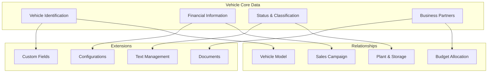
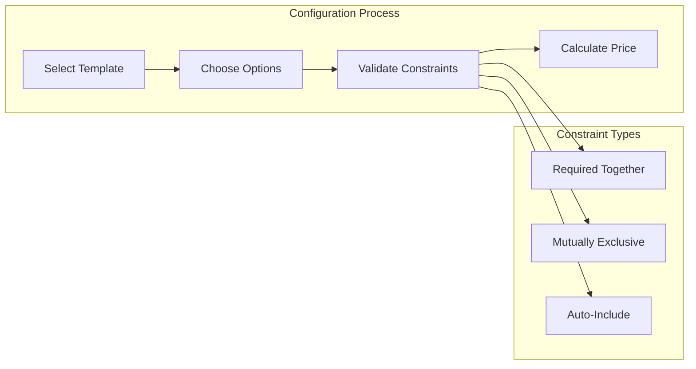

# Vehicle Management Module

## Overview

The Vehicle Management module provides comprehensive vehicle lifecycle management capabilities for automotive organizations. Designed to handle everything from individual vehicle records to large-scale fleet operations, the system delivers the flexibility and control needed to manage vehicles throughout their entire lifecycle while maintaining seamless integration with warranty, budget, and external business systems.

## Core Vehicle Management

### Vehicle Data Structure

The vehicle management system maintains comprehensive records for each vehicle with both standard and configurable fields. Core vehicle identification includes internal and external vehicle numbers, VIN (Vehicle Identification Number), equipment numbers, and batch tracking. Financial data captures gross pricing, currency specifications, and current mileage readings. Temporal tracking includes registration dates, production timestamps, and status update timestamps.

Each vehicle record links to multiple business partners including vendors, customers, sales order customers, and end customers, providing complete ownership and transaction history. The system supports both new and used vehicle tracking with appropriate flagging and archival capabilities for lifecycle management.

### Vehicle Models

Vehicle models form the foundation of the vehicle hierarchy, containing material numbers, model names, descriptions, base pricing, and currency information. Models link to multiple vehicles, enabling consistent data management and reporting across vehicle variants. The model structure supports both standard manufacturer models and custom configurations for specialized vehicles.

### Vehicle Classifications

Extensive classification capabilities organize vehicles across multiple dimensions:
- **Vehicle Status**: Current operational state of the vehicle
- **Availability**: Sales availability indicators
- **Visibility**: Display control for different user groups
- **Vehicle Usage**: Intended use categories (fleet, demo, retail, etc.)
- **Sales Campaign**: Marketing campaign associations
- **Plant and Storage Location**: Physical location tracking
- **Valuation Type**: Financial categorization
- **Shelf Level**: Inventory aging classifications

Each classification supports configurable values, enabling organizations to adapt the system to their specific business terminology and processes.

### Search and List Management

The vehicle search system provides comprehensive query capabilities across all standard and custom fields. Users can search using exact matches, partial text, wildcards, and complex combinations of criteria. The search infrastructure supports both simple queries for daily operations and sophisticated analysis for business intelligence.

List management features configurable views with:
- Column selection and ordering
- Multi-level sorting
- Advanced filtering with saved filter sets
- Bulk operations on selected vehicles
- Export capabilities for external analysis
- Real-time updates reflecting system changes

### Field Control System

Granular field controls determine data visibility and editability based on context and user permissions. The system supports:
- **Hidden Fields**: Complete removal from user interface
- **Read-Only Fields**: Visible but not editable
- **Optional Fields**: Editable but not required
- **Mandatory Fields**: Required for data progression

Field controls apply to over 30 vehicle-level fields, with separate configurations for internal and external users. Status-dependent controls ensure appropriate data access throughout the vehicle lifecycle.

## Vehicle Configuration System

### Configuration Templates

The advanced configuration system manages complex vehicle option structures through templates. Each template defines:
- Option groups organized by category (powertrain, exterior, interior, technology)
- Single-select and multi-select option types
- Required and optional selections
- Model-specific applicability
- Default selections and pricing

Templates support different model types (sedan, SUV, electric) with appropriate option sets for each vehicle category.

### Option Management

Options within configuration templates include:
- Readable codes and descriptions
- Individual pricing with currency specifications
- Material associations for parts tracking
- Constraint definitions (requires, excludes, implies)
- Metadata for additional properties
- Active status and sort ordering

The system maintains relationships between options, ensuring valid configurations through constraint validation.

### Constraint Resolution

A sophisticated constraint resolution engine validates vehicle configurations in real-time:
- **Requires Constraints**: Options that must be selected together
- **Excludes Constraints**: Mutually exclusive options
- **Implies Constraints**: Options that automatically include others
- Session-based configuration tracking
- Real-time validation with error messaging
- Total price calculation based on selections

Configuration sessions maintain state throughout the selection process, providing immediate feedback on invalid combinations and guiding users toward valid configurations.

### Third-Party Configuration

Integration with external configuration systems enables:
- Import of manufacturer configuration data
- Synchronization with configurator tools
- Validation against external rule engines
- Real-time configuration updates
- Characteristic name-value pair management

Each vehicle can maintain multiple configurations with characteristic names, values, and descriptions, supporting complex technical specifications and customer preferences.

## Budget Management

### Vehicle Budget Planning

The comprehensive budget system manages vehicle allocation planning across multiple dimensions. Annual budgets track planned vehicle quantities by:
- Model year specifications
- Vehicle model types
- Six configurable attributes for detailed categorization
- Monthly allocation breakdowns (12 months)
- Version control for budget iterations

Budget types support different planning scenarios (IC/OC/IV/OV) with separate tracking for incoming and outgoing vehicles across claimant and vendor channels.

### Dealer Distribution

Dealer distribution functionality allocates budgeted vehicles to specific dealers:
- Dealer-specific allocation from master budgets
- Monthly distribution planning
- Percentage-based or unit-based allocation
- Variance tracking against budgets
- Status indicators (Not Allocated, Under Allocated, Fully Allocated, Over Allocated)

Distribution views provide real-time visibility into allocation status, helping organizations optimize inventory distribution across their dealer network.

### Dealer Adjustments

Dealers can refine allocated budgets within defined constraints:
- Request adjustments to allocated quantities
- Maintain audit trail of adjustment requests
- Constraint validation against distribution limits
- Future workflow support for approval processes
- Historical tracking of all adjustments

### Budget Analytics

Built-in analytical views provide insights into budget performance:
- Budget versus allocation comparisons
- Variance calculations and percentages
- Dealer allocation summaries
- Model-level aggregations
- Temporal trend analysis

Virtual fields automatically calculate allocation percentages, variance amounts, and status indicators, providing immediate visibility into budget utilization.

## Custom Fields and Extensions

### Dynamic Field System

The custom field framework enables organizations to extend vehicle records without system modification:
- **Field Types**: Text, boolean, number, date, datetime, and textarea
- **Configuration Options**: Required status, editability, default values
- **Entity Support**: Vehicle-specific custom fields
- **Usage Tracking**: Automatic counting of field utilization

Custom fields integrate fully with standard functionality including search, filtering, export, and reporting capabilities.

### Text Management

Configurable text types organize narrative information:
- Multiple text types per vehicle
- Icon and category assignments
- Language-specific content
- Version tracking for text changes
- Integration with document management

Text management supports various use cases including internal notes, customer communications, technical specifications, and regulatory compliance documentation.

### Document Management

Comprehensive attachment capabilities handle vehicle-related documentation:
- Support for all file types
- Automatic vehicle association
- Metadata and categorization
- Integration with external document systems
- Compliance with retention policies

The attachment system uses SAP CAP's standard attachment framework, ensuring compatibility with enterprise document management strategies.

## Integration Capabilities

### ERP Integration

Direct integration with enterprise resource planning systems provides:
- **Business Partner Management**: Customer and vendor synchronization
- **Material Master**: Parts and accessory data
- **Organizational Structures**: Sales organizations and distribution channels
- **Financial Data**: Pricing, currency, and tax information
- **Search Helps**: Dynamic value lists from ERP master data

The integration framework supports multiple ERP systems with configurable mapping and transformation rules.

### Third-Party Status Management

External status management integration delivers:
- Auditable status processing with complete history
- Document generation in target systems (SAP or other ERPs)
- Workflow triggers based on status changes
- Multi-system status synchronization
- Compliance documentation and audit trails

Status transitions can trigger automated processes including document creation, notification generation, and system updates across integrated platforms.

### Order Inquiry Services

Integration with order management systems enables:
- Real-time order status inquiries
- Sales order linkage to vehicles
- Delivery tracking and confirmation
- Invoice association
- Customer order history

## Analytics and Reporting

### Operational Analytics

Real-time analytics provide visibility into vehicle operations:
- Inventory composition by model, status, and location
- Aging analysis for inventory optimization
- Turnover rates and velocity metrics
- Dealer performance comparisons
- Campaign effectiveness tracking

### Financial Analytics

Financial reporting capabilities include:
- Value analysis by vehicle categories
- Margin tracking on vehicle sales
- Budget utilization monitoring
- Cost allocation reporting
- Currency exposure analysis

### Virtual Fields

Computed fields provide automatic calculations:
- Age since production or registration
- Days in inventory
- Budget variance percentages
- Allocation completion rates
- Custom calculation formulas

## Security and Compliance

### Access Control
- Role-based permissions
- Field-level security through field controls
- Partner-specific data segregation
- Location-based access restrictions
- Operation-level authorization

### Data Protection
- Audit trails on all changes
- Version tracking for sensitive data
- Encryption for data at rest and in transit
- GDPR compliance features
- Data retention policy enforcement

### Compliance Support
- VIN validation and verification
- Regulatory reporting capabilities
- Document retention management
- Export control compliance
- Financial audit trail maintenance

## User Applications

The vehicle management module includes specialized applications:
- **Vehicles**: Primary vehicle management interface
- **Vehicle Configurator**: Configuration and option selection
- **Vehicle Budgets**: Budget planning and management
- **Dealer Distribution**: Allocation management
- **Dealer Adjustments**: Budget refinement interface
- **Custom Fields**: Field configuration and management
- **Text Types**: Text category configuration

Each application provides:
- Responsive design for various devices
- Configurable layouts and views
- Advanced filtering and search
- Bulk operation support
- Export and reporting capabilities

## Implementation Benefits

Organizations implementing the Vehicle Management module achieve:
- Centralized vehicle lifecycle management
- Improved inventory visibility and control
- Flexible adaptation to business requirements
- Seamless integration with existing systems
- Enhanced compliance and audit capabilities
- Optimized dealer network operations
- Reduced manual data entry through integrations
- Scalable architecture supporting growth

The system adapts to various automotive business models including retail dealerships, fleet operations, manufacturer subsidiaries, and independent dealer groups, providing the flexibility needed for diverse operational requirements while maintaining data integrity and system performance.