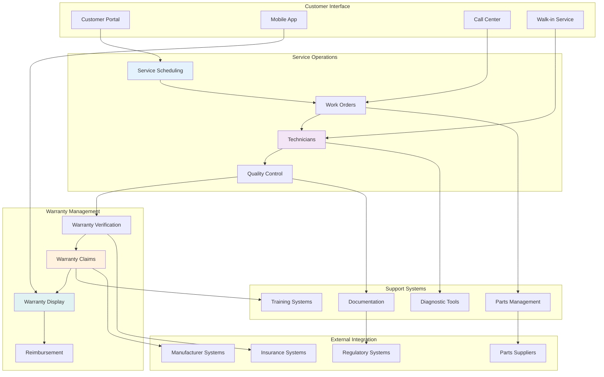
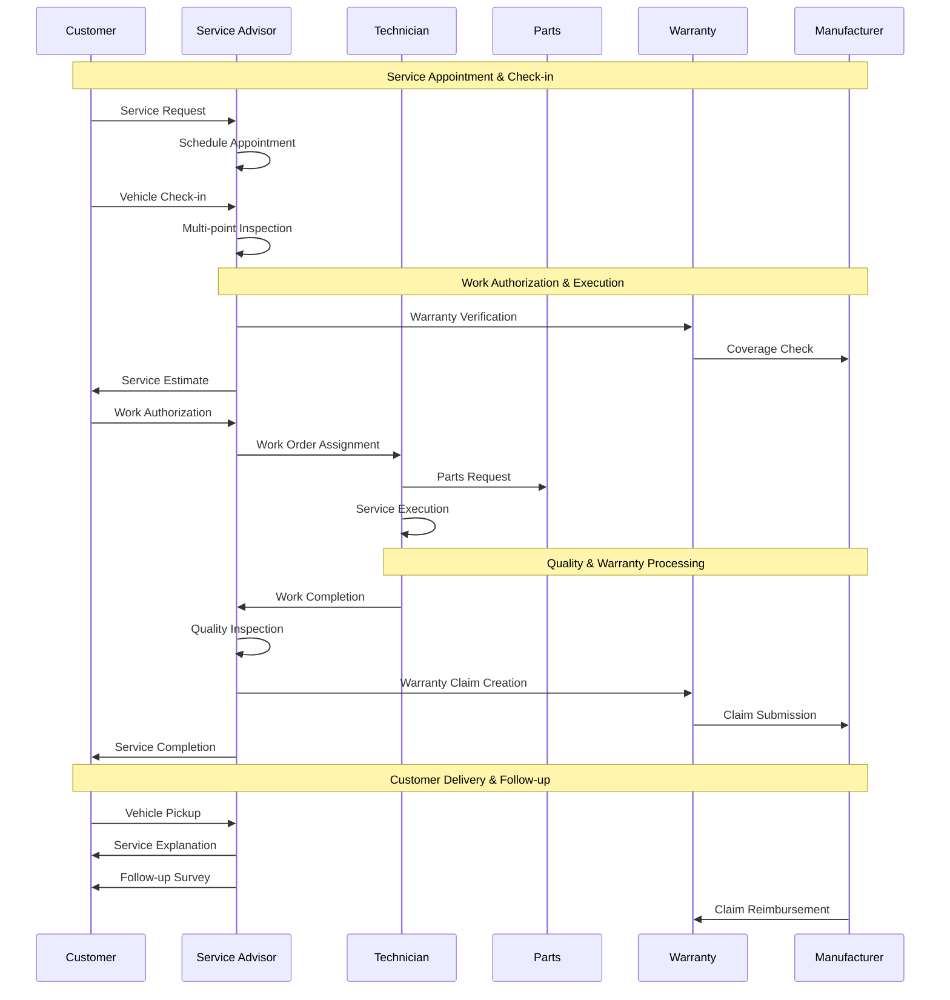
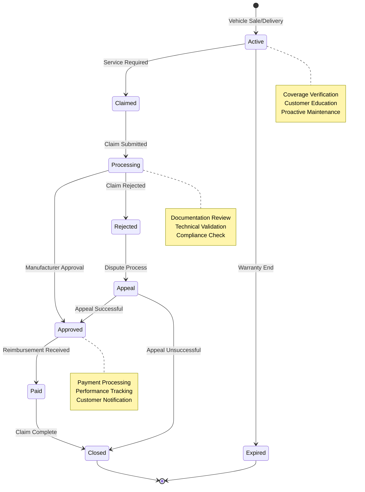
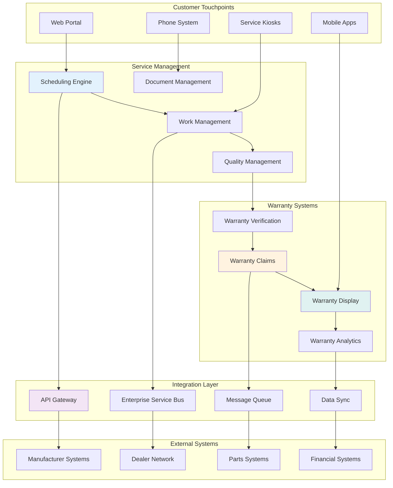

# Service & Warranty

## Overview
The Service & Warranty module provides comprehensive warranty administration through **4 implemented Fiori applications** built on SAP CAP. This system manages the complete warranty lifecycle from master warranty setup through claim processing, template management, and version tracking.

## ✅ Implemented Applications

### [Warranty Claims App](warranty-claims.md) 
Complete warranty claim management with advanced features.
- Claims entity management with comprehensive data model
- Claim items with position-based organization  
- Custom fields integration for flexible data capture
- Texts management for multilingual claim documentation
- Real-time claim state tracking and workflow management

### [Master Warranties App](master-warranties.md)
Master warranty profile and condition management.
- Master warranty profiles with vehicle model associations
- Warranty conditions with coverage rules and parameters
- Mileage and time-based warranty coverage management
- Integration with vehicle master data for automatic coverage determination

### [Claim Template Manager App](claim-template-manager.md)
Reusable claim template creation and management system.
- Claim templates for standardized claim creation
- Template items with predefined materials and quantities
- Template-based claim generation for efficiency
- Template versioning and approval workflows

### [Claim Versions App](claim-versions.md)  
Comprehensive claim version tracking and audit trail.
- Complete version history for all claim changes
- Version change type tracking (Created, Modified, Deleted)
- User attribution and timestamp tracking for compliance
- Version comparison and rollback capabilities

## ⚠️ Planned Features (Future Implementation)

### [Service Processing](service-processing.md)
*Planned: Comprehensive vehicle service management*
- Service appointment scheduling and resource optimization
- Work order management with technician assignment
- Multi-point inspections and service recommendations
- Customer communication throughout service process

### [Warranty Display](warranty-display.md)  
*Planned: Customer-facing warranty information portal*
- Real-time warranty coverage and status information
- Customer self-service portal with mobile optimization
- Proactive warranty notifications and recommendations
- Integration with service scheduling systems

## Service & Warranty Ecosystem

## Service Process Flow

## Warranty Lifecycle Management

## Business Value Framework

### Revenue Optimization
- **Warranty Recovery** - 95%+ warranty claim approval rate maximizing reimbursement
- **Service Revenue** - 25% increase in service revenue through upselling and retention
- **Customer Retention** - 90%+ service customer retention rate
- **Labor Efficiency** - 30% improvement in technician productivity and utilization

### Cost Management
- **Operational Efficiency** - 20% reduction in service department operating costs
- **Warranty Administration** - 40% reduction in warranty claim processing costs
- **Quality Costs** - 50% reduction in comeback and rework rates
- **Customer Service** - 35% reduction in customer service resolution time

### Customer Experience
- **Satisfaction Scores** - 95%+ customer satisfaction with service experience
- **Convenience** - 24/7 self-service capabilities and mobile access
- **Transparency** - Real-time service status and warranty information
- **Communication** - Proactive updates and personalized service recommendations

## Technology Architecture

## Performance Excellence Framework

### Service Metrics
- **First-Time Fix Rate** - Percentage of service issues resolved on first visit
- **Cycle Time** - Average time from service appointment to completion
- **Customer Wait Time** - Average customer wait time for service completion
- **Technician Efficiency** - Actual vs. estimated labor time performance
- **Service Quality** - Post-service customer satisfaction and quality scores

### Warranty Metrics
- **Claim Approval Rate** - Percentage of warranty claims approved by manufacturers
- **Processing Time** - Average time from claim submission to reimbursement
- **Recovery Rate** - Percentage of warranty costs recovered from manufacturers
- **Claim Accuracy** - Percentage of claims approved without revision or additional documentation
- **Audit Compliance** - Manufacturer audit scores and compliance ratings

### Financial Metrics
- **Service Revenue** - Total service department revenue and growth trends
- **Warranty Recovery** - Total warranty reimbursement amounts and percentages
- **Labor Gross Profit** - Service labor profitability and margin performance
- **Parts Gross Profit** - Parts sales profitability and markup optimization
- **Customer Lifetime Value** - Long-term value of service customers

### Customer Experience Metrics
- **Net Promoter Score** - Customer advocacy and referral likelihood
- **Customer Satisfaction** - Overall satisfaction with service experience
- **Retention Rate** - Percentage of customers returning for future service
- **Self-Service Adoption** - Usage rate of online and mobile self-service options
- **Communication Effectiveness** - Customer satisfaction with service communication

## Quality Assurance Program

### Service Quality Standards
- **Manufacturer Compliance** - Adherence to factory service procedures and standards
- **Industry Certifications** - ASE and manufacturer technician certifications
- **Continuous Training** - Ongoing technical training and skill development
- **Quality Audits** - Regular internal and external quality assessments

### Warranty Quality Management
- **Documentation Standards** - Complete and accurate warranty claim documentation
- **Process Compliance** - Adherence to manufacturer warranty policies and procedures
- **Audit Readiness** - Preparation for manufacturer audits and reviews
- **Continuous Improvement** - Regular process review and enhancement initiatives

## Digital Transformation Strategy

### Phase 1: Foundation (Months 1-6)
- **Core Service Management** - Essential service scheduling and work order management
- **Basic Warranty Processing** - Fundamental warranty verification and claim processing
- **Customer Portal** - Basic online service scheduling and warranty information
- **Integration Framework** - Core system integrations and data connectivity

### Phase 2: Enhancement (Months 7-12)
- **Advanced Scheduling** - AI-powered scheduling optimization and resource planning
- **Automated Warranty Claims** - Streamlined claim creation and submission processes
- **Mobile Applications** - Full-featured mobile apps for customers and technicians
- **Analytics Platform** - Business intelligence and performance analytics

### Phase 3: Optimization (Months 13-18)
- **Predictive Maintenance** - AI-driven maintenance recommendations and scheduling
- **Advanced Warranty Analytics** - Predictive warranty failure analysis and prevention
- **IoT Integration** - Connected vehicle data and remote diagnostics
- **Process Automation** - Robotic process automation for routine tasks

### Phase 4: Innovation (Months 19-24)
- **AI Service Advisor** - Intelligent service recommendations and customer interaction
- **Blockchain Warranty** - Immutable warranty records and smart contracts
- **Augmented Reality** - AR-assisted diagnostics and customer education
- **Autonomous Operations** - Self-managing service processes and optimization

## Success Metrics & ROI

### 6-Month Targets
- **Customer Satisfaction** - 90%+ service experience satisfaction
- **Warranty Recovery** - 90%+ warranty claim approval rate
- **Operational Efficiency** - 25% improvement in service throughput
- **System Adoption** - 85%+ user adoption across all platforms

### 12-Month Targets
- **Revenue Growth** - 20% increase in service department revenue
- **Cost Reduction** - 30% reduction in warranty administration costs
- **Customer Retention** - 95% service customer retention rate
- **Digital Adoption** - 70% of customers using self-service options

### 24-Month Targets
- **Market Leadership** - Top quartile in industry service performance metrics
- **Innovation Index** - Industry recognition for digital service innovation
- **Profitability** - 40% improvement in service department profitability
- **Sustainability** - Carbon-neutral service operations achievement