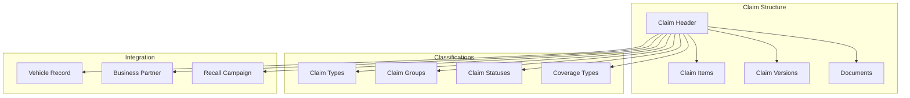

# Warranty Management Module

## Overview

The Warranty Management module provides comprehensive warranty claim processing and campaign management capabilities for automotive organizations. Built to handle the complexities of modern warranty operations, the system manages everything from individual service claims to large-scale recall campaigns while maintaining complete integration with vehicle records and external business systems.

## Core Functionality

### Claim Processing System

The warranty system centers around a sophisticated claim management structure that handles multiple claim scenarios. Each claim captures essential information including authorization numbers, business partners, repair dates, mileage, and operating hours. The system supports both manual claim entry and automated processing flows, with comprehensive status tracking throughout the claim lifecycle.

Claims are structured with header-level information and detailed line items, allowing for complex multi-part repairs and varied pricing scenarios. Each claim item can track different financial amounts for incoming claimant costs, incoming vendor costs, outgoing claimant reimbursements, and outgoing vendor payments, providing complete financial transparency.

### Template Management

Claim templates streamline the warranty process by providing pre-configured claim structures for common scenarios. Service advisors can select from a library of templates that automatically populate standard repair information, parts, labor operations, and documentation requirements.

Templates are managed centrally with full lifecycle control. Each template defines:
- Standard claim classifications (type, group, coverage)
- Pre-populated line items with materials and quantities
- Default financial allocations
- Required documentation specifications

Templates serve dual purposes - they can be used for individual service claims or as the foundation for recall campaigns, ensuring consistency across different claim scenarios while reducing data entry time and errors.

### Master Warranty Configuration

The Master Warranty system defines warranty coverage profiles that automatically determine claim eligibility. Each profile specifies:
- Coverage duration (minimum and maximum days from purchase)
- Mileage limitations (minimum and maximum mileage ranges)
- Parts and labor coverage inclusion
- Financial split percentages between OEM, dealer, and vendor
- Temporal validity periods for profile applicability

These profiles link to specific vehicle models and automatically validate coverage when claims are submitted, eliminating manual coverage verification and reducing claim rejection rates.

### Recall Campaign Management

The recall campaign system orchestrates complex vehicle recall and service campaign operations. Campaigns can be regulatory-mandated recalls or voluntary service actions, each with configurable priority levels and completion requirements.

Campaign features include:
- Campaign creation with title, description, affected parts, and regulatory references
- Vehicle assignment based on VIN ranges, model years, or specific criteria
- Dealer allocation for campaign execution
- Scheduled appointment management
- Progress tracking with real-time completion statistics
- Automatic claim generation using predefined templates

```mermaid
graph LR
    subgraph "Campaign Setup"
        Define[Define Campaign]
        Assign[Assign Vehicles]
        Allocate[Allocate to Dealers]
    end
    
    subgraph "Execution"
        Schedule[Schedule Service]
        Complete[Complete Repair]
        Generate[Generate Claim]
    end
    
    subgraph "Tracking"
        Monitor[Monitor Progress]
        Report[Generate Reports]
        Close[Close Campaign]
    end
    
    Define --> Assign
    Assign --> Allocate
    Allocate --> Schedule
    Schedule --> Complete
    Complete --> Generate
    
    Generate --> Monitor
    Monitor --> Report
    Report --> Close
```

### Version Management

Every warranty claim maintains a complete version history, capturing all changes throughout its lifecycle. The versioning system creates immutable snapshots of claims, including:
- Complete claim header data at each version
- Line item changes with original item references
- Text modifications and custom field updates
- Version creation metadata (who, when, why)
- Change type classification (created, modified, deleted)

A sophisticated version comparison feature allows side-by-side analysis of claim changes, providing complete audit trails for compliance and dispute resolution.

### Field Control System

The field control system provides granular control over data visibility and editability based on claim status and user context. Configuration options include:
- Hidden fields (not displayed to users)
- Read-only fields (visible but not editable)
- Optional fields (editable but not required)
- Mandatory fields (must be completed before progression)

Field controls can differentiate between internal and external users, ensuring appropriate data access for different user groups. Over 40 claim-level fields and multiple item-level fields can be individually controlled, providing precise data governance.

### Custom Fields and Extensions

Organizations can extend the standard warranty structure with custom fields to capture business-specific information. The custom field system supports:
- Multiple field types (text, boolean, number, date, datetime, textarea)
- Required and optional field configurations
- Default value specifications
- Entity-specific fields (claims, claim items, campaigns)
- Full integration with search and reporting functions

Custom fields maintain usage tracking, allowing administrators to understand field utilization and clean up unused extensions.

### Document Management

Comprehensive attachment capabilities support the documentation requirements of warranty operations. The system handles:
- Multiple file types and formats
- Automatic association with claims and vehicles
- Document categorization and metadata
- Retention policy support
- Integration with external document management systems

### Text Management

Configurable text types allow organizations to capture various narrative information:
- Internal notes and comments
- Customer communication
- Technical descriptions
- Repair instructions
- Regulatory notifications

Text types can be configured with specific icons and categories, organizing information for easy retrieval and display.

## Integration Capabilities

### Third-Party Status Processing

The warranty system integrates with external status management solutions that provide:
- Fully auditable status transitions
- Document generation in target systems (SAP or other ERPs)
- Complete audit trails for compliance
- Workflow automation based on status changes
- Multi-system synchronization

### ERP Integration

Direct integration with enterprise resource planning systems provides:
- Business partner search and validation
- Customer and dealer information access
- Sales organization structures
- Material master data synchronization
- Currency and unit of measure validation
- Order inquiry services

### Vehicle System Integration

Tight coupling with the vehicle management module ensures:
- Automatic vehicle data population in claims
- Warranty coverage validation based on vehicle history
- Service history visibility during claim processing
- Campaign assignment based on vehicle characteristics
- Budget allocation tracking for warranty costs

## Financial Management

The warranty system implements sophisticated financial tracking with the IC/IV/OC/OV model:
- **IC (Incoming Claimant)**: Costs charged by the claimant
- **IV (Incoming Vendor)**: Costs from external vendors
- **OC (Outgoing Claimant)**: Payments to claimants
- **OV (Outgoing Vendor)**: Payments to vendors

This multi-dimensional cost structure enables:
- Complete cost transparency
- Margin analysis on warranty operations
- Vendor performance tracking
- Claimant reimbursement management
- Financial reconciliation with accounting systems

## Parts Return Management

The parts return feature tracks defective part handling:
- Return flag management on claim items
- Return date tracking
- Causal part identification
- Return authorization workflows
- Vendor credit processing

## Analytics and Reporting

Built-in analytical capabilities provide insights into warranty operations:
- Campaign progress monitoring with completion rates
- Claim volume and value tracking
- Coverage utilization analysis
- Dealer performance metrics
- Parts failure rate analysis
- Processing time measurements

Virtual fields automatically calculate:
- Total claims per campaign
- Status distribution (not started, in progress, completed)
- Completion percentages
- Budget utilization rates

## Security and Compliance

### Data Protection
- Role-based access control
- Field-level security through field controls
- Partner-specific data segregation
- Audit trail maintenance on all changes
- Version history for compliance documentation

### Regulatory Support
- Configurable campaign types for regulatory compliance
- Regulatory reference tracking
- Mandatory field enforcement
- Document retention policies
- Complete audit trails for all transactions

## User Experience

The warranty module includes multiple specialized applications:
- **Warranty Claims**: Primary claim processing interface
- **Master Warranties**: Coverage profile configuration
- **Recall Campaigns**: Campaign management and monitoring
- **Claim Templates**: Template creation and maintenance
- **Parts Return**: Return processing workflows
- **Claim Versions**: Version comparison and audit review

Each application provides:
- Responsive design for desktop and mobile access
- Configurable list views with sorting and filtering
- Advanced search across all fields including custom extensions
- Bulk operation capabilities
- Export functionality for reporting

## Implementation Benefits

Organizations implementing the Warranty Management module gain:
- Streamlined claim processing through templates
- Reduced claim rejection rates via validation
- Improved campaign completion through tracking
- Enhanced compliance with comprehensive audit trails
- Flexible adaptation to business requirements through custom fields
- Integration with existing ERP investments
- Granular control over data access and modification
- Complete financial transparency in warranty operations

The system scales from small warranty operations to large-scale multi-national deployments, maintaining performance and reliability while adapting to specific business requirements through extensive configuration capabilities.