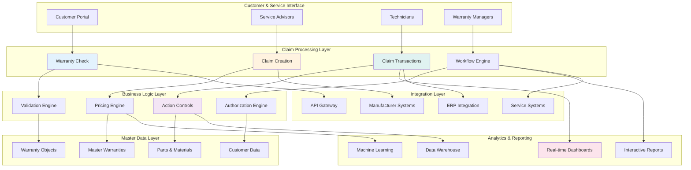
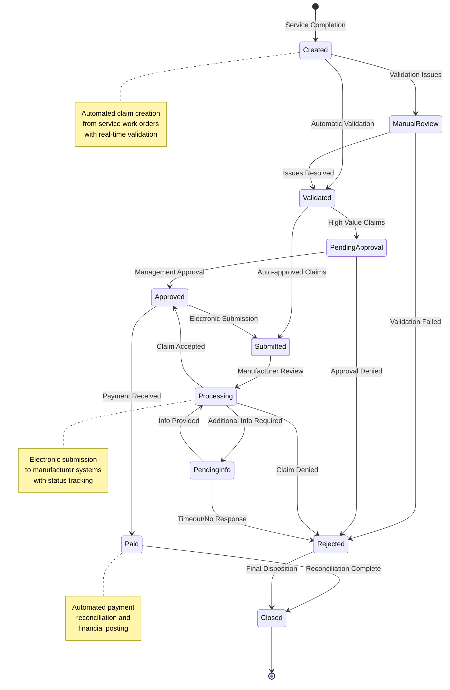
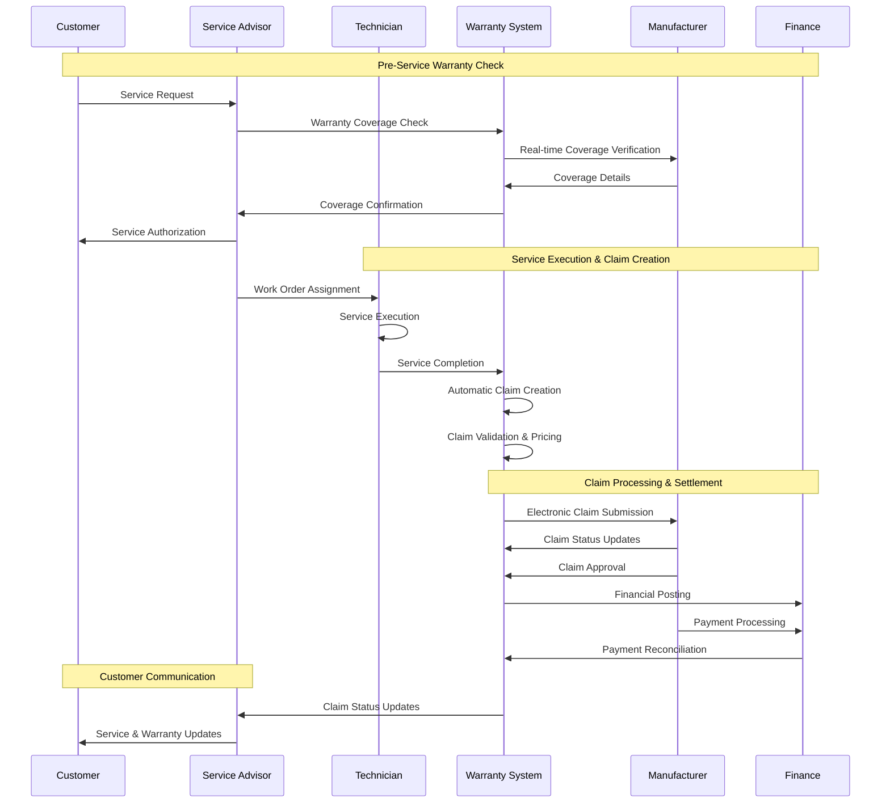
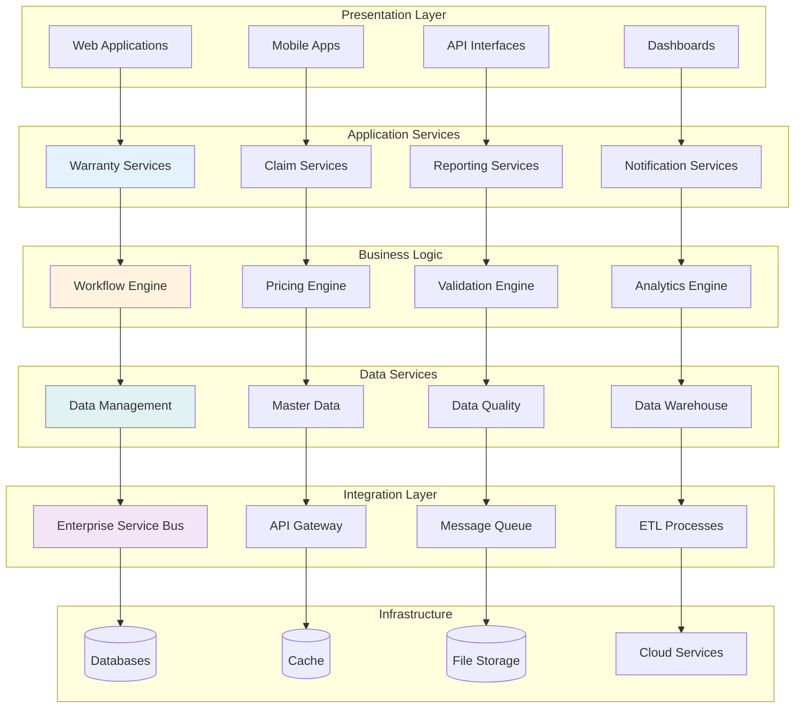
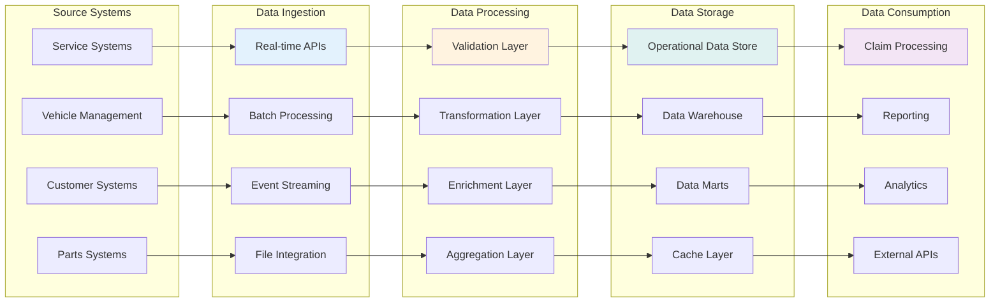
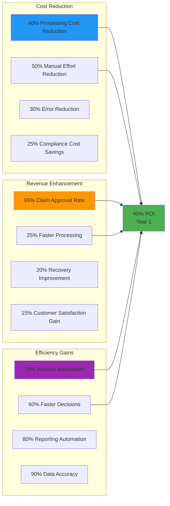
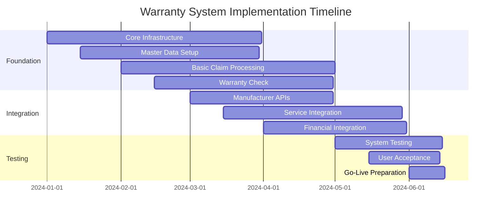

# Warranty Management System

## Overview
Comprehensive warranty management system designed to maximize warranty recovery, ensure compliance, and deliver exceptional customer service. This integrated platform manages the complete warranty lifecycle from coverage verification through claim settlement and financial reconciliation.

## Core Modules

### 🔧 [Claim Processing](claim-processing/)
**Complete warranty claim lifecycle management and transaction processing**

- **[Claim Transactions](claim-processing/claim-transactions.md)** - Comprehensive transaction processing with multiple claim types
- **[Claim Creation & Management](claim-processing/claim-creation-management.md)** - Flexible claim creation with customizable interfaces
- **[Warranty Check](claim-processing/warranty-check.md)** - Real-time warranty coverage verification and validation

**Business Impact**: 95%+ claim approval rates, 50% reduction in processing time

### 📊 [Master Data](master-data/)
**Foundational data management for warranty objects and policies**

- **[Warranty Objects](master-data/warranty-objects.md)** - Comprehensive warranty-covered item definitions
- **[Master Warranties](master-data/master-warranties.md)** - Warranty program and policy management

**Business Impact**: 99%+ data accuracy, consistent warranty coverage interpretation

### ⚙️ [Control Configuration](control-configuration/)
**Business process automation and pricing management**

- **[Claim Types & Pricing](control-configuration/claim-types-pricing.md)** - Flexible claim categorization and pricing structures
- **[Action Controls](control-configuration/action-controls.md)** - Automated workflow and business process management

**Business Impact**: 70% process automation, 30% reduction in manual effort

### 📈 [Reporting & Analytics](reporting-analytics/)
**Comprehensive warranty intelligence and business analytics**

- **[Online Reporting](reporting-analytics/online-reporting.md)** - Real-time dashboards and interactive reporting
- **[BW Reporting](reporting-analytics/bw-reporting.md)** - Enterprise data warehouse and advanced analytics

**Business Impact**: Real-time visibility, data-driven decision making

## Warranty System Architecture

## Warranty Claim Lifecycle

## Business Process Flow

## Technology Architecture

## Data Flow Architecture

## Business Value Proposition

### Financial Impact

### Operational Excellence Framework

#### Process Efficiency
- **Automated Claim Creation** - 90% of claims created automatically from service orders
- **Real-time Validation** - Instant warranty coverage verification and claim validation
- **Intelligent Routing** - Smart workflow routing based on claim characteristics
- **Exception Management** - Automated handling of exceptions and edge cases

#### Quality Assurance
- **Data Quality** - 99%+ accuracy in warranty data and claim information
- **Process Consistency** - Standardized processes across all warranty operations
- **Compliance Management** - Automated compliance checking and validation
- **Audit Readiness** - Complete audit trails and documentation

#### Customer Experience
- **Transparency** - Real-time visibility into warranty status and claim progress
- **Self-Service** - Customer portal for warranty information and status checking
- **Proactive Communication** - Automated notifications and updates
- **Fast Resolution** - Accelerated claim processing and dispute resolution

## Key Performance Indicators

### Financial Metrics
- **Warranty Recovery Rate** - 95%+ claim approval and recovery rate
- **Processing Cost per Claim** - 40% reduction in processing costs
- **Cash Flow Improvement** - 25% faster payment cycles
- **ROI Achievement** - 45% return on investment within first year

### Operational Metrics
- **Claim Processing Time** - 50% reduction in average processing time
- **First-Time Approval Rate** - 90%+ first-time claim approval rate
- **Process Automation Rate** - 70% of processes fully automated
- **Error Rate Reduction** - 80% reduction in processing errors

### Quality Metrics
- **Data Accuracy** - 99%+ accuracy in warranty and claim data
- **Customer Satisfaction** - 95%+ customer satisfaction with warranty service
- **Compliance Rate** - 100% compliance with regulatory requirements
- **Audit Performance** - Top-tier performance in manufacturer audits

### Technology Metrics
- **System Availability** - 99.9% uptime for all critical warranty systems
- **Response Time** - Sub-second response for warranty lookups and validations
- **Integration Success** - 99%+ success rate for external system integrations
- **User Adoption** - 95%+ user adoption across all warranty functions

## Implementation Strategy

### Phase 1: Foundation (Months 1-6)

### Phase 2: Enhancement (Months 7-12)
- **Advanced Analytics** - Predictive modeling and business intelligence
- **Process Automation** - Workflow automation and intelligent routing
- **Customer Portal** - Self-service warranty information and status
- **Mobile Applications** - Mobile access for field operations

### Phase 3: Optimization (Months 13-18)
- **AI/ML Integration** - Machine learning for claim processing optimization
- **Advanced Reporting** - Executive dashboards and strategic analytics
- **Performance Optimization** - System performance tuning and scalability
- **Partner Integration** - Extended partner and supplier integration

### Phase 4: Innovation (Months 19-24)
- **Predictive Maintenance** - IoT integration for predictive warranty analytics
- **Blockchain Integration** - Transparent and immutable warranty records
- **Advanced AI** - Natural language processing and intelligent automation
- **Industry Leadership** - Industry-leading warranty management capabilities

## Success Metrics & Targets

### 6-Month Targets
- **System Implementation** - Core warranty system fully operational
- **User Adoption** - 90%+ user adoption across all warranty functions
- **Process Efficiency** - 40% improvement in claim processing efficiency
- **Data Quality** - 98%+ accuracy in warranty data and processing

### 12-Month Targets
- **Financial Performance** - 45% ROI achievement with measurable cost savings
- **Customer Experience** - 95%+ customer satisfaction with warranty service
- **Operational Excellence** - 70% process automation and 95% claim approval rate
- **Compliance Achievement** - 100% compliance with all regulatory requirements

### 24-Month Targets
- **Industry Leadership** - Top quartile performance in warranty management
- **Innovation Recognition** - Industry recognition for warranty innovation
- **Scalability Achievement** - Platform supporting 10x growth in transaction volume
- **Strategic Value** - Warranty system as competitive differentiator

## Risk Management

### Technical Risks
- **Integration Complexity** - Comprehensive testing and phased rollout approach
- **Data Migration** - Validated data migration with parallel processing
- **Performance Scalability** - Cloud-native architecture with auto-scaling
- **Security Compliance** - Multi-layered security with continuous monitoring

### Business Risks
- **Change Management** - Comprehensive training and change management program
- **Process Disruption** - Parallel processing during transition periods
- **Stakeholder Alignment** - Regular communication and stakeholder engagement
- **Manufacturer Relations** - Proactive manufacturer engagement and collaboration

---

*This warranty management system represents a transformational approach to warranty operations, delivering measurable business value through technology innovation and process excellence.*